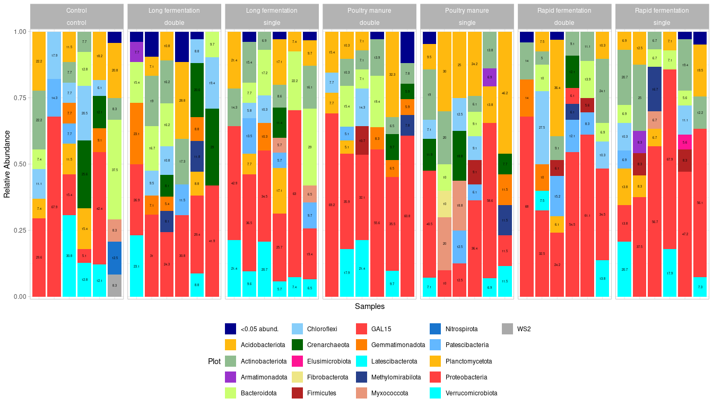

``` r
knitr::opts_chunk$set(fig.width = 14, fig.height = 8)
 

source("functions.R")


set.seed(5678)
setwd('~/Analysis/16s-amplicon-processing/')


bact <- readRDS("bact.RData")
bact
```

```
## phyloseq-class experiment-level object
## otu_table()   OTU Table:         [ 343 taxa and 42 samples ]
## sample_data() Sample Data:       [ 42 samples by 5 sample variables ]
## tax_table()   Taxonomy Table:    [ 343 taxa by 6 taxonomic ranks ]
## phy_tree()    Phylogenetic Tree: [ 343 tips and 341 internal nodes ]
## refseq()      DNAStringSet:      [ 343 reference sequences ]
```

``` r
fungi <- readRDS("fungi.RData")
fungi
```

```
## phyloseq-class experiment-level object
## otu_table()   OTU Table:         [ 140 taxa and 42 samples ]
## sample_data() Sample Data:       [ 42 samples by 5 sample variables ]
## tax_table()   Taxonomy Table:    [ 140 taxa by 7 taxonomic ranks ]
## refseq()      DNAStringSet:      [ 140 reference sequences ]
```

## Save ASVs table at different levels


``` r
bact %>% tax_table() %>% colnames()
```

```
## [1] "Kingdom" "Phylum"  "Class"   "Order"   "Family"  "Genus"
```

``` r
write_ASVs_table(bact, "tables/ASVs_abs_abundances_bact.csv")
```

```
## Table written to: tables/ASVs_abs_abundances_bact.csv
```

``` r
write_ASVs_table(bact, "tables/genus_abs_abundances_bact.csv", tax_level = "Genus")
```

```
## Table written to: tables/genus_abs_abundances_bact.csv
```

``` r
write_ASVs_table(bact, "tables/Phylum_abs_abundances_bact.csv", tax_level = "Phylum")
```

```
## Table written to: tables/Phylum_abs_abundances_bact.csv
```

``` r
write_ASVs_table(fungi %>% rarefy_even_depth(verbose = F), "tables/ASVs_raref_abundances_fungi.csv")
```

```
## Table written to: tables/ASVs_raref_abundances_fungi.csv
```

``` r
write_ASVs_table(fungi %>% rarefy_even_depth(verbose = F), "tables/genus_raref_abundances_fungi.csv", tax_level = "Genus")
```

```
## Table written to: tables/genus_raref_abundances_fungi.csv
```

``` r
write_ASVs_table(fungi %>% rarefy_even_depth(verbose = F), "tables/Phylum_raref_abundances_fungi.csv", tax_level = "Phylum")
```

```
## Table written to: tables/Phylum_raref_abundances_fungi.csv
```


## Plot barplots


``` r
bargraph(ps = bact, rank = "Phylum", threshold = 0.05, percents = T) +
  facet_grid(cols = vars(Treatment, Dosage), scales = "free", space = "free")
```

```
## Warning: Removed 640 rows containing missing values or values outside the scale range
## (`geom_text()`).
```

<!-- -->

``` r
# ggsave("bars.tiff", units="in", width=12, height=8, dpi=300, compression = 'lzw')


bargraph(ps = fungi, rank = "Class", threshold = 0.05, percents = T) +
  facet_grid(cols = vars(Treatment, Dosage), scales = "free", space = "free")
```

```
## Warning: Removed 447 rows containing missing values or values outside the scale range
## (`geom_text()`).
```

<!-- -->

``` r
# ggsave("bars.tiff", units="in", width=12, height=8, dpi=300, compression = 'lzw')
```

## Heatmap


``` r
plot_heatmap(ps = bact, X = "Filename", taxa = "Family", log.transform = T) + 
  facet_grid(rows = vars(Phylum), 
             cols = vars(Treatment, Dosage), scales = "free", space = "free")
```

<!-- -->

``` r
plot_heatmap(ps = fungi, X = "Filename", taxa = "Family", log.transform = F) + 
  facet_grid(rows = vars(Phylum), 
             cols = vars(Treatment, Dosage), scales = "free", space = "free")
```

<!-- -->

## Alpha-diversity


``` r
sample_sums(bact)
```

```
## S246 S247 S248 S249 S250 S251 S255 S256 S257 S258 S259 S260 S264 S265 S266 S267 
##   27   28   26   39   33   24   42   20   16   33   29   26   26   39   28   36 
## S268 S269 S273 S274 S275 S276 S277 S278 S282 S283 S284 S285 S286 S287 S291 S292 
##   31   51   29   24   30   28   36   41   50   40   33   33   36   29   14   52 
## S293 S294 S295 S296 S300 S301 S302 S303 S304 S305 
##   29   35   27   31   26   42   37   52   34   31
```

``` r
alpha.bact <- alpha_div_table(ps = bact, 
                              cols_to_keep = c("Treatment", "Dosage"),
                              sample.size = 24, # can be NULL - rarefaction to the minimum
                              metric = c("Observed", "Shannon", "Simpson", "Chao1"))
```

```
## Loading required package: picante
```

```
## Loading required package: ape
```

```
## 
## Attaching package: 'ape'
```

```
## The following object is masked from 'package:dplyr':
## 
##     where
```

```
## The following object is masked from 'package:Biostrings':
## 
##     complement
```

```
## Loading required package: vegan
```

```
## Loading required package: permute
```

```
## Loading required package: nlme
```

```
## 
## Attaching package: 'nlme'
```

```
## The following object is masked from 'package:dplyr':
## 
##     collapse
```

```
## The following object is masked from 'package:Biostrings':
## 
##     collapse
```

```
## The following object is masked from 'package:IRanges':
## 
##     collapse
```

```
## Loading required package: tidyr
```

```
## 
## Attaching package: 'tidyr'
```

```
## The following object is masked from 'package:S4Vectors':
## 
##     expand
```

```
## Rarefying to depth: 24
```

```
## Samples retained after rarefaction: 39/42
```

```
## Warning in sqrt(sum(Deriv.Ch1 %*% t(Deriv.Ch1) * (diag(a) - a %*%
## t(a)/S.ACE))): NaNs produced
```

``` r
alpha.bact %>% head() # also there are PD and MPD
```

```
## # A tibble: 6 × 5
##   SampleID Treatment Dosage  Metric    Value
##   <chr>    <chr>     <chr>   <chr>     <dbl>
## 1 S246     Control   control Observed 10    
## 2 S246     Control   control Shannon   2.22 
## 3 S246     Control   control Simpson   0.882
## 4 S246     Control   control Chao1    10    
## 5 S246     Control   control MPD       0.414
## 6 S246     Control   control PD        2.41
```

``` r
sample_sums(fungi)
```

```
## PE10 PE11 PE15 PE16 PE17 PE18 PE19 PE20 PE24 PE25 PE26 PE27 PE28 PE29 PE33 PE34 
##   15   61   20   21   37   56   73   39   76   57   23   63   58   56   21   70 
## PE35 PE36 PE37 PE38 PE42 PE43 PE44 PE45 PE46 PE47 PE51 PE52 PE53 PE54 PE55 PE56 
##   64   59   69   70   71   66   67   76   87   55   21   61   80   10   67   56 
##  PE6 PE60 PE61 PE62 PE63 PE64 PE65  PE7  PE8  PE9 
##   38   59   72   67   77   73   32   66   29   42
```

``` r
alpha.fungi <- alpha_div_table(ps = fungi, 
                              cols_to_keep = c("Treatment", "Dosage"))
```

```
## No rarefaction depth specified. Using minimum depth: 10
```

```
## Samples retained after rarefaction: 42/42
```

``` r
alpha.fungi %>% head() # default indices
```

```
## # A tibble: 6 × 5
##   SampleID Treatment Dosage  Metric   Value
##   <chr>    <chr>     <chr>   <chr>    <dbl>
## 1 PE10     Control   control Observed  6   
## 2 PE10     Control   control Shannon   1.75
## 3 PE10     Control   control Simpson   0.82
## 4 PE11     Control   control Observed  5   
## 5 PE11     Control   control Shannon   1.23
## 6 PE11     Control   control Simpson   0.6
```


``` r
plot_alpha(alpha_table = alpha.bact,
           X = "Treatment",
           colour = "Dosage")
```

```
## 
## Attaching package: 'rlang'
```

```
## The following object is masked from 'package:Biobase':
## 
##     exprs
```

<!-- -->

``` r
plot_alpha(alpha_table = alpha.fungi,
           X = "Treatment",
           colour = "Dosage")
```

<!-- -->


## Beta-diversity


``` r
beta_plot(bact,
          method = "PCoA", distance = "bray", 
          color="Treatment", shape = "Dosage")
```

<!-- -->

``` r
beta_plot(fungi,
          method = "PCoA", distance = "bray", 
          color="Treatment", shape = "Dosage")
```

<!-- -->


## Relative abundance analysis


``` r
full.bact <- readRDS("~/Soil_Institute/2025_Poultry/ps.16s.RData") %>%
  subset_samples(Group %in% c("Experiment") & (Treatment %in% c("Control", "Poultry_manure_single", "Poultry_manure_double")))
```


``` r
deseq_sigtable(ps = full.bact, 
          formula = ~Treatment,
          baseMean = 20,
          log2FoldChange = 2)
```

```
## [1] 6
```

```
##         baseMean log2FoldChange    lfcSE      stat       pvalue         padj
## ASV253 26.969773       23.09007 1.897658 12.167668 4.620940e-34 2.584030e-30
## ASV187 38.415610       22.73036 1.765610 12.873941 6.309863e-38 1.058543e-33
## ASV944  7.298383       22.13698 2.709608  8.169807 3.088822e-16 1.036361e-12
## ASV458 10.721846      -20.70237 2.772461 -7.467145 8.195328e-14 2.291414e-10
## ASV132 19.596389       22.24088 2.387273  9.316434 1.203160e-20 5.046055e-17
## ASV295 29.163779       23.20500 1.843740 12.585833 2.526639e-36 2.119345e-32
##         Kingdom          Phylum               Class           Order
## ASV253 Bacteria Verrucomicrobia    Verrucomicrobiae      Opitutales
## ASV187 Bacteria Verrucomicrobia    Verrucomicrobiae      Opitutales
## ASV944 Bacteria  Proteobacteria Deltaproteobacteria    Myxococcales
## ASV458 Bacteria  Proteobacteria Deltaproteobacteria    Myxococcales
## ASV132 Bacteria  Proteobacteria Gammaproteobacteria Xanthomonadales
## ASV295 Bacteria   Bacteroidetes         Bacteroidia    Cytophagales
##                    Family         Genus
## ASV253        Opitutaceae      Opitutus
## ASV187        Opitutaceae Lacunisphaera
## ASV944            BIrii41          <NA>
## ASV458            BIrii41          <NA>
## ASV132 Rhodanobacteraceae Rhodanobacter
## ASV295    Microscillaceae          <NA>
```

``` r
deseq_sigtable(ps = full.bact, 
          formula = ~Treatment,
          baseMean = 20,
          log2FoldChange = 2,
          pairs = c("Control", "Poultry_manure_single"))
```

```
## [1] 6
```

```
##         baseMean log2FoldChange    lfcSE       stat       pvalue         padj
## ASV253 26.969773      -23.09007 1.897658 -12.167668 4.620940e-34 2.584030e-30
## ASV187 38.415610      -22.73036 1.765610 -12.873941 6.309863e-38 1.058543e-33
## ASV944  7.298383      -22.13698 2.709608  -8.169807 3.088822e-16 1.036361e-12
## ASV458 10.721846       20.70237 2.772461   7.467145 8.195328e-14 2.291414e-10
## ASV132 19.596389      -22.24088 2.387273  -9.316434 1.203160e-20 5.046055e-17
## ASV295 29.163779      -23.20500 1.843740 -12.585833 2.526639e-36 2.119345e-32
##         Kingdom          Phylum               Class           Order
## ASV253 Bacteria Verrucomicrobia    Verrucomicrobiae      Opitutales
## ASV187 Bacteria Verrucomicrobia    Verrucomicrobiae      Opitutales
## ASV944 Bacteria  Proteobacteria Deltaproteobacteria    Myxococcales
## ASV458 Bacteria  Proteobacteria Deltaproteobacteria    Myxococcales
## ASV132 Bacteria  Proteobacteria Gammaproteobacteria Xanthomonadales
## ASV295 Bacteria   Bacteroidetes         Bacteroidia    Cytophagales
##                    Family         Genus
## ASV253        Opitutaceae      Opitutus
## ASV187        Opitutaceae Lacunisphaera
## ASV944            BIrii41          <NA>
## ASV458            BIrii41          <NA>
## ASV132 Rhodanobacteraceae Rhodanobacter
## ASV295    Microscillaceae          <NA>
```

``` r
deseq_sigtable(ps = full.bact, 
          formula = ~Treatment,
          baseMean = 20,
          log2FoldChange = 2,
          pairs = c("Poultry_manure_single", "Poultry_manure_double"))
```

```
## [1] 2
```

```
##        baseMean log2FoldChange    lfcSE       stat       pvalue         padj
## ASV458 10.72185      -24.09780 2.956066  -8.151983 3.580050e-16 3.002946e-12
## ASV361 22.58095      -32.92579 3.086640 -10.667196 1.449338e-26 2.431409e-22
##         Kingdom         Phylum               Class           Order
## ASV458 Bacteria Proteobacteria Deltaproteobacteria    Myxococcales
## ASV361 Bacteria Proteobacteria Gammaproteobacteria Pseudomonadales
##                  Family       Genus
## ASV458          BIrii41        <NA>
## ASV361 Pseudomonadaceae Pseudomonas
```


``` r
ancombc_sigtable(ps = full.bact,
                 fix_formula = "Treatment")
```

```
## $feature_table
##       S246 S247 S248 S249 S250 S251 S255 S256 S257 S258 S259 S260 S264 S265
## ASV6     0    0    0    0    0    0    0    0    0    0    0    2    0    0
## ASV11    0    0    0    3    0    0    0    0    0    0    0    0    0    0
## ASV8     0    0    3    2    0    0    0    0    0    0    0    0    0    4
## ASV10    0    0    0    0    0    0    0    0    0    0    0    0    0    0
## ASV16    0    0    0    0    0    0    0    0    0    0    0    0    0    0
## ASV4     0    0    0    0    0    0    0    0    0    0    0    0    3    0
## ASV2     0    0    0    0    3    1    0    0    0    0    1    0    0    6
## ASV5     0    0    0    0    0    0    0    0    0    0    0    0    5    5
## ASV9     0    1    0    0    0    0    0    0    0    0    0    0    0    0
## ASV15    0    0    0    0    2    0    0    0    0    0    0    0    0    0
## ASV1     0    4    0    0    0    0    2    0    0    0    2    0    5    0
## ASV7     3    0    0    0    0    0    0    0    0    0    2    0    0    1
## ASV13    0    0    2    0    0    0    3    0    0    0    0    0    0    0
## ASV3     1    0    2    0    0    0    0    0    0    1    0    0    0    0
##       S266 S267 S268 S269 S273 S274 S275 S276 S277 S278 S282 S283 S284 S285
## ASV6     0    1    3    3    0    0    0    0    1    0    0    0    0    0
## ASV11    3    0    0    0    4    0    0    3    0    0    0    0    0    0
## ASV8     3    0    0    0    2    0    0    0    0    0    0    0    0    0
## ASV10    0    0    0    0    3    1    0    0    0    2    0    0    1    0
## ASV16    0    0    0    0    0    0    0    0    2    0    0    0    0    0
## ASV4     0   10    0   11    0    0    1    0    0    0    0    0    0    0
## ASV2     0    7    4    5    0    0    0    0    0    0    2    0    0    0
## ASV5     0    0    0    9    0    0    0    5    0    0    0    0    0    0
## ASV9     0    0    0    0    0    0    0    0    0    0    0    3    0    7
## ASV15    0    0    0    1    0    0    0    0    2    2    1    0    0    0
## ASV1     0    0    0    0    0    3    4    3    0    2    2    0    2    4
## ASV7     0    0    0    2    0    0    0    2    4    3    0    0    0    0
## ASV13    0    0    3    0    0    0    0    0    0    0    0    0    0    0
## ASV3     4    0    0    0    3    0    0    0    0    0    0   11    1    0
##       S286 S287 S291 S292 S293 S294 S295 S296 S300 S301 S302 S303 S304 S305
## ASV6     0    0    0    0    0    0    0    1    0    0    0    0    4    9
## ASV11    0    0    0    0    0    0    0    0    0    0    0    0    2    0
## ASV8     0    0    0    5    0    0    0    0    3    0    0    0    1    0
## ASV10    0    4    0    2    0    0    0    0    0    0    2    2    1    0
## ASV16    0    0    0    0    2    0    0    1    1    0    0    5    0    0
## ASV4     1    1    0    0    0    0    0    2    0    4    0    0    0    0
## ASV2     0    0    0    0    0    0   10    0    0    0    0    0    0    0
## ASV5     0    0    0    4    0    0    0    0    0    3    0    0    1    0
## ASV9     0    3    0    2    4    0    0    1    0    0    1    0    0    0
## ASV15    0    0    0    0    0    0    0    0    0    0    0    0    1    2
## ASV1     0    0    0    0    0    0    0    0    0    0    6    4    2    2
## ASV7     0    0    0    0    0    0    1    2    0    0    0    0    0    3
## ASV13    0    0    1    1    0    0    0    0    0    0    0    0    3    0
## ASV3     0    0    0    0    3    1    0    0    0    1    4    2    0    0
## 
## $bias_correct_log_table
##             S246       S247       S248       S249         S250       S251
## ASV6          NA         NA         NA         NA           NA         NA
## ASV11         NA         NA         NA  0.1772530           NA         NA
## ASV8          NA         NA -0.1133455 -0.1128893           NA         NA
## ASV10         NA         NA         NA         NA           NA         NA
## ASV16         NA         NA         NA         NA           NA         NA
## ASV4          NA         NA         NA         NA           NA         NA
## ASV2          NA         NA         NA         NA -0.409010357 -0.4090104
## ASV5          NA         NA         NA         NA           NA         NA
## ASV9          NA -0.7161576         NA         NA           NA         NA
## ASV15         NA         NA         NA         NA -0.007476629         NA
## ASV1          NA  0.3815834         NA         NA           NA         NA
## ASV7   0.7936065         NA         NA         NA           NA         NA
## ASV13         NA         NA -0.2239083         NA           NA         NA
## ASV3  -0.2890341         NA -0.2885779         NA           NA         NA
##              S255 S256 S257      S258       S259       S260      S264
## ASV6           NA   NA   NA        NA         NA -0.4794289        NA
## ASV11          NA   NA   NA        NA         NA         NA        NA
## ASV8           NA   NA   NA        NA         NA         NA        NA
## ASV10          NA   NA   NA        NA         NA         NA        NA
## ASV16          NA   NA   NA        NA         NA         NA        NA
## ASV4           NA   NA   NA        NA         NA         NA 0.2147134
## ASV2           NA   NA   NA        NA -0.6836643         NA        NA
## ASV5           NA   NA   NA        NA         NA         NA 0.3517208
## ASV9           NA   NA   NA        NA         NA         NA        NA
## ASV15          NA   NA   NA        NA         NA         NA        NA
## ASV1  -0.06886122   NA   NA        NA  0.1461905         NA 0.6439805
## ASV7           NA   NA   NA        NA  0.4670938         NA        NA
## ASV13  0.73814853   NA   NA        NA         NA         NA        NA
## ASV3           NA   NA   NA 0.8202465         NA         NA        NA
##             S265      S266       S267        S268       S269        S273
## ASV6          NA        NA -1.1591754 -0.03165985 -0.2540459          NA
## ASV11         NA 0.2037649         NA          NA         NA  0.06591373
## ASV8   0.3748236 0.3190877         NA          NA         NA -0.51191070
## ASV10         NA        NA         NA          NA         NA  0.26912119
## ASV16         NA        NA         NA          NA         NA          NA
## ASV4          NA        NA  0.9678293          NA  0.8696566          NA
## ASV2   0.5369387        NA  0.3928882 -0.13782438 -0.1370669          NA
## ASV5   0.1990650        NA         NA          NA  0.2951677          NA
## ASV9          NA        NA         NA          NA         NA          NA
## ASV15         NA        NA         NA          NA -0.9395060          NA
## ASV1          NA        NA         NA          NA         NA          NA
## ASV7  -0.7972099        NA         NA          NA -0.5957467          NA
## ASV13         NA        NA         NA  0.11274581         NA          NA
## ASV3          NA 0.8370024         NA          NA         NA  0.12378710
##             S274        S275       S276       S277       S278        S282
## ASV6          NA          NA         NA -1.0735255         NA          NA
## ASV11         NA          NA 0.14532483         NA         NA          NA
## ASV8          NA          NA         NA         NA         NA          NA
## ASV10 -0.2678149          NA         NA         NA  0.1352171          NA
## ASV16         NA          NA         NA -0.1702884         NA          NA
## ASV4          NA -1.39520909         NA         NA         NA          NA
## ASV2          NA          NA         NA         NA         NA -0.06360452
## ASV5          NA          NA 0.37257114         NA         NA          NA
## ASV9          NA          NA         NA         NA         NA          NA
## ASV15         NA          NA         NA  0.0327739  0.3232992  0.05024713
## ASV1   0.3485882 -0.09047326 0.15400520         NA -0.3469920  0.07310310
## ASV7          NA          NA 0.06944341  0.3765332  0.3793764          NA
## ASV13         NA          NA         NA         NA         NA          NA
## ASV3          NA          NA         NA         NA         NA          NA
##             S283        S284       S285      S286       S287        S291
## ASV6          NA          NA         NA        NA         NA          NA
## ASV11         NA          NA         NA        NA         NA          NA
## ASV8          NA          NA         NA        NA         NA          NA
## ASV10         NA  0.09192284         NA        NA  0.2335013          NA
## ASV16         NA          NA         NA        NA         NA          NA
## ASV4          NA          NA         NA -1.473987 -1.5534437          NA
## ASV2          NA          NA         NA        NA         NA          NA
## ASV5          NA          NA         NA        NA         NA          NA
## ASV9  -0.6366329          NA  0.3251069        NA -0.2478366          NA
## ASV15         NA          NA         NA        NA         NA          NA
## ASV1          NA  0.30286086 -0.5230622        NA         NA          NA
## ASV7          NA          NA         NA        NA         NA          NA
## ASV13         NA          NA         NA        NA         NA -0.01766981
## ASV3   0.7109718 -0.05341126         NA        NA         NA          NA
##              S292        S293      S294      S295        S296       S300
## ASV6           NA          NA        NA        NA -0.04726171         NA
## ASV11          NA          NA        NA        NA          NA         NA
## ASV8   0.44650452          NA        NA        NA          NA  0.3899485
## ASV10 -0.09421943          NA        NA        NA          NA         NA
## ASV16          NA -0.50222234        NA        NA  0.16282817 -0.3480773
## ASV4           NA          NA        NA        NA  0.47030503         NA
## ASV2           NA          NA        NA 2.3178499          NA         NA
## ASV5  -0.17554109          NA        NA        NA          NA         NA
## ASV9  -0.28787531  0.01224926        NA        NA -0.01584741         NA
## ASV15          NA          NA        NA        NA          NA         NA
## ASV1           NA          NA        NA        NA          NA         NA
## ASV7           NA          NA        NA 0.4728757  0.70964981         NA
## ASV13 -0.86803113          NA        NA        NA          NA         NA
## ASV3           NA -0.22711103 -0.291842        NA          NA         NA
##             S301       S302       S303         S304       S305
## ASV6          NA         NA         NA  0.975731883  1.2735101
## ASV11         NA         NA         NA  0.016765358         NA
## ASV8          NA         NA         NA -0.561059078         NA
## ASV10         NA -0.3228723 -0.4139329 -0.185492293         NA
## ASV16         NA         NA  0.4873775           NA         NA
## ASV4   0.5246985         NA         NA           NA         NA
## ASV2          NA         NA         NA           NA         NA
## ASV5  -0.1368018         NA         NA -0.959961136         NA
## ASV9          NA -1.2096754         NA           NA         NA
## ASV15         NA         NA         NA  0.002589756  0.1825850
## ASV1          NA  0.2935308 -0.2029949  0.025445729 -0.4877063
## ASV7          NA         NA         NA           NA  0.2386622
## ASV13         NA         NA         NA  0.832455473         NA
## ASV3  -0.6062793  0.2249408 -0.5592670           NA         NA
## 
## $ss_tab
##    taxon (Intercept) TreatmentLong fermentation TreatmentPoultry manure
## 1   ASV6           1                        1.0                       1
## 2  ASV11           1                        1.0                       1
## 3   ASV8           1                        1.0                       1
## 4  ASV10           1                        1.0                       1
## 5  ASV16           1                        0.9                       1
## 6   ASV4           1                        1.0                       1
## 7   ASV2           1                        1.0                       1
## 8   ASV5           1                        1.0                       1
## 9   ASV9           1                        1.0                       1
## 10 ASV15           1                        1.0                       1
## 11  ASV1           1                        1.0                       1
## 12  ASV7           1                        1.0                       1
## 13 ASV13           1                        1.0                       1
## 14  ASV3           1                        1.0                       1
##    TreatmentRapid fermentation
## 1                            1
## 2                            1
## 3                            1
## 4                            1
## 5                            1
## 6                            1
## 7                            1
## 8                            1
## 9                            1
## 10                           1
## 11                           1
## 12                           1
## 13                           1
## 14                           1
## 
## $zero_ind
## NULL
## 
## $samp_frac
##        S246        S247        S248        S249        S250        S251 
## -0.44046619 -0.06166439  0.25222483 -0.15369642  0.30453971 -0.79407258 
##        S255        S256        S257        S258        S259        S260 
## -0.30436691         NaN         NaN -1.54974673 -0.51941859  0.36333976 
##        S264        S265        S266        S267        S268        S269 
## -0.10091790  0.05173787 -0.18020830  0.34993902  0.32103580  0.54342188 
##        S273        S274        S275        S276        S277        S278 
##  0.24532495 -0.31635125  0.41039231 -0.12176822  0.26428917 -0.02623611 
##        S282        S283        S284        S285        S286        S287 
## -0.44633123  0.95742318 -0.67608899  0.84298124  0.48917046  0.56862690 
##        S291        S292        S293        S294        S295        S296 
## -0.64716087  0.20320046  0.59622307 -0.43765822 -1.21834771 -0.76197463 
##        S300        S301        S302        S303        S304        S305 
## -0.25106914 -0.12322090  0.43185335  0.52291393 -0.39867386  0.11447812 
## 
## $delta_em
## [1] -0.06166439 -0.04097671  0.10592756  0.18116794
## 
## $delta_wls
## [1] -0.06166421 -0.04429733  0.10592902  0.23154642
## 
## $res
##    taxon lfc_(Intercept) lfc_TreatmentLong fermentation
## 1   ASV6     0.733993430                    0.000000000
## 2  ASV11     0.177253025                   -0.160487667
## 3   ASV8    -0.113117408                    0.204915383
## 4  ASV10    -0.254129236                    0.000000000
## 5  ASV16    -0.050023490                    0.000000000
## 6   ASV4     0.497501759                    0.000000000
## 7   ASV2    -0.409010357                    2.726860223
## 8   ASV5    -0.424101345                    0.000000000
## 9   ASV9    -0.716157643                    0.340870432
## 10 ASV15    -0.007476629                    0.100063985
## 11  ASV1     0.381583440                   -0.474514589
## 12  ASV7     0.793606483                   -0.319877249
## 13 ASV13    -0.223908321                    0.206159832
## 14  ASV3    -0.288805973                   -0.003105752
##    lfc_TreatmentPoultry manure lfc_TreatmentRapid fermentation se_(Intercept)
## 1                  -1.21507094                     -1.80751894       1.066493
## 2                   0.02651188                     -0.07163374       1.085996
## 3                   0.46007301                     -0.39879330       1.066493
## 4                   0.00000000                      0.34651875       1.059873
## 5                   0.00000000                     -0.12026496       1.085996
## 6                   0.18656469                     -1.97171509       1.066493
## 7                   0.40326460                      0.34540583       1.059873
## 8                   0.70608587                      0.79667249       1.073053
## 9                   0.00000000                      0.52970341       1.066493
## 10                 -0.93202935                      0.14291670       1.073053
## 11                 -0.14114686                     -0.39329345       1.018741
## 12                 -1.10222741                     -0.51848882       1.053189
## 13                  0.64935549                      0.00000000       1.079553
## 14                  1.11743042                      0.54925520       1.039624
##    se_TreatmentLong fermentation se_TreatmentPoultry manure
## 1                       1.338342                   1.336218
## 2                       1.359542                   1.358244
## 3                       1.337295                   1.333876
## 4                       1.327122                   1.325598
## 5                       1.361550                   1.358244
## 6                       1.335193                   1.334975
## 7                       1.326921                   1.328743
## 8                       1.344785                   1.342107
## 9                       1.338418                   1.333871
## 10                      1.343432                   1.342068
## 11                      1.276731                   1.275141
## 12                      1.318947                   1.320338
## 13                      1.356158                   1.350824
## 14                      1.303146                   1.300293
##    se_TreatmentRapid fermentation W_(Intercept) W_TreatmentLong fermentation
## 1                        1.334835   0.688230642                  0.000000000
## 2                        1.359198   0.163216978                 -0.118045397
## 3                        1.334835  -0.106064800                  0.153231237
## 4                        1.327176  -0.239773297                  0.000000000
## 5                        1.359187  -0.046062305                  0.000000000
## 6                        1.334876   0.466483678                  0.000000000
## 7                        1.326569  -0.385905073                  2.055028245
## 8                        1.343025  -0.395228782                  0.000000000
## 9                        1.336375  -0.671506875                  0.254681527
## 10                       1.343199  -0.006967624                  0.074483863
## 11                       1.277483   0.374563705                 -0.371663712
## 12                       1.318436   0.753526819                 -0.242524663
## 13                       1.351142  -0.207408341                  0.152017583
## 14                       1.302381  -0.277798507                 -0.002383272
##    W_TreatmentPoultry manure W_TreatmentRapid fermentation p_(Intercept)
## 1                -0.90933607                   -1.35411396     0.5219294
## 2                 0.01951924                   -0.05270297     0.8970011
## 3                 0.34491433                   -0.29875846     0.9206373
## 4                 0.00000000                    0.26109488     0.8173758
## 5                 0.00000000                   -0.08848298     0.9661553
## 6                 0.13975148                   -1.47707693     0.6604876
## 7                 0.30349331                    0.26037537     0.7154409
## 8                 0.52610245                    0.59319238     0.7128452
## 9                 0.00000000                    0.39637347     0.5316680
## 10               -0.69447238                    0.10640028     0.9948781
## 11               -0.11069119                   -0.30786578     0.7151055
## 12               -0.83480705                   -0.39326037     0.4796477
## 13                0.48071061                    0.00000000     0.8489720
## 14                0.85936812                    0.42173166     0.7882112
##    p_TreatmentLong fermentation p_TreatmentPoultry manure
## 1                    1.00000000                 0.4048732
## 2                    0.92519614                 0.9875752
## 3                    0.88563529                 0.7475316
## 4                    1.00000000                 1.0000000
## 5                    1.00000000                 1.0000000
## 6                    1.00000000                 0.8943113
## 7                    0.09503259                 0.7737366
## 8                    1.00000000                 0.6266368
## 9                    0.80911226                 1.0000000
## 10                   0.94531392                 0.5373361
## 11                   0.71720308                 0.9138550
## 12                   0.81645117                 0.4357983
## 13                   0.88882101                 0.6636013
## 14                   0.99815678                 0.4151447
##    p_TreatmentRapid fermentation q_(Intercept) q_TreatmentLong fermentation
## 1                      0.2336824     0.9948781                            1
## 2                      0.9664793     0.9948781                            1
## 3                      0.7800024     0.9948781                            1
## 4                      0.8015343     0.9948781                            1
## 5                      0.9350686     0.9948781                            1
## 6                      0.1996942     0.9948781                            1
## 7                      0.8049570     0.9948781                            1
## 8                      0.5849669     0.9948781                            1
## 9                      0.7081803     0.9948781                            1
## 10                     0.9219807     0.9948781                            1
## 11                     0.7639355     0.9948781                            1
## 12                     0.7077204     0.9948781                            1
## 13                     1.0000000     0.9948781                            1
## 14                     0.6843249     0.9948781                            1
##    q_TreatmentPoultry manure q_TreatmentRapid fermentation diff_(Intercept)
## 1                          1                             1            FALSE
## 2                          1                             1            FALSE
## 3                          1                             1            FALSE
## 4                          1                             1            FALSE
## 5                          1                             1            FALSE
## 6                          1                             1            FALSE
## 7                          1                             1            FALSE
## 8                          1                             1            FALSE
## 9                          1                             1            FALSE
## 10                         1                             1            FALSE
## 11                         1                             1            FALSE
## 12                         1                             1            FALSE
## 13                         1                             1            FALSE
## 14                         1                             1            FALSE
##    diff_TreatmentLong fermentation diff_TreatmentPoultry manure
## 1                            FALSE                        FALSE
## 2                            FALSE                        FALSE
## 3                            FALSE                        FALSE
## 4                            FALSE                        FALSE
## 5                            FALSE                        FALSE
## 6                            FALSE                        FALSE
## 7                            FALSE                        FALSE
## 8                            FALSE                        FALSE
## 9                            FALSE                        FALSE
## 10                           FALSE                        FALSE
## 11                           FALSE                        FALSE
## 12                           FALSE                        FALSE
## 13                           FALSE                        FALSE
## 14                           FALSE                        FALSE
##    diff_TreatmentRapid fermentation passed_ss_(Intercept)
## 1                             FALSE                  TRUE
## 2                             FALSE                  TRUE
## 3                             FALSE                  TRUE
## 4                             FALSE                  TRUE
## 5                             FALSE                  TRUE
## 6                             FALSE                  TRUE
## 7                             FALSE                  TRUE
## 8                             FALSE                  TRUE
## 9                             FALSE                  TRUE
## 10                            FALSE                  TRUE
## 11                            FALSE                  TRUE
## 12                            FALSE                  TRUE
## 13                            FALSE                  TRUE
## 14                            FALSE                  TRUE
##    passed_ss_TreatmentLong fermentation passed_ss_TreatmentPoultry manure
## 1                                  TRUE                              TRUE
## 2                                  TRUE                              TRUE
## 3                                  TRUE                              TRUE
## 4                                  TRUE                              TRUE
## 5                                 FALSE                              TRUE
## 6                                  TRUE                              TRUE
## 7                                  TRUE                              TRUE
## 8                                  TRUE                              TRUE
## 9                                  TRUE                              TRUE
## 10                                 TRUE                              TRUE
## 11                                 TRUE                              TRUE
## 12                                 TRUE                              TRUE
## 13                                 TRUE                              TRUE
## 14                                 TRUE                              TRUE
##    passed_ss_TreatmentRapid fermentation
## 1                                   TRUE
## 2                                   TRUE
## 3                                   TRUE
## 4                                   TRUE
## 5                                   TRUE
## 6                                   TRUE
## 7                                   TRUE
## 8                                   TRUE
## 9                                   TRUE
## 10                                  TRUE
## 11                                  TRUE
## 12                                  TRUE
## 13                                  TRUE
## 14                                  TRUE
## 
## $res_global
## NULL
## 
## $res_pair
## NULL
## 
## $res_dunn
## NULL
## 
## $res_trend
## NULL
```

``` r
ancombc_sigtable(ps = full.bact,
                 fix_formula = "Treatment",
                 intercept = "Control",
                 pairwise = T)
```

```
## $feature_table
##       S246 S247 S248 S249 S250 S251 S255 S256 S257 S258 S259 S260 S264 S265
## ASV6     0    0    0    0    0    0    0    0    0    0    0    2    0    0
## ASV11    0    0    0    3    0    0    0    0    0    0    0    0    0    0
## ASV8     0    0    3    2    0    0    0    0    0    0    0    0    0    4
## ASV10    0    0    0    0    0    0    0    0    0    0    0    0    0    0
## ASV16    0    0    0    0    0    0    0    0    0    0    0    0    0    0
## ASV4     0    0    0    0    0    0    0    0    0    0    0    0    3    0
## ASV2     0    0    0    0    3    1    0    0    0    0    1    0    0    6
## ASV5     0    0    0    0    0    0    0    0    0    0    0    0    5    5
## ASV9     0    1    0    0    0    0    0    0    0    0    0    0    0    0
## ASV15    0    0    0    0    2    0    0    0    0    0    0    0    0    0
## ASV1     0    4    0    0    0    0    2    0    0    0    2    0    5    0
## ASV7     3    0    0    0    0    0    0    0    0    0    2    0    0    1
## ASV13    0    0    2    0    0    0    3    0    0    0    0    0    0    0
## ASV3     1    0    2    0    0    0    0    0    0    1    0    0    0    0
##       S266 S267 S268 S269 S273 S274 S275 S276 S277 S278 S282 S283 S284 S285
## ASV6     0    1    3    3    0    0    0    0    1    0    0    0    0    0
## ASV11    3    0    0    0    4    0    0    3    0    0    0    0    0    0
## ASV8     3    0    0    0    2    0    0    0    0    0    0    0    0    0
## ASV10    0    0    0    0    3    1    0    0    0    2    0    0    1    0
## ASV16    0    0    0    0    0    0    0    0    2    0    0    0    0    0
## ASV4     0   10    0   11    0    0    1    0    0    0    0    0    0    0
## ASV2     0    7    4    5    0    0    0    0    0    0    2    0    0    0
## ASV5     0    0    0    9    0    0    0    5    0    0    0    0    0    0
## ASV9     0    0    0    0    0    0    0    0    0    0    0    3    0    7
## ASV15    0    0    0    1    0    0    0    0    2    2    1    0    0    0
## ASV1     0    0    0    0    0    3    4    3    0    2    2    0    2    4
## ASV7     0    0    0    2    0    0    0    2    4    3    0    0    0    0
## ASV13    0    0    3    0    0    0    0    0    0    0    0    0    0    0
## ASV3     4    0    0    0    3    0    0    0    0    0    0   11    1    0
##       S286 S287 S291 S292 S293 S294 S295 S296 S300 S301 S302 S303 S304 S305
## ASV6     0    0    0    0    0    0    0    1    0    0    0    0    4    9
## ASV11    0    0    0    0    0    0    0    0    0    0    0    0    2    0
## ASV8     0    0    0    5    0    0    0    0    3    0    0    0    1    0
## ASV10    0    4    0    2    0    0    0    0    0    0    2    2    1    0
## ASV16    0    0    0    0    2    0    0    1    1    0    0    5    0    0
## ASV4     1    1    0    0    0    0    0    2    0    4    0    0    0    0
## ASV2     0    0    0    0    0    0   10    0    0    0    0    0    0    0
## ASV5     0    0    0    4    0    0    0    0    0    3    0    0    1    0
## ASV9     0    3    0    2    4    0    0    1    0    0    1    0    0    0
## ASV15    0    0    0    0    0    0    0    0    0    0    0    0    1    2
## ASV1     0    0    0    0    0    0    0    0    0    0    6    4    2    2
## ASV7     0    0    0    0    0    0    1    2    0    0    0    0    0    3
## ASV13    0    0    1    1    0    0    0    0    0    0    0    0    3    0
## ASV3     0    0    0    0    3    1    0    0    0    1    4    2    0    0
## 
## $bias_correct_log_table
##             S246       S247       S248       S249         S250       S251
## ASV6          NA         NA         NA         NA           NA         NA
## ASV11         NA         NA         NA  0.1772530           NA         NA
## ASV8          NA         NA -0.1133455 -0.1128893           NA         NA
## ASV10         NA         NA         NA         NA           NA         NA
## ASV16         NA         NA         NA         NA           NA         NA
## ASV4          NA         NA         NA         NA           NA         NA
## ASV2          NA         NA         NA         NA -0.409010357 -0.4090104
## ASV5          NA         NA         NA         NA           NA         NA
## ASV9          NA -0.7161576         NA         NA           NA         NA
## ASV15         NA         NA         NA         NA -0.007476629         NA
## ASV1          NA  0.3815834         NA         NA           NA         NA
## ASV7   0.7936065         NA         NA         NA           NA         NA
## ASV13         NA         NA -0.2239083         NA           NA         NA
## ASV3  -0.2890341         NA -0.2885779         NA           NA         NA
##              S255 S256 S257      S258       S259       S260      S264
## ASV6           NA   NA   NA        NA         NA -0.4794289        NA
## ASV11          NA   NA   NA        NA         NA         NA        NA
## ASV8           NA   NA   NA        NA         NA         NA        NA
## ASV10          NA   NA   NA        NA         NA         NA        NA
## ASV16          NA   NA   NA        NA         NA         NA        NA
## ASV4           NA   NA   NA        NA         NA         NA 0.2147134
## ASV2           NA   NA   NA        NA -0.6836643         NA        NA
## ASV5           NA   NA   NA        NA         NA         NA 0.3517208
## ASV9           NA   NA   NA        NA         NA         NA        NA
## ASV15          NA   NA   NA        NA         NA         NA        NA
## ASV1  -0.06886122   NA   NA        NA  0.1461905         NA 0.6439805
## ASV7           NA   NA   NA        NA  0.4670938         NA        NA
## ASV13  0.73814853   NA   NA        NA         NA         NA        NA
## ASV3           NA   NA   NA 0.8202465         NA         NA        NA
##             S265      S266       S267        S268       S269        S273
## ASV6          NA        NA -1.1591754 -0.03165985 -0.2540459          NA
## ASV11         NA 0.2037649         NA          NA         NA  0.06591373
## ASV8   0.3748236 0.3190877         NA          NA         NA -0.51191070
## ASV10         NA        NA         NA          NA         NA  0.26912119
## ASV16         NA        NA         NA          NA         NA          NA
## ASV4          NA        NA  0.9678293          NA  0.8696566          NA
## ASV2   0.5369387        NA  0.3928882 -0.13782438 -0.1370669          NA
## ASV5   0.1990650        NA         NA          NA  0.2951677          NA
## ASV9          NA        NA         NA          NA         NA          NA
## ASV15         NA        NA         NA          NA -0.9395060          NA
## ASV1          NA        NA         NA          NA         NA          NA
## ASV7  -0.7972099        NA         NA          NA -0.5957467          NA
## ASV13         NA        NA         NA  0.11274581         NA          NA
## ASV3          NA 0.8370024         NA          NA         NA  0.12378710
##             S274        S275       S276       S277       S278        S282
## ASV6          NA          NA         NA -1.0735255         NA          NA
## ASV11         NA          NA 0.14532483         NA         NA          NA
## ASV8          NA          NA         NA         NA         NA          NA
## ASV10 -0.2678149          NA         NA         NA  0.1352171          NA
## ASV16         NA          NA         NA -0.1702884         NA          NA
## ASV4          NA -1.39520909         NA         NA         NA          NA
## ASV2          NA          NA         NA         NA         NA -0.06360452
## ASV5          NA          NA 0.37257114         NA         NA          NA
## ASV9          NA          NA         NA         NA         NA          NA
## ASV15         NA          NA         NA  0.0327739  0.3232992  0.05024713
## ASV1   0.3485882 -0.09047326 0.15400520         NA -0.3469920  0.07310310
## ASV7          NA          NA 0.06944341  0.3765332  0.3793764          NA
## ASV13         NA          NA         NA         NA         NA          NA
## ASV3          NA          NA         NA         NA         NA          NA
##             S283        S284       S285      S286       S287        S291
## ASV6          NA          NA         NA        NA         NA          NA
## ASV11         NA          NA         NA        NA         NA          NA
## ASV8          NA          NA         NA        NA         NA          NA
## ASV10         NA  0.09192284         NA        NA  0.2335013          NA
## ASV16         NA          NA         NA        NA         NA          NA
## ASV4          NA          NA         NA -1.473987 -1.5534437          NA
## ASV2          NA          NA         NA        NA         NA          NA
## ASV5          NA          NA         NA        NA         NA          NA
## ASV9  -0.6366329          NA  0.3251069        NA -0.2478366          NA
## ASV15         NA          NA         NA        NA         NA          NA
## ASV1          NA  0.30286086 -0.5230622        NA         NA          NA
## ASV7          NA          NA         NA        NA         NA          NA
## ASV13         NA          NA         NA        NA         NA -0.01766981
## ASV3   0.7109718 -0.05341126         NA        NA         NA          NA
##              S292        S293      S294      S295        S296       S300
## ASV6           NA          NA        NA        NA -0.04726171         NA
## ASV11          NA          NA        NA        NA          NA         NA
## ASV8   0.44650452          NA        NA        NA          NA  0.3899485
## ASV10 -0.09421943          NA        NA        NA          NA         NA
## ASV16          NA -0.50222234        NA        NA  0.16282817 -0.3480773
## ASV4           NA          NA        NA        NA  0.47030503         NA
## ASV2           NA          NA        NA 2.3178499          NA         NA
## ASV5  -0.17554109          NA        NA        NA          NA         NA
## ASV9  -0.28787531  0.01224926        NA        NA -0.01584741         NA
## ASV15          NA          NA        NA        NA          NA         NA
## ASV1           NA          NA        NA        NA          NA         NA
## ASV7           NA          NA        NA 0.4728757  0.70964981         NA
## ASV13 -0.86803113          NA        NA        NA          NA         NA
## ASV3           NA -0.22711103 -0.291842        NA          NA         NA
##             S301       S302       S303         S304       S305
## ASV6          NA         NA         NA  0.975731883  1.2735101
## ASV11         NA         NA         NA  0.016765358         NA
## ASV8          NA         NA         NA -0.561059078         NA
## ASV10         NA -0.3228723 -0.4139329 -0.185492293         NA
## ASV16         NA         NA  0.4873775           NA         NA
## ASV4   0.5246985         NA         NA           NA         NA
## ASV2          NA         NA         NA           NA         NA
## ASV5  -0.1368018         NA         NA -0.959961136         NA
## ASV9          NA -1.2096754         NA           NA         NA
## ASV15         NA         NA         NA  0.002589756  0.1825850
## ASV1          NA  0.2935308 -0.2029949  0.025445729 -0.4877063
## ASV7          NA         NA         NA           NA  0.2386622
## ASV13         NA         NA         NA  0.832455473         NA
## ASV3  -0.6062793  0.2249408 -0.5592670           NA         NA
## 
## $ss_tab
##    taxon (Intercept) TreatmentLong fermentation TreatmentPoultry manure
## 1   ASV6           1                        1.0                       1
## 2  ASV11           1                        1.0                       1
## 3   ASV8           1                        1.0                       1
## 4  ASV10           1                        1.0                       1
## 5  ASV16           1                        0.9                       1
## 6   ASV4           1                        1.0                       1
## 7   ASV2           1                        1.0                       1
## 8   ASV5           1                        1.0                       1
## 9   ASV9           1                        1.0                       1
## 10 ASV15           1                        1.0                       1
## 11  ASV1           1                        1.0                       1
## 12  ASV7           1                        1.0                       1
## 13 ASV13           1                        1.0                       1
## 14  ASV3           1                        1.0                       1
##    TreatmentRapid fermentation TreatmentPoultry manure - Long fermentation
## 1                            1                                        1.00
## 2                            1                                        1.00
## 3                            1                                        1.00
## 4                            1                                        1.00
## 5                            1                                        0.28
## 6                            1                                        1.00
## 7                            1                                        0.76
## 8                            1                                        1.00
## 9                            1                                        0.70
## 10                           1                                        1.00
## 11                           1                                        1.00
## 12                           1                                        1.00
## 13                           1                                        1.00
## 14                           1                                        1.00
##    TreatmentRapid fermentation - Long fermentation
## 1                                             0.22
## 2                                             1.00
## 3                                             1.00
## 4                                             1.00
## 5                                             0.00
## 6                                             1.00
## 7                                             1.00
## 8                                             1.00
## 9                                             1.00
## 10                                            1.00
## 11                                            1.00
## 12                                            1.00
## 13                                            0.08
## 14                                            1.00
##    TreatmentRapid fermentation - Poultry manure
## 1                                          0.00
## 2                                          1.00
## 3                                          1.00
## 4                                          0.96
## 5                                          1.00
## 6                                          0.46
## 7                                          0.00
## 8                                          0.50
## 9                                          1.00
## 10                                         1.00
## 11                                         1.00
## 12                                         1.00
## 13                                         0.86
## 14                                         1.00
## 
## $zero_ind
## NULL
## 
## $samp_frac
##        S246        S247        S248        S249        S250        S251 
## -0.44046619 -0.06166439  0.25222483 -0.15369642  0.30453971 -0.79407258 
##        S255        S256        S257        S258        S259        S260 
## -0.30436691         NaN         NaN -1.54974673 -0.51941859  0.36333976 
##        S264        S265        S266        S267        S268        S269 
## -0.10091790  0.05173787 -0.18020830  0.34993902  0.32103580  0.54342188 
##        S273        S274        S275        S276        S277        S278 
##  0.24532495 -0.31635125  0.41039231 -0.12176822  0.26428917 -0.02623611 
##        S282        S283        S284        S285        S286        S287 
## -0.44633123  0.95742318 -0.67608899  0.84298124  0.48917046  0.56862690 
##        S291        S292        S293        S294        S295        S296 
## -0.64716087  0.20320046  0.59622307 -0.43765822 -1.21834771 -0.76197463 
##        S300        S301        S302        S303        S304        S305 
## -0.25106914 -0.12322090  0.43185335  0.52291393 -0.39867386  0.11447812 
## 
## $delta_em
## [1] -0.06166439 -0.04097671  0.10592756  0.18116794
## 
## $delta_wls
## [1] -0.06166421 -0.04429733  0.10592902  0.23154642
## 
## $res
##    taxon lfc_(Intercept) lfc_TreatmentLong fermentation
## 1   ASV6     0.733993430                    0.000000000
## 2  ASV11     0.177253025                   -0.160487667
## 3   ASV8    -0.113117408                    0.204915383
## 4  ASV10    -0.254129236                    0.000000000
## 5  ASV16    -0.050023490                    0.000000000
## 6   ASV4     0.497501759                    0.000000000
## 7   ASV2    -0.409010357                    2.726860223
## 8   ASV5    -0.424101345                    0.000000000
## 9   ASV9    -0.716157643                    0.340870432
## 10 ASV15    -0.007476629                    0.100063985
## 11  ASV1     0.381583440                   -0.474514589
## 12  ASV7     0.793606483                   -0.319877249
## 13 ASV13    -0.223908321                    0.206159832
## 14  ASV3    -0.288805973                   -0.003105752
##    lfc_TreatmentPoultry manure lfc_TreatmentRapid fermentation se_(Intercept)
## 1                  -1.21507094                     -1.80751894       1.066493
## 2                   0.02651188                     -0.07163374       1.085996
## 3                   0.46007301                     -0.39879330       1.066493
## 4                   0.00000000                      0.34651875       1.059873
## 5                   0.00000000                     -0.12026496       1.085996
## 6                   0.18656469                     -1.97171509       1.066493
## 7                   0.40326460                      0.34540583       1.059873
## 8                   0.70608587                      0.79667249       1.073053
## 9                   0.00000000                      0.52970341       1.066493
## 10                 -0.93202935                      0.14291670       1.073053
## 11                 -0.14114686                     -0.39329345       1.018741
## 12                 -1.10222741                     -0.51848882       1.053189
## 13                  0.64935549                      0.00000000       1.079553
## 14                  1.11743042                      0.54925520       1.039624
##    se_TreatmentLong fermentation se_TreatmentPoultry manure
## 1                       1.338342                   1.336218
## 2                       1.359542                   1.358244
## 3                       1.337295                   1.333876
## 4                       1.327122                   1.325598
## 5                       1.361550                   1.358244
## 6                       1.335193                   1.334975
## 7                       1.326921                   1.328743
## 8                       1.344785                   1.342107
## 9                       1.338418                   1.333871
## 10                      1.343432                   1.342068
## 11                      1.276731                   1.275141
## 12                      1.318947                   1.320338
## 13                      1.356158                   1.350824
## 14                      1.303146                   1.300293
##    se_TreatmentRapid fermentation W_(Intercept) W_TreatmentLong fermentation
## 1                        1.334835   0.688230642                  0.000000000
## 2                        1.359198   0.163216978                 -0.118045397
## 3                        1.334835  -0.106064800                  0.153231237
## 4                        1.327176  -0.239773297                  0.000000000
## 5                        1.359187  -0.046062305                  0.000000000
## 6                        1.334876   0.466483678                  0.000000000
## 7                        1.326569  -0.385905073                  2.055028245
## 8                        1.343025  -0.395228782                  0.000000000
## 9                        1.336375  -0.671506875                  0.254681527
## 10                       1.343199  -0.006967624                  0.074483863
## 11                       1.277483   0.374563705                 -0.371663712
## 12                       1.318436   0.753526819                 -0.242524663
## 13                       1.351142  -0.207408341                  0.152017583
## 14                       1.302381  -0.277798507                 -0.002383272
##    W_TreatmentPoultry manure W_TreatmentRapid fermentation p_(Intercept)
## 1                -0.90933607                   -1.35411396     0.5219294
## 2                 0.01951924                   -0.05270297     0.8970011
## 3                 0.34491433                   -0.29875846     0.9206373
## 4                 0.00000000                    0.26109488     0.8173758
## 5                 0.00000000                   -0.08848298     0.9661553
## 6                 0.13975148                   -1.47707693     0.6604876
## 7                 0.30349331                    0.26037537     0.7154409
## 8                 0.52610245                    0.59319238     0.7128452
## 9                 0.00000000                    0.39637347     0.5316680
## 10               -0.69447238                    0.10640028     0.9948781
## 11               -0.11069119                   -0.30786578     0.7151055
## 12               -0.83480705                   -0.39326037     0.4796477
## 13                0.48071061                    0.00000000     0.8489720
## 14                0.85936812                    0.42173166     0.7882112
##    p_TreatmentLong fermentation p_TreatmentPoultry manure
## 1                    1.00000000                 0.4048732
## 2                    0.92519614                 0.9875752
## 3                    0.88563529                 0.7475316
## 4                    1.00000000                 1.0000000
## 5                    1.00000000                 1.0000000
## 6                    1.00000000                 0.8943113
## 7                    0.09503259                 0.7737366
## 8                    1.00000000                 0.6266368
## 9                    0.80911226                 1.0000000
## 10                   0.94531392                 0.5373361
## 11                   0.71720308                 0.9138550
## 12                   0.81645117                 0.4357983
## 13                   0.88882101                 0.6636013
## 14                   0.99815678                 0.4151447
##    p_TreatmentRapid fermentation q_(Intercept) q_TreatmentLong fermentation
## 1                      0.2336824     0.9948781                            1
## 2                      0.9664793     0.9948781                            1
## 3                      0.7800024     0.9948781                            1
## 4                      0.8015343     0.9948781                            1
## 5                      0.9350686     0.9948781                            1
## 6                      0.1996942     0.9948781                            1
## 7                      0.8049570     0.9948781                            1
## 8                      0.5849669     0.9948781                            1
## 9                      0.7081803     0.9948781                            1
## 10                     0.9219807     0.9948781                            1
## 11                     0.7639355     0.9948781                            1
## 12                     0.7077204     0.9948781                            1
## 13                     1.0000000     0.9948781                            1
## 14                     0.6843249     0.9948781                            1
##    q_TreatmentPoultry manure q_TreatmentRapid fermentation diff_(Intercept)
## 1                          1                             1            FALSE
## 2                          1                             1            FALSE
## 3                          1                             1            FALSE
## 4                          1                             1            FALSE
## 5                          1                             1            FALSE
## 6                          1                             1            FALSE
## 7                          1                             1            FALSE
## 8                          1                             1            FALSE
## 9                          1                             1            FALSE
## 10                         1                             1            FALSE
## 11                         1                             1            FALSE
## 12                         1                             1            FALSE
## 13                         1                             1            FALSE
## 14                         1                             1            FALSE
##    diff_TreatmentLong fermentation diff_TreatmentPoultry manure
## 1                            FALSE                        FALSE
## 2                            FALSE                        FALSE
## 3                            FALSE                        FALSE
## 4                            FALSE                        FALSE
## 5                            FALSE                        FALSE
## 6                            FALSE                        FALSE
## 7                            FALSE                        FALSE
## 8                            FALSE                        FALSE
## 9                            FALSE                        FALSE
## 10                           FALSE                        FALSE
## 11                           FALSE                        FALSE
## 12                           FALSE                        FALSE
## 13                           FALSE                        FALSE
## 14                           FALSE                        FALSE
##    diff_TreatmentRapid fermentation passed_ss_(Intercept)
## 1                             FALSE                  TRUE
## 2                             FALSE                  TRUE
## 3                             FALSE                  TRUE
## 4                             FALSE                  TRUE
## 5                             FALSE                  TRUE
## 6                             FALSE                  TRUE
## 7                             FALSE                  TRUE
## 8                             FALSE                  TRUE
## 9                             FALSE                  TRUE
## 10                            FALSE                  TRUE
## 11                            FALSE                  TRUE
## 12                            FALSE                  TRUE
## 13                            FALSE                  TRUE
## 14                            FALSE                  TRUE
##    passed_ss_TreatmentLong fermentation passed_ss_TreatmentPoultry manure
## 1                                  TRUE                              TRUE
## 2                                  TRUE                              TRUE
## 3                                  TRUE                              TRUE
## 4                                  TRUE                              TRUE
## 5                                 FALSE                              TRUE
## 6                                  TRUE                              TRUE
## 7                                  TRUE                              TRUE
## 8                                  TRUE                              TRUE
## 9                                  TRUE                              TRUE
## 10                                 TRUE                              TRUE
## 11                                 TRUE                              TRUE
## 12                                 TRUE                              TRUE
## 13                                 TRUE                              TRUE
## 14                                 TRUE                              TRUE
##    passed_ss_TreatmentRapid fermentation
## 1                                   TRUE
## 2                                   TRUE
## 3                                   TRUE
## 4                                   TRUE
## 5                                   TRUE
## 6                                   TRUE
## 7                                   TRUE
## 8                                   TRUE
## 9                                   TRUE
## 10                                  TRUE
## 11                                  TRUE
## 12                                  TRUE
## 13                                  TRUE
## 14                                  TRUE
## 
## $res_global
## NULL
## 
## $res_pair
##    taxon lfc_TreatmentLong fermentation lfc_TreatmentPoultry manure
## 1   ASV6                    0.000000000                 -1.21507094
## 2  ASV11                   -0.160487667                  0.02651188
## 3   ASV8                    0.204915383                  0.46007301
## 4  ASV10                    0.000000000                  0.00000000
## 5  ASV16                    0.000000000                  0.00000000
## 6   ASV4                    0.000000000                  0.18656469
## 7   ASV2                    2.726860223                  0.40326460
## 8   ASV5                    0.000000000                  0.70608587
## 9   ASV9                    0.340870432                  0.00000000
## 10 ASV15                    0.100063985                 -0.93202935
## 11  ASV1                   -0.474514589                 -0.14114686
## 12  ASV7                   -0.319877249                 -1.10222741
## 13 ASV13                    0.206159832                  0.64935549
## 14  ASV3                   -0.003105752                  1.11743042
##    lfc_TreatmentRapid fermentation
## 1                      -1.80751894
## 2                      -0.07163374
## 3                      -0.39879330
## 4                       0.34651875
## 5                      -0.12026496
## 6                      -1.97171509
## 7                       0.34540583
## 8                       0.79667249
## 9                       0.52970341
## 10                      0.14291670
## 11                     -0.39329345
## 12                     -0.51848882
## 13                      0.00000000
## 14                      0.54925520
##    lfc_TreatmentPoultry manure_TreatmentLong fermentation
## 1                                              -1.2150709
## 2                                               0.1869996
## 3                                               0.2551576
## 4                                               0.0000000
## 5                                               0.0000000
## 6                                               0.1865647
## 7                                              -2.3235956
## 8                                               0.7060859
## 9                                              -0.3408704
## 10                                             -1.0320933
## 11                                              0.3333677
## 12                                             -0.7823502
## 13                                              0.4431957
## 14                                              1.1205362
##    lfc_TreatmentRapid fermentation_TreatmentLong fermentation
## 1                                                 -1.80751894
## 2                                                  0.08885392
## 3                                                 -0.60370868
## 4                                                  0.34651875
## 5                                                 -0.12026496
## 6                                                 -1.97171509
## 7                                                 -2.38145439
## 8                                                  0.79667249
## 9                                                  0.18883298
## 10                                                 0.04285272
## 11                                                 0.08122114
## 12                                                -0.19861157
## 13                                                -0.20615983
## 14                                                 0.55236095
##    lfc_TreatmentRapid fermentation_TreatmentPoultry manure
## 1                                              -0.59244800
## 2                                              -0.09814563
## 3                                              -0.85886631
## 4                                               0.34651875
## 5                                              -0.12026496
## 6                                              -2.15827978
## 7                                              -0.05785877
## 8                                               0.09058662
## 9                                               0.52970341
## 10                                              1.07494606
## 11                                             -0.25214659
## 12                                              0.58373859
## 13                                             -0.64935549
## 14                                             -0.56817522
##    se_TreatmentLong fermentation se_TreatmentPoultry manure
## 1                       1.338342                   1.336218
## 2                       1.359542                   1.358244
## 3                       1.337295                   1.333876
## 4                       1.327122                   1.325598
## 5                       1.361550                   1.358244
## 6                       1.335193                   1.334975
## 7                       1.326921                   1.328743
## 8                       1.344785                   1.342107
## 9                       1.338418                   1.333871
## 10                      1.343432                   1.342068
## 11                      1.276731                   1.275141
## 12                      1.318947                   1.320338
## 13                      1.356158                   1.350824
## 14                      1.303146                   1.300293
##    se_TreatmentRapid fermentation
## 1                        1.334835
## 2                        1.359198
## 3                        1.334835
## 4                        1.327176
## 5                        1.359187
## 6                        1.334876
## 7                        1.326569
## 8                        1.343025
## 9                        1.336375
## 10                       1.343199
## 11                       1.277483
## 12                       1.318436
## 13                       1.351142
## 14                       1.302381
##    se_TreatmentPoultry manure_TreatmentLong fermentation
## 1                                               1.547928
## 2                                               1.551921
## 3                                               1.545001
## 4                                               1.540334
## 5                                               1.553680
## 6                                               1.544131
## 7                                               1.542869
## 8                                               1.547392
## 9                                               1.545969
## 10                                              1.546182
## 11                                              1.522671
## 12                                              1.540066
## 13                                              1.553670
## 14                                              1.532085
##    se_TreatmentRapid fermentation_TreatmentLong fermentation
## 1                                                   1.546735
## 2                                                   1.552756
## 3                                                   1.545829
## 4                                                   1.541692
## 5                                                   1.554506
## 6                                                   1.544046
## 7                                                   1.540997
## 8                                                   1.548188
## 9                                                   1.548130
## 10                                                  1.547163
## 11                                                  1.524633
## 12                                                  1.538436
## 13                                                  1.553946
## 14                                                  1.533858
##    se_TreatmentRapid fermentation_TreatmentPoultry manure
## 1                                                1.544897
## 2                                                1.551619
## 3                                                1.542872
## 4                                                1.540380
## 5                                                1.551610
## 6                                                1.543858
## 7                                                1.542566
## 8                                                1.545863
## 9                                                1.544200
## 10                                               1.545979
## 11                                               1.523302
## 12                                               1.539628
## 13                                               1.549294
## 14                                               1.531434
##    W_TreatmentLong fermentation W_TreatmentPoultry manure
## 1                   0.000000000               -0.90933607
## 2                  -0.118045397                0.01951924
## 3                   0.153231237                0.34491433
## 4                   0.000000000                0.00000000
## 5                   0.000000000                0.00000000
## 6                   0.000000000                0.13975148
## 7                   2.055028245                0.30349331
## 8                   0.000000000                0.52610245
## 9                   0.254681527                0.00000000
## 10                  0.074483863               -0.69447238
## 11                 -0.371663712               -0.11069119
## 12                 -0.242524663               -0.83480705
## 13                  0.152017583                0.48071061
## 14                 -0.002383272                0.85936812
##    W_TreatmentRapid fermentation
## 1                    -1.35411396
## 2                    -0.05270297
## 3                    -0.29875846
## 4                     0.26109488
## 5                    -0.08848298
## 6                    -1.47707693
## 7                     0.26037537
## 8                     0.59319238
## 9                     0.39637347
## 10                    0.10640028
## 11                   -0.30786578
## 12                   -0.39326037
## 13                    0.00000000
## 14                    0.42173166
##    W_TreatmentPoultry manure_TreatmentLong fermentation
## 1                                            -0.7849661
## 2                                             0.1204956
## 3                                             0.1651505
## 4                                             0.0000000
## 5                                             0.0000000
## 6                                             0.1208218
## 7                                            -1.5060229
## 8                                             0.4563072
## 9                                            -0.2204898
## 10                                           -0.6675110
## 11                                            0.2189362
## 12                                           -0.5079978
## 13                                            0.2852573
## 14                                            0.7313797
##    W_TreatmentRapid fermentation_TreatmentLong fermentation
## 1                                               -1.16860312
## 2                                                0.05722338
## 3                                               -0.39054038
## 4                                                0.22476519
## 5                                               -0.07736541
## 6                                               -1.27697912
## 7                                               -1.54539877
## 8                                                0.51458378
## 9                                                0.12197492
## 10                                               0.02769761
## 11                                               0.05327258
## 12                                              -0.12909965
## 13                                              -0.13266857
## 14                                               0.36011227
##    W_TreatmentRapid fermentation_TreatmentPoultry manure
## 1                                            -0.38348703
## 2                                            -0.06325369
## 3                                            -0.55666713
## 4                                             0.22495666
## 5                                            -0.07750978
## 6                                            -1.39797837
## 7                                            -0.03750814
## 8                                             0.05859940
## 9                                             0.34302775
## 10                                            0.69531724
## 11                                           -0.16552636
## 12                                            0.37914250
## 13                                           -0.41913002
## 14                                           -0.37100855
##    p_TreatmentLong fermentation p_TreatmentPoultry manure
## 1                             1                         1
## 2                             1                         1
## 3                             1                         1
## 4                             1                         1
## 5                             1                         1
## 6                             1                         1
## 7                             1                         1
## 8                             1                         1
## 9                             1                         1
## 10                            1                         1
## 11                            1                         1
## 12                            1                         1
## 13                            1                         1
## 14                            1                         1
##    p_TreatmentRapid fermentation
## 1                      1.0000000
## 2                      1.0000000
## 3                      1.0000000
## 4                      1.0000000
## 5                      0.9350686
## 6                      1.0000000
## 7                      1.0000000
## 8                      1.0000000
## 9                      1.0000000
## 10                     1.0000000
## 11                     1.0000000
## 12                     1.0000000
## 13                     1.0000000
## 14                     1.0000000
##    p_TreatmentPoultry manure_TreatmentLong fermentation
## 1                                                     1
## 2                                                     1
## 3                                                     1
## 4                                                     1
## 5                                                     1
## 6                                                     1
## 7                                                     1
## 8                                                     1
## 9                                                     1
## 10                                                    1
## 11                                                    1
## 12                                                    1
## 13                                                    1
## 14                                                    1
##    p_TreatmentRapid fermentation_TreatmentLong fermentation
## 1                                                 1.0000000
## 2                                                 1.0000000
## 3                                                 1.0000000
## 4                                                 1.0000000
## 5                                                 0.9432038
## 6                                                 1.0000000
## 7                                                 1.0000000
## 8                                                 1.0000000
## 9                                                 1.0000000
## 10                                                1.0000000
## 11                                                1.0000000
## 12                                                1.0000000
## 13                                                1.0000000
## 14                                                1.0000000
##    p_TreatmentRapid fermentation_TreatmentPoultry manure
## 1                                              1.0000000
## 2                                              1.0000000
## 3                                              1.0000000
## 4                                              1.0000000
## 5                                              0.9430981
## 6                                              1.0000000
## 7                                              1.0000000
## 8                                              1.0000000
## 9                                              1.0000000
## 10                                             1.0000000
## 11                                             1.0000000
## 12                                             1.0000000
## 13                                             1.0000000
## 14                                             1.0000000
##    q_TreatmentLong fermentation q_TreatmentPoultry manure
## 1                             1                         1
## 2                             1                         1
## 3                             1                         1
## 4                             1                         1
## 5                             1                         1
## 6                             1                         1
## 7                             1                         1
## 8                             1                         1
## 9                             1                         1
## 10                            1                         1
## 11                            1                         1
## 12                            1                         1
## 13                            1                         1
## 14                            1                         1
##    q_TreatmentRapid fermentation
## 1                              1
## 2                              1
## 3                              1
## 4                              1
## 5                              1
## 6                              1
## 7                              1
## 8                              1
## 9                              1
## 10                             1
## 11                             1
## 12                             1
## 13                             1
## 14                             1
##    q_TreatmentPoultry manure_TreatmentLong fermentation
## 1                                                     1
## 2                                                     1
## 3                                                     1
## 4                                                     1
## 5                                                     1
## 6                                                     1
## 7                                                     1
## 8                                                     1
## 9                                                     1
## 10                                                    1
## 11                                                    1
## 12                                                    1
## 13                                                    1
## 14                                                    1
##    q_TreatmentRapid fermentation_TreatmentLong fermentation
## 1                                                         1
## 2                                                         1
## 3                                                         1
## 4                                                         1
## 5                                                         1
## 6                                                         1
## 7                                                         1
## 8                                                         1
## 9                                                         1
## 10                                                        1
## 11                                                        1
## 12                                                        1
## 13                                                        1
## 14                                                        1
##    q_TreatmentRapid fermentation_TreatmentPoultry manure
## 1                                                      1
## 2                                                      1
## 3                                                      1
## 4                                                      1
## 5                                                      1
## 6                                                      1
## 7                                                      1
## 8                                                      1
## 9                                                      1
## 10                                                     1
## 11                                                     1
## 12                                                     1
## 13                                                     1
## 14                                                     1
##    diff_TreatmentLong fermentation diff_TreatmentPoultry manure
## 1                            FALSE                        FALSE
## 2                            FALSE                        FALSE
## 3                            FALSE                        FALSE
## 4                            FALSE                        FALSE
## 5                            FALSE                        FALSE
## 6                            FALSE                        FALSE
## 7                            FALSE                        FALSE
## 8                            FALSE                        FALSE
## 9                            FALSE                        FALSE
## 10                           FALSE                        FALSE
## 11                           FALSE                        FALSE
## 12                           FALSE                        FALSE
## 13                           FALSE                        FALSE
## 14                           FALSE                        FALSE
##    diff_TreatmentRapid fermentation
## 1                             FALSE
## 2                             FALSE
## 3                             FALSE
## 4                             FALSE
## 5                             FALSE
## 6                             FALSE
## 7                             FALSE
## 8                             FALSE
## 9                             FALSE
## 10                            FALSE
## 11                            FALSE
## 12                            FALSE
## 13                            FALSE
## 14                            FALSE
##    diff_TreatmentPoultry manure_TreatmentLong fermentation
## 1                                                    FALSE
## 2                                                    FALSE
## 3                                                    FALSE
## 4                                                    FALSE
## 5                                                    FALSE
## 6                                                    FALSE
## 7                                                    FALSE
## 8                                                    FALSE
## 9                                                    FALSE
## 10                                                   FALSE
## 11                                                   FALSE
## 12                                                   FALSE
## 13                                                   FALSE
## 14                                                   FALSE
##    diff_TreatmentRapid fermentation_TreatmentLong fermentation
## 1                                                        FALSE
## 2                                                        FALSE
## 3                                                        FALSE
## 4                                                        FALSE
## 5                                                        FALSE
## 6                                                        FALSE
## 7                                                        FALSE
## 8                                                        FALSE
## 9                                                        FALSE
## 10                                                       FALSE
## 11                                                       FALSE
## 12                                                       FALSE
## 13                                                       FALSE
## 14                                                       FALSE
##    diff_TreatmentRapid fermentation_TreatmentPoultry manure
## 1                                                     FALSE
## 2                                                     FALSE
## 3                                                     FALSE
## 4                                                     FALSE
## 5                                                     FALSE
## 6                                                     FALSE
## 7                                                     FALSE
## 8                                                     FALSE
## 9                                                     FALSE
## 10                                                    FALSE
## 11                                                    FALSE
## 12                                                    FALSE
## 13                                                    FALSE
## 14                                                    FALSE
##    passed_ss_TreatmentLong fermentation passed_ss_TreatmentPoultry manure
## 1                                  TRUE                              TRUE
## 2                                  TRUE                              TRUE
## 3                                  TRUE                              TRUE
## 4                                  TRUE                              TRUE
## 5                                 FALSE                              TRUE
## 6                                  TRUE                              TRUE
## 7                                  TRUE                              TRUE
## 8                                  TRUE                              TRUE
## 9                                  TRUE                              TRUE
## 10                                 TRUE                              TRUE
## 11                                 TRUE                              TRUE
## 12                                 TRUE                              TRUE
## 13                                 TRUE                              TRUE
## 14                                 TRUE                              TRUE
##    passed_ss_TreatmentRapid fermentation
## 1                                   TRUE
## 2                                   TRUE
## 3                                   TRUE
## 4                                   TRUE
## 5                                   TRUE
## 6                                   TRUE
## 7                                   TRUE
## 8                                   TRUE
## 9                                   TRUE
## 10                                  TRUE
## 11                                  TRUE
## 12                                  TRUE
## 13                                  TRUE
## 14                                  TRUE
##    passed_ss_TreatmentPoultry manure_TreatmentLong fermentation
## 1                                                          TRUE
## 2                                                          TRUE
## 3                                                          TRUE
## 4                                                          TRUE
## 5                                                         FALSE
## 6                                                          TRUE
## 7                                                         FALSE
## 8                                                          TRUE
## 9                                                         FALSE
## 10                                                         TRUE
## 11                                                         TRUE
## 12                                                         TRUE
## 13                                                         TRUE
## 14                                                         TRUE
##    passed_ss_TreatmentRapid fermentation_TreatmentLong fermentation
## 1                                                             FALSE
## 2                                                              TRUE
## 3                                                              TRUE
## 4                                                              TRUE
## 5                                                             FALSE
## 6                                                              TRUE
## 7                                                              TRUE
## 8                                                              TRUE
## 9                                                              TRUE
## 10                                                             TRUE
## 11                                                             TRUE
## 12                                                             TRUE
## 13                                                            FALSE
## 14                                                             TRUE
##    passed_ss_TreatmentRapid fermentation_TreatmentPoultry manure
## 1                                                          FALSE
## 2                                                           TRUE
## 3                                                           TRUE
## 4                                                          FALSE
## 5                                                           TRUE
## 6                                                          FALSE
## 7                                                          FALSE
## 8                                                          FALSE
## 9                                                           TRUE
## 10                                                          TRUE
## 11                                                          TRUE
## 12                                                          TRUE
## 13                                                         FALSE
## 14                                                          TRUE
## 
## $res_dunn
## NULL
## 
## $res_trend
## NULL
```

