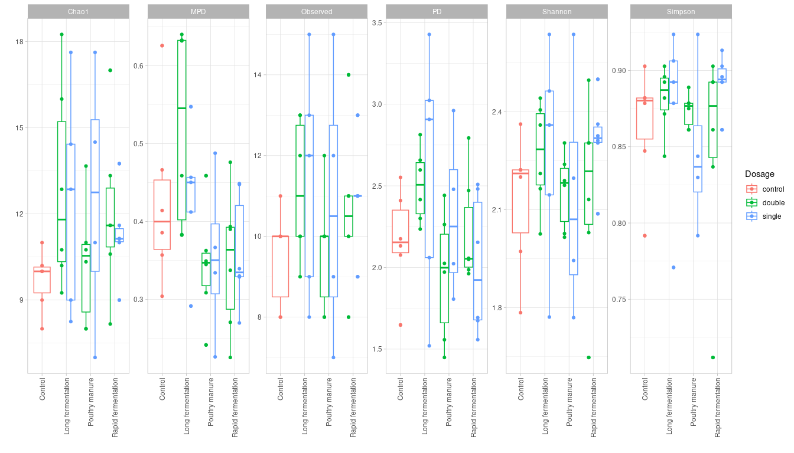

```r
knitr::opts_chunk$set(fig.width = 14, fig.height = 8)
 

library('phyloseq')
library('tidyverse')
library('ggVennDiagram')


set.seed(5678)
setwd('~/Analysis/16s-amplicon-processing/')
ps <- readRDS("ps.RData")
ps
```

```
## phyloseq-class experiment-level object
## otu_table()   OTU Table:         [ 8785 taxa and 36 samples ]
## sample_data() Sample Data:       [ 36 samples by 6 sample variables ]
## tax_table()   Taxonomy Table:    [ 8785 taxa by 7 taxonomic ranks ]
## refseq()      DNAStringSet:      [ 8785 reference sequences ]
```

## Brief view on samples


```r
sample_sums(ps) %>% sort()
```

```
## U3.C.2 U3.C.1 U3.C.4 U1.C.4 U1.A.3 U3.C.3 U1.A.4 U3.B.1 U1.B.4 U1.B.1 U3.B.2 
##  11982  13511  13598  14890  15011  15174  15280  15499  15764  15796  15801 
## U1.B.3 U3.A.1 U3.A.4 U3.B.3 U1.A.1 U1.C.1 U3.A.2 U1.B.2 U1.A.2 U3.A.3 U2.C.1 
##  15947  16117  16128  16140  16225  16295  16315  16389  17061  17080  17291 
## U2.A.1 U2.A.3 U3.B.4 U2.C.4 U2.B.2 U2.B.4 U2.C.2 U2.A.2 U2.B.1 U2.A.4 U2.B.3 
##  17473  17537  17581  17874  17895  18087  18534  18871  18896  18933  19017 
## U2.C.3 U1.C.2 U1.C.3 
##  19019  24402  30559
```

```r
taxa_sums(ps) %>% log() %>%  hist()
```

<!-- -->

```r
ps@sam_data[1:8,]
```

```
##        SampleID           Filename Group BioRepeat TechRepeat    Location
## U1.A.1   U1.A.1 Abakumov-SEQ126-37    U1         A          1 Quarry Clay
## U1.A.2   U1.A.2 Abakumov-SEQ126-38    U1         A          2 Quarry Clay
## U1.A.3   U1.A.3 Abakumov-SEQ126-39    U1         A          3 Quarry Clay
## U1.A.4   U1.A.4 Abakumov-SEQ126-40    U1         A          4 Quarry Clay
## U1.B.1   U1.B.1 Abakumov-SEQ126-41    U1         B          1 Quarry Clay
## U1.B.2   U1.B.2 Abakumov-SEQ126-42    U1         B          2 Quarry Clay
## U1.B.3   U1.B.3 Abakumov-SEQ126-43    U1         B          3 Quarry Clay
## U1.B.4   U1.B.4 Abakumov-SEQ126-44    U1         B          4 Quarry Clay
```


## Plot barplots


```r
# Draw barplot of relative abundance by taxa level
bargraph <- function(ps, rank, threshold=0.05, percents=FALSE){
  require(dplyr)
  require(ggplot2)
  require(phyloseq)
  
  ps <- prune_taxa(taxa_sums(ps) > 0, ps)
  ps2 <- tax_glom(ps, taxrank = rank)
  ps3 = transform_sample_counts(ps2, function(x) x / sum(x) )
  data <- psmelt(ps3) # create dataframe from phyloseq object
  data$Plot <- as.character(data[,rank]) # convert to character
  data$Plot[data$Abundance < threshold] <- paste0("<", threshold, " abund.")
  medians <- data %>% group_by(Plot) %>% mutate(median=median(data$Abundance))
  remainder <- medians[medians$median <= threshold,]$Plot
  data$Percentage = ifelse(data$Plot != paste0("<", threshold, " abund."),
                           round(data$Abundance, 3)*100, NA)
  
  # create palette long enough for our data
  base.palette <- c("darkblue", "darkgoldenrod1", "darkseagreen", "darkorchid", "darkolivegreen1", "lightskyblue", 
                    "darkgreen", "deeppink", "khaki2", "firebrick", "brown1", "darkorange1", "cyan1", "royalblue4", 
                    "darksalmon", "dodgerblue3", "steelblue1", "darkgoldenrod1", "brown1", "cyan1", "darkgrey")
  required.colors <- nlevels(factor(data$Plot))
  repeats = required.colors %/% length(base.palette) + 1
  palette <- rep(base.palette, length.out = repeats * length(base.palette))
  
  ggplot(data=data, aes(x=Sample, y=Abundance, fill=Plot)) +
    geom_bar(stat="identity", position="stack") + 
    theme_light() +
    guides() +
    scale_fill_manual(values = palette) +
    scale_y_continuous(limits = c(0,1), 
                       expand = expansion(mult = c(.01, .01))) +
    ylab("Relative Abundance") +
    xlab("Samples") +
    theme(legend.position="bottom",
          axis.text.x = element_blank(),
          axis.ticks.x = element_blank()) +
    if (percents) {
      geom_text(aes(label = Percentage),
                position = position_stack(vjust = 0.5), size = 1.5)
    }
}

bargraph(ps, "Phylum", 0.02) +
  facet_grid(cols = vars(Group, BioRepeat), scales = "free", space = "free")
```

<!-- -->

```r
# ggsave("bars.tiff", units="in", width=12, height=8, dpi=300, compression = 'lzw')
```

## Heatmap


```r
plot_heatmap <- function(ps, taxa = "Genus", log.transform = TRUE){
  require(dplyr)
  require(phyloseq)
  require(ggplot2)
  
  ps <- prune_taxa(taxa_sums(ps) > 0, ps)
  ps <- tax_glom(ps, taxa)
  sig.taxa.long <- psmelt(ps) %>%
    arrange(Phylum) %>% 
    mutate(row = row_number())
  
  sig.taxa.long$Abundance <- as.numeric(sig.taxa.long$Abundance)
  sig.taxa.long$Taxa <- sig.taxa.long[,taxa]
  
  sig.taxa.long[sig.taxa.long == "Burkholderia-Caballeronia-Paraburkholderia"] <- "Burkholderia"
  sig.taxa.long[sig.taxa.long == "Allorhizobium-Neorhizobium-Pararhizobium-Rhizobium"] <- "Pararhizobium"
  
  ggplot(sig.taxa.long, aes(x = SampleID, y = reorder(Taxa, row))) +
    {if(log.transform) geom_tile(aes(fill=log(Abundance)))} +
    {if(!log.transform) geom_tile(aes(fill=Abundance))} +
    scale_fill_distiller(palette = "OrRd", trans = "reverse") +
    facet_grid(rows = vars(Phylum), scales = "free", space = "free") +
    theme_light() +
    theme(strip.text.y = element_text(angle = 0),
          panel.spacing = unit(0.02,'lines'),
          axis.text.x = element_blank(),
          axis.ticks.x = element_blank()) +
    xlab("") + ylab("")
}


ps.major <- prune_taxa(taxa_sums(ps) > 100, ps)

plot_heatmap(ps.major, taxa = "Family") + 
  facet_grid(rows = vars(Phylum), 
             cols = vars(Group, BioRepeat), scales = "free", space = "free")
```

<!-- -->

## Alpha-diversity


```r
# Calculate several alpha-diversity indexes, return one dataframe
alpha_div_table <- function(ps, metric, cols_to_keep){
  require(phyloseq)
  
  ps <- prune_taxa(taxa_sums(ps) > 0, ps)
  ps <- rarefy_even_depth(ps)
  obs_sim <- estimate_richness(ps, split = TRUE, measures = metric)
  alpha <- cbind(sample_data(ps)[,cols_to_keep], obs_sim)
  alpha %>% 
    pivot_longer(all_of(metric), names_to = "Metric")
}


sample_sums(ps) %>% sort()
```

```
## U3.C.2 U3.C.1 U3.C.4 U1.C.4 U1.A.3 U3.C.3 U1.A.4 U3.B.1 U1.B.4 U1.B.1 U3.B.2 
##  11982  13511  13598  14890  15011  15174  15280  15499  15764  15796  15801 
## U1.B.3 U3.A.1 U3.A.4 U3.B.3 U1.A.1 U1.C.1 U3.A.2 U1.B.2 U1.A.2 U3.A.3 U2.C.1 
##  15947  16117  16128  16140  16225  16295  16315  16389  17061  17080  17291 
## U2.A.1 U2.A.3 U3.B.4 U2.C.4 U2.B.2 U2.B.4 U2.C.2 U2.A.2 U2.B.1 U2.A.4 U2.B.3 
##  17473  17537  17581  17874  17895  18087  18534  18871  18896  18933  19017 
## U2.C.3 U1.C.2 U1.C.3 
##  19019  24402  30559
```

```r
ps.raref <- rarefy_even_depth(ps)
```

```
## You set `rngseed` to FALSE. Make sure you've set & recorded
##  the random seed of your session for reproducibility.
## See `?set.seed`
```

```
## ...
```

```
## 55OTUs were removed because they are no longer 
## present in any sample after random subsampling
```

```
## ...
```

```r
alpha <- alpha_div_table(ps.raref, 
                         metric = c("Observed", "Simpson"),
                         cols_to_keep = c("Group", "BioRepeat"))
```

```
## You set `rngseed` to FALSE. Make sure you've set & recorded
##  the random seed of your session for reproducibility.
## See `?set.seed`
## 
## ...
```

```
## 71OTUs were removed because they are no longer 
## present in any sample after random subsampling
```

```
## ...
```

```r
alpha
```

```
## # A tibble: 72 × 4
##    Group BioRepeat Metric      value
##    <chr> <chr>     <chr>       <dbl>
##  1 U1    A         Observed 2108    
##  2 U1    A         Simpson     0.999
##  3 U1    A         Observed 2101    
##  4 U1    A         Simpson     0.998
##  5 U1    A         Observed 2076    
##  6 U1    A         Simpson     0.998
##  7 U1    A         Observed 2082    
##  8 U1    A         Simpson     0.998
##  9 U1    B         Observed 1994    
## 10 U1    B         Simpson     0.998
## # ℹ 62 more rows
```

```r
ggplot(alpha, aes(Group, value)) +
  geom_point(aes(color = BioRepeat)) +
  facet_wrap(~Metric, scales = "free_y")+
  theme_light() +
  xlab("") + ylab("")
```

<!-- -->

## Beta-diversity


```r
# Plot beta-diversity
beta_plot <- function(ps, method, distance, ...){
  require(phyloseq)
  require(ggplot2)
  
  ps.prop <- transform_sample_counts(ps, function(x) x/sum(x))
  ords <- ordinate(ps.prop, method=method, distance=distance)
  plot_ordination(ps.prop, ords, title=deparse(substitute(ps)), ...) +
    geom_point(size=3, alpha=0.7) + 
    theme_light() +
    ggtitle(distance)
}

beta_plot(ps,
          method = "PCoA", distance = "bray", 
          color="Group", shape = "BioRepeat")
```

<!-- -->

## Ideas to check

1.
2.
3.
