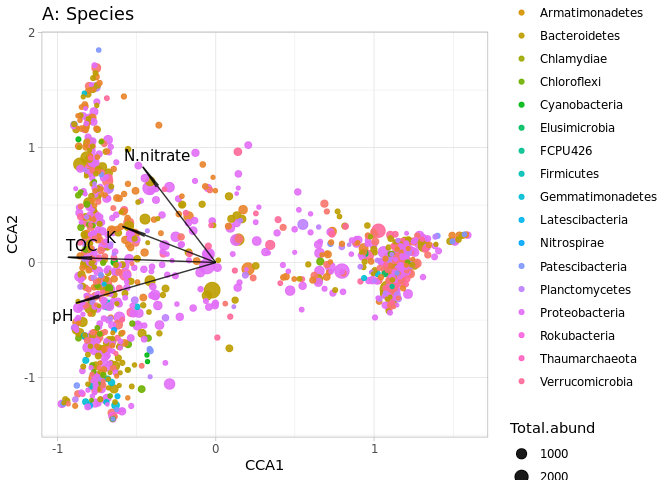

## Preparation

Merge samples to level with unique nutrition data. Sort the ASVs, select top 1000 or less. Check metadata at the map, fix it, if nessesary


```r
ps <- readRDS("ps.RData")

# we do not have propper column in metadata, create it
ps@sam_data$BioGroup <- paste0(ps@sam_data$Group, ".", ps@sam_data$BioRepeat)

ps.m <- merge_samples(ps, "BioGroup", fun = sum)
```

```
## Warning in asMethod(object): NAs introduced by coercion

## Warning in asMethod(object): NAs introduced by coercion

## Warning in asMethod(object): NAs introduced by coercion

## Warning in asMethod(object): NAs introduced by coercion

## Warning in asMethod(object): NAs introduced by coercion

## Warning in asMethod(object): NAs introduced by coercion
```

```r
ps.m@sam_data
```

```
##      SampleID Filename Group BioRepeat TechRepeat Location BioGroup
## U1.A       NA       NA    NA        NA         10       NA       NA
## U1.B       NA       NA    NA        NA         10       NA       NA
## U1.C       NA       NA    NA        NA         10       NA       NA
## U2.A       NA       NA    NA        NA         10       NA       NA
## U2.B       NA       NA    NA        NA         10       NA       NA
## U2.C       NA       NA    NA        NA         10       NA       NA
## U3.A       NA       NA    NA        NA         10       NA       NA
## U3.B       NA       NA    NA        NA         10       NA       NA
## U3.C       NA       NA    NA        NA         10       NA       NA
```

Sample data is fucked, so read a new nutrition data instead of it


```r
agro <- read.csv("agrochem_map.csv")
rownames(agro) <- agro$SampleID
agro
```

```
##      SampleID         Location  TOC  pH    P   K N.ammonium N.nitrate
## U1.A     U1.A      Quarry Clay 1.45 6.8 42.0 369      98.60     15.20
## U1.B     U1.B      Quarry Clay 1.56 7.0  7.3 337      44.30      1.59
## U1.C     U1.C      Quarry Clay 1.21 6.9 36.0 885      93.00     12.40
## U2.A     U2.A    Forest Global 0.66 6.4 46.0  59       7.62      2.50
## U2.B     U2.B    Forest Global 0.87 5.9 52.0 188      10.30      2.24
## U2.C     U2.C    Forest Global 0.55 5.5 67.0 296      19.20      0.77
## U3.A     U3.A Quarry Limestone 1.22 7.3  4.7 785       3.76      0.73
## U3.B     U3.B Quarry Limestone 1.34 7.5  6.8 118       9.36      1.38
## U3.C     U3.C Quarry Limestone 1.12 7.4  2.1 240       4.26      4.65
```

```r
sample_data(ps.m) <- sample_data(agro)
```

## Made CCA model


```r
veganifyOTU <- function(physeq){
  require(phyloseq)
  if(taxa_are_rows(physeq)){physeq <- t(physeq)}
  return(as(otu_table(physeq), "matrix"))
}

ps.top1k <- prune_taxa(names(sort(taxa_sums(ps.m), TRUE)[1:1000]), ps.m)
X <- veganifyOTU(ps.top1k)
  
vare.cca <- vegan::cca(X ~ TOC + pH + P + K + N.ammonium + N.nitrate, data=agro)
anova(vare.cca)
```

```
## Permutation test for cca under reduced model
## Permutation: free
## Number of permutations: 999
## 
## Model: cca(formula = X ~ TOC + pH + P + K + N.ammonium + N.nitrate, data = agro)
##          Df ChiSquare      F Pr(>F)  
## Model     6    1.7336 1.5784  0.056 .
## Residual  2    0.3661                
## ---
## Signif. codes:  0 '***' 0.001 '**' 0.01 '*' 0.05 '.' 0.1 ' ' 1
```

Model is invalid :( Ok, let's see closely - it can de tuned


```r
anova(vare.cca, by="terms") # just one valid predictor
```

```
## Permutation test for cca under reduced model
## Terms added sequentially (first to last)
## Permutation: free
## Number of permutations: 999
## 
## Model: cca(formula = X ~ TOC + pH + P + K + N.ammonium + N.nitrate, data = agro)
##            Df ChiSquare      F Pr(>F)   
## TOC         1   0.61556 3.3628  0.003 **
## pH          1   0.28928 1.5803  0.137   
## P           1   0.26219 1.4323  0.212   
## K           1   0.18946 1.0350  0.416   
## N.ammonium  1   0.20016 1.0935  0.382   
## N.nitrate   1   0.17692 0.9665  0.488   
## Residual    2   0.36610                 
## ---
## Signif. codes:  0 '***' 0.001 '**' 0.01 '*' 0.05 '.' 0.1 ' ' 1
```

```r
vif.cca(vare.cca) # lots of multicollinear predictors
```

```
##        TOC         pH          P          K N.ammonium  N.nitrate 
##  12.619744  27.160608  44.737806   2.242099  19.243336  12.252530
```
Drop predictors one by one, according to: 1) max VIF value, 2) insignificant in anova


```r
vare.cca <- vegan::cca(X ~ TOC + pH + K + N.ammonium + N.nitrate, data=agro) # drop P
anova(vare.cca)
```

```
## Permutation test for cca under reduced model
## Permutation: free
## Number of permutations: 999
## 
## Model: cca(formula = X ~ TOC + pH + K + N.ammonium + N.nitrate, data = agro)
##          Df ChiSquare      F Pr(>F)  
## Model     5   1.54158 1.6573  0.023 *
## Residual  3   0.55809                
## ---
## Signif. codes:  0 '***' 0.001 '**' 0.01 '*' 0.05 '.' 0.1 ' ' 1
```

```r
anova(vare.cca, by="terms") # still one valid predictor
```

```
## Permutation test for cca under reduced model
## Terms added sequentially (first to last)
## Permutation: free
## Number of permutations: 999
## 
## Model: cca(formula = X ~ TOC + pH + K + N.ammonium + N.nitrate, data = agro)
##            Df ChiSquare      F Pr(>F)   
## TOC         1   0.61556 3.3089  0.008 **
## pH          1   0.28928 1.5550  0.121   
## K           1   0.19735 1.0608  0.401   
## N.ammonium  1   0.25301 1.3601  0.191   
## N.nitrate   1   0.18638 1.0019  0.433   
## Residual    3   0.55809                 
## ---
## Signif. codes:  0 '***' 0.001 '**' 0.01 '*' 0.05 '.' 0.1 ' ' 1
```

```r
vif.cca(vare.cca) # keep dropping
```

```
##        TOC         pH          K N.ammonium  N.nitrate 
##   6.627632   5.836973   1.845574  16.261543  10.182854
```
keep dropping. Valid VIF is ~<10-12


```r
vare.cca <- vegan::cca(X ~ TOC + pH + K + N.nitrate, data=agro) # drop N.ammonium
anova(vare.cca)
```

```
## Permutation test for cca under reduced model
## Permutation: free
## Number of permutations: 999
## 
## Model: cca(formula = X ~ TOC + pH + K + N.nitrate, data = agro)
##          Df ChiSquare      F Pr(>F)   
## Model     4   1.35968 1.8374  0.008 **
## Residual  4   0.73999                 
## ---
## Signif. codes:  0 '***' 0.001 '**' 0.01 '*' 0.05 '.' 0.1 ' ' 1
```

```r
anova(vare.cca, by="terms") # still one valid predictor
```

```
## Permutation test for cca under reduced model
## Terms added sequentially (first to last)
## Permutation: free
## Number of permutations: 999
## 
## Model: cca(formula = X ~ TOC + pH + K + N.nitrate, data = agro)
##           Df ChiSquare      F Pr(>F)   
## TOC        1   0.61556 3.3274  0.004 **
## pH         1   0.28928 1.5637  0.124   
## K          1   0.19735 1.0668  0.349   
## N.nitrate  1   0.25750 1.3919  0.163   
## Residual   4   0.73999                 
## ---
## Signif. codes:  0 '***' 0.001 '**' 0.01 '*' 0.05 '.' 0.1 ' ' 1
```

```r
vif.cca(vare.cca) # keep dropping
```

```
##       TOC        pH         K N.nitrate 
##  3.097511  2.695779  1.346477  1.476320
```
VIF is good, model is valid with one significant predictor

## Plot CCA

Our model contain three types of data:

 * CCA coordinates for the samples
 * CCA coordinates for the ASVs
 * CCA coordinates for the agrochemical vectors.
 
Enrich the model using metadata: taxonomy for ASVs, metadata for samples


```r
cca.data <- fortify(vare.cca)

cca.taxa <- cca.data %>% 
  filter(Score == "species") %>%
  inner_join(ps.top1k@tax_table %>% data.frame() %>% mutate(OTU = rownames(.)), 
             by = c("Label" = "OTU"))
cca.biplot <- cca.data %>% 
  filter(Score == "biplot")
cca.sites <- cca.data %>% 
  filter(Score == "sites") %>% 
  inner_join(ps.m@sam_data %>% data.frame() %>% select(Location, SampleID) %>% distinct(),
             by = c("Label" = "SampleID"))
```


```r
# plot species
ggplot() +
  geom_point(data=cca.taxa %>% 
               inner_join(data.frame(OTU = names(taxa_sums(ps.top1k)),
                                     Total.abund = taxa_sums(ps.top1k)),
                          by = c("Label" = "OTU")),
             aes(x=CCA1, y=CCA2, color=Phylum, size=Total.abund), alpha=0.9) +
  geom_segment(data = cca.biplot, 
               aes(x = 0, xend = CCA1, y = 0, yend = CCA2), 
               alpha=0.8, color = "black",arrow = arrow(angle = 3)) +
  geom_text_repel(data = cca.biplot, aes(x=CCA1, y=CCA2, label= Label), size=4) +
  theme_light() +
  ggtitle("A: Species")
```

<!-- -->

```r
# plot samples
ggplot() +
  geom_point(data=cca.sites, aes(x=CCA1, y=CCA2, color=Location), size=3, alpha=0.7) +
  geom_segment(data = cca.biplot, 
               aes(x = 0, xend = CCA1, y = 0, yend = CCA2), 
               alpha=0.8, color = "black",arrow = arrow(angle = 3)) +
  geom_text_repel(data = cca.biplot, aes(x=CCA1, y=CCA2, label= Label), size=4) +
  theme_light() +
  ggtitle("B. Samples")
```

<!-- -->

