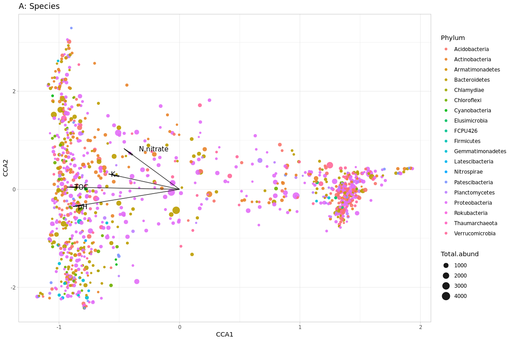

## Preparation

Merge samples to level with unique nutrition data. Check the metadata at the map and fix it, if necessary


```r
ps <- readRDS("ps.RData")

# we do not have proper column in metadata, so create it
ps@sam_data$BioGroup <- paste0(ps@sam_data$Group, ".", ps@sam_data$BioRepeat)

ps.m <- merge_samples(ps, "BioGroup", fun = sum)
```

```
## Warning in asMethod(object): NAs introduced by coercion

## Warning in asMethod(object): NAs introduced by coercion

## Warning in asMethod(object): NAs introduced by coercion

## Warning in asMethod(object): NAs introduced by coercion

## Warning in asMethod(object): NAs introduced by coercion

## Warning in asMethod(object): NAs introduced by coercion
```

```r
ps.m@sam_data
```

```
##      SampleID Filename Group BioRepeat TechRepeat Location BioGroup
## U1.A       NA       NA    NA        NA         10       NA       NA
## U1.B       NA       NA    NA        NA         10       NA       NA
## U1.C       NA       NA    NA        NA         10       NA       NA
## U2.A       NA       NA    NA        NA         10       NA       NA
## U2.B       NA       NA    NA        NA         10       NA       NA
## U2.C       NA       NA    NA        NA         10       NA       NA
## U3.A       NA       NA    NA        NA         10       NA       NA
## U3.B       NA       NA    NA        NA         10       NA       NA
## U3.C       NA       NA    NA        NA         10       NA       NA
```

The sample data are fucked, so get new nutrition data instead of it...


```r
agro <- read.csv("agrochem_map.csv")
rownames(agro) <- agro$SampleID
agro
```

```
##      SampleID Replica         Location  TOC  pH    P   K N.ammonium N.nitrate
## U1.A     U1.A       A      Quarry Clay 1.45 6.8 42.0 369      98.60     15.20
## U1.B     U1.B       B      Quarry Clay 1.56 7.0  7.3 337      44.30      1.59
## U1.C     U1.C       C      Quarry Clay 1.21 6.9 36.0 885      93.00     12.40
## U2.A     U2.A       A    Forest Global 0.66 6.4 46.0  59       7.62      2.50
## U2.B     U2.B       B    Forest Global 0.87 5.9 52.0 188      10.30      2.24
## U2.C     U2.C       C    Forest Global 0.55 5.5 67.0 296      19.20      0.77
## U3.A     U3.A       A Quarry Limestone 1.22 7.3  4.7 785       3.76      0.73
## U3.B     U3.B       B Quarry Limestone 1.34 7.5  6.8 118       9.36      1.38
## U3.C     U3.C       C Quarry Limestone 1.12 7.4  2.1 240       4.26      4.65
```

```r
sample_data(ps.m) <- sample_data(agro)
```

## Made CCA model

For a CCA model sort the ASVs, and select top-1000 or less. 


```r
veganifyOTU <- function(physeq){
  require(phyloseq)
  if(taxa_are_rows(physeq)){physeq <- t(physeq)}
  return(as(otu_table(physeq), "matrix"))
}

ps.top1k <- prune_taxa(names(sort(taxa_sums(ps.m), TRUE)[1:1000]), ps.m)
X <- veganifyOTU(ps.top1k)
  
vare.cca <- vegan::cca(X ~ TOC + pH + P + K + N.ammonium + N.nitrate, data=agro)
anova(vare.cca)
```

```
## Permutation test for cca under reduced model
## Permutation: free
## Number of permutations: 999
## 
## Model: cca(formula = X ~ TOC + pH + P + K + N.ammonium + N.nitrate, data = agro)
##          Df ChiSquare      F Pr(>F)  
## Model     6    1.7336 1.5784  0.056 .
## Residual  2    0.3661                
## ---
## Signif. codes:  0 '***' 0.001 '**' 0.01 '*' 0.05 '.' 0.1 ' ' 1
```

Model is invalid :( Ok, let's see it closely - it can be tuned


```r
anova(vare.cca, by="terms") # just one valid predictor
```

```
## Permutation test for cca under reduced model
## Terms added sequentially (first to last)
## Permutation: free
## Number of permutations: 999
## 
## Model: cca(formula = X ~ TOC + pH + P + K + N.ammonium + N.nitrate, data = agro)
##            Df ChiSquare      F Pr(>F)   
## TOC         1   0.61556 3.3628  0.003 **
## pH          1   0.28928 1.5803  0.137   
## P           1   0.26219 1.4323  0.212   
## K           1   0.18946 1.0350  0.416   
## N.ammonium  1   0.20016 1.0935  0.382   
## N.nitrate   1   0.17692 0.9665  0.488   
## Residual    2   0.36610                 
## ---
## Signif. codes:  0 '***' 0.001 '**' 0.01 '*' 0.05 '.' 0.1 ' ' 1
```

```r
vif.cca(vare.cca) # lots of multicollinear predictors
```

```
##        TOC         pH          P          K N.ammonium  N.nitrate 
##  12.619744  27.160608  44.737806   2.242099  19.243336  12.252530
```

Drop predictors one by one, according to: 1) max VIF value, 2) insignificance in ANOVA


```r
vare.cca <- vegan::cca(X ~ TOC + pH + K + N.ammonium + N.nitrate, data=agro) # drop P
anova(vare.cca)
```

```
## Permutation test for cca under reduced model
## Permutation: free
## Number of permutations: 999
## 
## Model: cca(formula = X ~ TOC + pH + K + N.ammonium + N.nitrate, data = agro)
##          Df ChiSquare      F Pr(>F)  
## Model     5   1.54158 1.6573  0.023 *
## Residual  3   0.55809                
## ---
## Signif. codes:  0 '***' 0.001 '**' 0.01 '*' 0.05 '.' 0.1 ' ' 1
```

```r
anova(vare.cca, by="terms") # still one valid predictor
```

```
## Permutation test for cca under reduced model
## Terms added sequentially (first to last)
## Permutation: free
## Number of permutations: 999
## 
## Model: cca(formula = X ~ TOC + pH + K + N.ammonium + N.nitrate, data = agro)
##            Df ChiSquare      F Pr(>F)   
## TOC         1   0.61556 3.3089  0.008 **
## pH          1   0.28928 1.5550  0.121   
## K           1   0.19735 1.0608  0.401   
## N.ammonium  1   0.25301 1.3601  0.191   
## N.nitrate   1   0.18638 1.0019  0.433   
## Residual    3   0.55809                 
## ---
## Signif. codes:  0 '***' 0.001 '**' 0.01 '*' 0.05 '.' 0.1 ' ' 1
```

```r
vif.cca(vare.cca) # keep dropping
```

```
##        TOC         pH          K N.ammonium  N.nitrate 
##   6.627632   5.836973   1.845574  16.261543  10.182854
```

keep dropping. Valid VIF is ~<10-12


```r
vare.cca <- vegan::cca(X ~ TOC + pH + K + N.nitrate, data=agro) # drop N.ammonium
anova(vare.cca)
```

```
## Permutation test for cca under reduced model
## Permutation: free
## Number of permutations: 999
## 
## Model: cca(formula = X ~ TOC + pH + K + N.nitrate, data = agro)
##          Df ChiSquare      F Pr(>F)   
## Model     4   1.35968 1.8374  0.008 **
## Residual  4   0.73999                 
## ---
## Signif. codes:  0 '***' 0.001 '**' 0.01 '*' 0.05 '.' 0.1 ' ' 1
```

```r
anova(vare.cca, by="terms") # still one valid predictor
```

```
## Permutation test for cca under reduced model
## Terms added sequentially (first to last)
## Permutation: free
## Number of permutations: 999
## 
## Model: cca(formula = X ~ TOC + pH + K + N.nitrate, data = agro)
##           Df ChiSquare      F Pr(>F)   
## TOC        1   0.61556 3.3274  0.004 **
## pH         1   0.28928 1.5637  0.124   
## K          1   0.19735 1.0668  0.349   
## N.nitrate  1   0.25750 1.3919  0.163   
## Residual   4   0.73999                 
## ---
## Signif. codes:  0 '***' 0.001 '**' 0.01 '*' 0.05 '.' 0.1 ' ' 1
```

```r
vif.cca(vare.cca) # keep dropping
```

```
##       TOC        pH         K N.nitrate 
##  3.097511  2.695779  1.346477  1.476320
```

VIF is good, model is valid with one significant predictor


```r
vare.cca
```

```
## Call: cca(formula = X ~ TOC + pH + K + N.nitrate, data = agro)
## 
##               Inertia Proportion Rank
## Total          2.0997     1.0000     
## Constrained    1.3597     0.6476    4
## Unconstrained  0.7400     0.3524    4
## Inertia is scaled Chi-square 
## 
## Eigenvalues for constrained axes:
##   CCA1   CCA2   CCA3   CCA4 
## 0.6787 0.3151 0.2291 0.1367 
## 
## Eigenvalues for unconstrained axes:
##     CA1     CA2     CA3     CA4 
## 0.27567 0.20219 0.16956 0.09257
```

## Plot CCA

Our model contain three types of data:

 * CCA coordinates for the samples (`vare.cca$CCA$u`)
 * CCA coordinates for the ASVs (`vare.cca$CCA$v`)
 * CCA coordinates for the agrochemical vectors (`vare.cca$CCA$biplot`).
 
Enrich the model using this information: taxonomy for ASVs, and metadata for samples


```r
ASVs.data <- vare.cca$CCA$v %>% 
               data.frame() %>% 
               mutate(ASV = rownames(.)) %>% 
               inner_join(data.frame(ASV = names(taxa_sums(ps.top1k)),
                                     Total.abund = taxa_sums(ps.top1k),
                                     ps.top1k@tax_table[,2], # Phylum
                                     ps.top1k@tax_table[,3], # Class
                                     ps.top1k@tax_table[,4],
                                     ps.top1k@tax_table[,5],
                                     ps.top1k@tax_table[,6]),
                          by = "ASV")

samples.data <- vare.cca$CCA$u %>% 
  data.frame() %>% 
  mutate(Names = rownames(.)) %>% 
  inner_join(ps.top1k@sam_data %>% 
               data.frame() %>% 
               mutate(Samples = rownames(.)), by = c("Names" = "Samples"))
```

Plot our data


```r
# plot ASVs
ggplot() +
  geom_point(data=ASVs.data,
             aes(x=CCA1, y=CCA2, color=Phylum, size=Total.abund), alpha=0.9) +
  geom_segment(data = vare.cca$CCA$biplot %>% data.frame(),
               aes(x = 0, xend = CCA1, y = 0, yend = CCA2),
               alpha=0.8, color = "black",arrow = arrow(angle = 3)) +
  geom_text(data = vare.cca$CCA$biplot %>%
                    data.frame() %>%
                    mutate(Label = rownames(.)),
            aes(x=CCA1, y=CCA2, label= Label,
                hjust = -0.5), size=4) +
  theme_light() +
  ggtitle("A: Species")
```

<!-- -->

```r
# plot samples
ggplot() +
  geom_point(data=samples.data, 
             aes(x=CCA1, y=CCA2, color=Location, shape=Replica), size=3, alpha=0.7) +
  geom_segment(data = vare.cca$CCA$biplot %>% data.frame(),
               aes(x = 0, xend = CCA1, y = 0, yend = CCA2),
               alpha=0.8, color = "black",arrow = arrow(angle = 3)) +
  geom_text(data = vare.cca$CCA$biplot %>%
                    data.frame() %>%
                    mutate(Label = rownames(.)),
            aes(x=CCA1, y=CCA2, label= Label,
                hjust = -0.5), size=4) +
  theme_light() +
  ggtitle("B. Samples")
```

<!-- -->

It is reasonable to filter minor phyla


```r
ASVs.data %>% 
  group_by(Phylum) %>% 
  summarize(sum = sum(Total.abund)) %>% 
  arrange(desc(sum))
```

```
## # A tibble: 19 × 2
##    Phylum              sum
##    <chr>             <dbl>
##  1 Proteobacteria   130209
##  2 Bacteroidetes     71192
##  3 Acidobacteria     41486
##  4 Actinobacteria    37025
##  5 Verrucomicrobia   22942
##  6 Planctomycetes    10531
##  7 Chloroflexi        6910
##  8 Patescibacteria    3139
##  9 Gemmatimonadetes   2772
## 10 Thaumarchaeota     1633
## 11 Firmicutes         1208
## 12 Cyanobacteria       780
## 13 Elusimicrobia       581
## 14 Latescibacteria     480
## 15 Rokubacteria        346
## 16 Nitrospirae         183
## 17 Chlamydiae          148
## 18 FCPU426             142
## 19 Armatimonadetes     136
```

```r
major.phyla <- ASVs.data %>% 
  group_by(Phylum) %>% 
  summarize(sum = sum(Total.abund)) %>% 
  arrange(desc(sum)) %>% 
  select(Phylum) %>% 
  head(10) %>% 
  as.vector()

# plot major ASVs
ggplot() +
  geom_point(data=ASVs.data %>% filter(Phylum %in% major.phyla$Phylum),
             aes(x=CCA1, y=CCA2, color=Phylum, size=Total.abund), alpha=0.9) +
  geom_segment(data = vare.cca$CCA$biplot %>% data.frame(),
               aes(x = 0, xend = CCA1, y = 0, yend = CCA2),
               alpha=0.8, color = "black",arrow = arrow(angle = 3)) +
  geom_text(data = vare.cca$CCA$biplot %>%
                    data.frame() %>%
                    mutate(Label = rownames(.)),
            aes(x=CCA1, y=CCA2, label= Label,
                hjust = -0.5), size=4) +
  theme_light() +
  theme(legend.position = "bottom") +
  ggtitle("A: Species")
```

<!-- -->

... or plot different phyla separately (uncomment labels to indicate ASV names)


```r
for (i in major.phyla$Phylum) {
  
  if (i == "Proteobacteria") {
    for (j in c("Deltaproteobacteria", "Alphaproteobacteria", "Gammaproteobacteria")){

      p <- ggplot() +
      geom_point(data=ASVs.data,
                 aes(x=CCA1, y=CCA2, size=Total.abund), alpha=0.2, color="grey80") +
      geom_point(data=ASVs.data %>% filter(Class == j),
                 aes(x=CCA1, y=CCA2, color=Family, size=Total.abund), alpha=0.9) +
#### comment this to remove labels ####
      geom_text(data=ASVs.data %>% filter(Class == j),
                 aes(x=CCA1, y=CCA2, color=Family, label=paste0('#', substring(ASV, 4))),
                size=3, nudge_y=0.1) +
####                               ####
      geom_segment(data = vare.cca$CCA$biplot %>% data.frame(),
                  aes(x = 0, xend = CCA1, y = 0, yend = CCA2),
                  alpha=0.8, color = "black",arrow = arrow(angle = 3)) +
      geom_text(data = vare.cca$CCA$biplot %>%
                        data.frame() %>%
                        mutate(Label = rownames(.)),
                aes(x=CCA1, y=CCA2, label= Label,
                    hjust = -0.5), size=4) +
      theme_light() +
      ggtitle(paste(i, " - ",j))
    print(p)
    }
  } else {
    
    p <- ggplot() +
      geom_point(data=ASVs.data,
                 aes(x=CCA1, y=CCA2, size=Total.abund), alpha=0.2, color="grey80") +
      geom_point(data=ASVs.data %>% filter(Phylum == i),
                 aes(x=CCA1, y=CCA2, color=Family, size=Total.abund), alpha=0.9) +
#### comment this to remove labels ####
      geom_text(data=ASVs.data %>% filter(Phylum == i),
                 aes(x=CCA1, y=CCA2, color=Family, label=paste0('#', substring(ASV, 4))),
                size=3, nudge_y=0.1) +
####                               ####
      geom_segment(data = vare.cca$CCA$biplot %>% data.frame(),
                   aes(x = 0, xend = CCA1, y = 0, yend = CCA2),
                   alpha=0.8, color = "black",arrow = arrow(angle = 3)) +
      geom_text(data = vare.cca$CCA$biplot %>%
                        data.frame() %>%
                        mutate(Label = rownames(.)),
                aes(x=CCA1, y=CCA2, label= Label,
                    hjust = -0.5), size=4) +
      theme_light() +
      ggtitle(i)
    print(p)
    }
}
```

<!-- --><!-- --><!-- --><!-- --><!-- --><!-- --><!-- --><!-- --><!-- --><!-- --><!-- --><!-- -->


