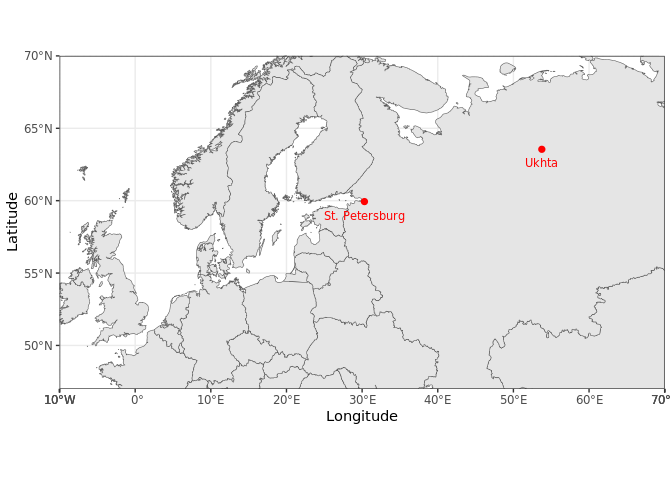
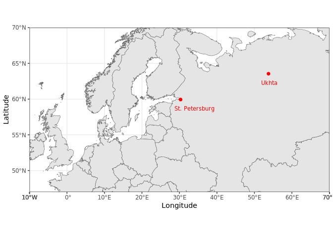

## Plotting geolocation of samples

Set the `xlim` and `ylim` according to the frame and scale of your mapping.

Fit the labels position manually in case of overlapping.


```r
probdata = data.frame(Site = c("Ukhta", "St. Petersburg"),
                  Longitude = c(53.757, 30.308), 
                  Latitude =  c(63.548, 59.937),
                  xlabel = c(54, 34),
                  ylabel = c(63.2, 59.6))

probdata
```

```
##             Site Longitude Latitude xlabel ylabel
## 1          Ukhta    53.757   63.548     54   63.2
## 2 St. Petersburg    30.308   59.937     34   59.6
```

For the labels is possible to use `Longitude` and `Latitude` coordinates, or tune them them in `xlabel` and `ylabel`


```r
world <- ne_countries(scale = "large", returnclass = "sf")
spdf.ru.geounit <- ne_countries(geounit = 'russia', returnclass = "sf")


 ggplot(data = world) + 
  geom_sf() +
  coord_sf(xlim = c(-10, 70), ylim = c(47, 70), expand = FALSE) +
  geom_point(data = probdata, aes(x = Longitude, y = Latitude), size = 3, 
  shape = 20, colour = "red") +
  geom_text(data = probdata, aes(x = Longitude, y = Latitude, label = Site), 
            vjust=2, size = 3, colour="red") + 
  theme_bw()
```

<!-- -->

```r
ggplot(data = world) + 
  geom_sf() +
  coord_sf(xlim = c(-10, 70), ylim = c(47, 70), expand = FALSE) +
  geom_point(data = probdata, aes(x = Longitude, y = Latitude), size = 3, 
  shape = 20, colour = "red") +
  geom_text(data = probdata, aes(x = xlabel, y = ylabel, label = Site), 
            vjust=2, size = 3, colour="red") + 
  theme_bw()
```

<!-- -->
