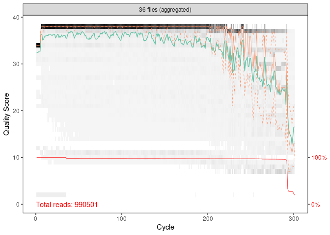
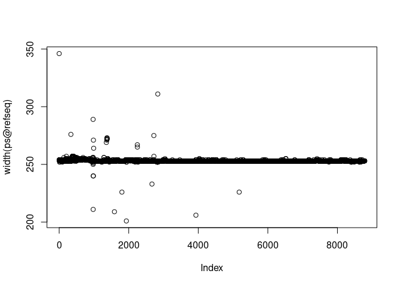

## Intro

This pipeline offers an attempt to standardize procedure of soil 16S rDNA Illumina reads processing in ARRIAM. Most operations are performed by R libraries and are covered in functions. Here we talk about the most common way of the analysis - for the tuning or for more details you have to manipulate with the functions themselves, in [functions.R](/functions.R) or use them for the building of your own pipeline. 

As a rule, raw reads processing is more conservative, whereas the EDA and the plotting require more tuning. Routinely I use [functions](/functions.R) for the raw reads processing, and then use the [EDA](/eda.md) template for the EDA. In the template where I can directly modify any function according to my needs.

I also strongly recommend to save the data in `.RData` files after merging the phyloseq object.

Required libraries:

* [dada2](https://benjjneb.github.io/dada2/tutorial.html)
* [Biostrings](https://bioconductor.org/packages/release/bioc/html/Biostrings.html)
* [DECIPHER](https://bioconductor.org/packages/release/bioc/html/DECIPHER.html)
* [phyloseq](https://joey711.github.io/phyloseq/)
* [ggplot2](https://ggplot2.tidyverse.org/)
* [ggpubr](https://rpkgs.datanovia.com/ggpubr/)
* [dplyr](https://dplyr.tidyverse.org/)
* [DESeq2](http://bioconductor.org/packages/release/bioc/html/DESeq2.html)


---

## Libraries and functions import

Load required libraries. Please, install them, if you don't have it. Also, import functions, set your working directory and the random seed.

In our test data, we will see at the microbial communities on abandoned and reclaimed 
mining sites in the Komi Republic (data are obtained from [this article](https://doi.org/10.3390/microorganisms11030720)).


```r
library(dada2)
library(Biostrings)
library(DECIPHER)
library(phyloseq)
library(tidyverse)


source('functions.R')
set.seed(5678)

setwd('~/Analysis/16s-amplicon-processing/')
```


---

## Dada2 processing of sequences

For processing of data, we need to specify a way to raw data, and file with metadata (information about samples). In our example, raw files are in `/raw` directory, and metadata in `metadata.csv` file of current work directory.

Functions in this module are:

#### Read metadata

`read_metadata(filename, sample.names, ...)`

Read a metadata file, add desirable sample names to rownames (it is important for the downstream analysis). It is reasonable to use patterns for the fast identification of samples. For example, in this dataset the pattern is <GROUP>.<BIOREPEAT>.<TRCHREPEAT> (U2.A.2, or U1.C.3), so the name itself is enough for the complete identification of the sample.

* `filename` - name of metadata file
* `sample.names` - column with names, which you want to see in downstream analysis. Be sure, that names are unique
* `...` - you also can pass any information to `read.csv()` function (for example, the separator `sep=("\t")`)
* return a dataframe, rownames are from `sample.names` column


```r
mdat <- read_metadata(filename = 'map.csv',
                      sample.names = "SampleID",
                      sep = '\t')
mdat
```

```
##        SampleID           Filename Group BioRepeat TechRepeat         Location
## U1.A.1   U1.A.1 Abakumov-SEQ126-37    U1         A          1      Quarry Clay
## U1.A.2   U1.A.2 Abakumov-SEQ126-38    U1         A          2      Quarry Clay
## U1.A.3   U1.A.3 Abakumov-SEQ126-39    U1         A          3      Quarry Clay
## U1.A.4   U1.A.4 Abakumov-SEQ126-40    U1         A          4      Quarry Clay
## U1.B.1   U1.B.1 Abakumov-SEQ126-41    U1         B          1      Quarry Clay
## U1.B.2   U1.B.2 Abakumov-SEQ126-42    U1         B          2      Quarry Clay
## U1.B.3   U1.B.3 Abakumov-SEQ126-43    U1         B          3      Quarry Clay
## U1.B.4   U1.B.4 Abakumov-SEQ126-44    U1         B          4      Quarry Clay
## U1.C.1   U1.C.1 Abakumov-SEQ126-45    U1         C          1      Quarry Clay
## U1.C.2   U1.C.2 Abakumov-SEQ126-46    U1         C          2      Quarry Clay
## U1.C.3   U1.C.3 Abakumov-SEQ126-47    U1         C          3      Quarry Clay
## U1.C.4   U1.C.4 Abakumov-SEQ126-48    U1         C          4      Quarry Clay
## U2.A.1   U2.A.1 Abakumov-SEQ126-49    U2         A          1    Forest Global
## U2.A.2   U2.A.2 Abakumov-SEQ126-50    U2         A          2    Forest Global
## U2.A.3   U2.A.3 Abakumov-SEQ126-51    U2         A          3    Forest Global
## U2.A.4   U2.A.4 Abakumov-SEQ126-52    U2         A          4    Forest Global
## U2.B.1   U2.B.1 Abakumov-SEQ126-53    U2         B          1    Forest Global
## U2.B.2   U2.B.2 Abakumov-SEQ126-54    U2         B          2    Forest Global
## U2.B.3   U2.B.3 Abakumov-SEQ126-55    U2         B          3    Forest Global
## U2.B.4   U2.B.4 Abakumov-SEQ126-56    U2         B          4    Forest Global
## U2.C.1   U2.C.1 Abakumov-SEQ126-57    U2         C          1    Forest Global
## U2.C.2   U2.C.2 Abakumov-SEQ126-58    U2         C          2    Forest Global
## U2.C.3   U2.C.3 Abakumov-SEQ126-59    U2         C          3    Forest Global
## U2.C.4   U2.C.4 Abakumov-SEQ126-60    U2         C          4    Forest Global
## U3.A.1   U3.A.1 Abakumov-SEQ126-61    U3         A          1 Quarry Limestone
## U3.A.2   U3.A.2 Abakumov-SEQ126-62    U3         A          2 Quarry Limestone
## U3.A.3   U3.A.3 Abakumov-SEQ126-63    U3         A          3 Quarry Limestone
## U3.A.4   U3.A.4 Abakumov-SEQ126-64    U3         A          4 Quarry Limestone
## U3.B.1   U3.B.1 Abakumov-SEQ126-65    U3         B          1 Quarry Limestone
## U3.B.2   U3.B.2 Abakumov-SEQ126-66    U3         B          2 Quarry Limestone
## U3.B.3   U3.B.3 Abakumov-SEQ126-67    U3         B          3 Quarry Limestone
## U3.B.4   U3.B.4 Abakumov-SEQ126-68    U3         B          4 Quarry Limestone
## U3.C.1   U3.C.1 Abakumov-SEQ126-69    U3         C          1 Quarry Limestone
## U3.C.2   U3.C.2 Abakumov-SEQ126-70    U3         C          2 Quarry Limestone
## U3.C.3   U3.C.3 Abakumov-SEQ126-71    U3         C          3 Quarry Limestone
## U3.C.4   U3.C.4 Abakumov-SEQ126-72    U3         C          4 Quarry Limestone
```

#### dada2 pipeline 

`reads_to_seqtable_by_dada2(raw_files_path, trimLeft, truncLen, pool=TRUE, cores=TRUE)`

Process reads, plot quality data and show basic stats by all steps (also saves it to `processing.log` file).

* `raw_files_path` - source to raw .fastq.gz files
* `trimLeft` - if you want to cut primers from ends, use this variable as vector - c(len_forward, len_reverse)
* `truncLen` - specify the maximum length of reads, also use this variable as vector
* `pool` - pooling strategy. Options are `TRUE`, `"pseudo"` or `FALSE`. See [dada2](https://benjjneb.github.io/dada2/tutorial.html) manual.
* `cores` - number of cores for analysis. Use `TRUE` for all available
* return ASV table and their abundance in samples


```r
seqtab <- reads_to_seqtable_by_dada2(raw_files_path = 'raw',
                                     trimLeft = c(19, 20), 
                                     truncLen = c(220,180),
                                     cores = 30)
```

```
##  [1] "Abakumov-SEQ126-37" "Abakumov-SEQ126-38" "Abakumov-SEQ126-39"
##  [4] "Abakumov-SEQ126-40" "Abakumov-SEQ126-41" "Abakumov-SEQ126-42"
##  [7] "Abakumov-SEQ126-43" "Abakumov-SEQ126-44" "Abakumov-SEQ126-45"
## [10] "Abakumov-SEQ126-46" "Abakumov-SEQ126-47" "Abakumov-SEQ126-48"
## [13] "Abakumov-SEQ126-49" "Abakumov-SEQ126-50" "Abakumov-SEQ126-51"
## [16] "Abakumov-SEQ126-52" "Abakumov-SEQ126-53" "Abakumov-SEQ126-54"
## [19] "Abakumov-SEQ126-55" "Abakumov-SEQ126-56" "Abakumov-SEQ126-57"
## [22] "Abakumov-SEQ126-58" "Abakumov-SEQ126-59" "Abakumov-SEQ126-60"
## [25] "Abakumov-SEQ126-61" "Abakumov-SEQ126-62" "Abakumov-SEQ126-63"
## [28] "Abakumov-SEQ126-64" "Abakumov-SEQ126-65" "Abakumov-SEQ126-66"
## [31] "Abakumov-SEQ126-67" "Abakumov-SEQ126-68" "Abakumov-SEQ126-69"
## [34] "Abakumov-SEQ126-70" "Abakumov-SEQ126-71" "Abakumov-SEQ126-72"
```

<!-- -->

```
## 102604671 total bases in 510471 reads from 20 samples will be used for learning the error rates.
## 101139680 total bases in 632123 reads from 25 samples will be used for learning the error rates.
## 36 samples were pooled: 883946 reads in 334985 unique sequences.
## 36 samples were pooled: 883946 reads in 344623 unique sequences.
```

```
## 18945 paired-reads (in 3633 unique pairings) successfully merged out of 24031 (in 7742 pairings) input.
```

```
## 19349 paired-reads (in 3740 unique pairings) successfully merged out of 24346 (in 7827 pairings) input.
```

```
## 17509 paired-reads (in 3573 unique pairings) successfully merged out of 21803 (in 7094 pairings) input.
```

```
## 17557 paired-reads (in 3610 unique pairings) successfully merged out of 22167 (in 7442 pairings) input.
```

```
## 19504 paired-reads (in 3383 unique pairings) successfully merged out of 23786 (in 6831 pairings) input.
```

```
## 18633 paired-reads (in 3127 unique pairings) successfully merged out of 22954 (in 6555 pairings) input.
```

```
## 18660 paired-reads (in 3380 unique pairings) successfully merged out of 23382 (in 7133 pairings) input.
```

```
## 18466 paired-reads (in 3205 unique pairings) successfully merged out of 22604 (in 6470 pairings) input.
```

```
## 19138 paired-reads (in 3569 unique pairings) successfully merged out of 24200 (in 7662 pairings) input.
```

```
## 27827 paired-reads (in 4031 unique pairings) successfully merged out of 36641 (in 10777 pairings) input.
```

```
## 33855 paired-reads (in 4455 unique pairings) successfully merged out of 42559 (in 11112 pairings) input.
```

```
## 16972 paired-reads (in 3561 unique pairings) successfully merged out of 21574 (in 7355 pairings) input.
```

```
## 18570 paired-reads (in 2527 unique pairings) successfully merged out of 21123 (in 4531 pairings) input.
```

```
## 19749 paired-reads (in 2607 unique pairings) successfully merged out of 22665 (in 4824 pairings) input.
```

```
## 18313 paired-reads (in 2576 unique pairings) successfully merged out of 21035 (in 4661 pairings) input.
```

```
## 20162 paired-reads (in 2578 unique pairings) successfully merged out of 22726 (in 4568 pairings) input.
```

```
## 19598 paired-reads (in 3081 unique pairings) successfully merged out of 22078 (in 5021 pairings) input.
```

```
## 18637 paired-reads (in 3089 unique pairings) successfully merged out of 21183 (in 5159 pairings) input.
```

```
## 19984 paired-reads (in 3112 unique pairings) successfully merged out of 22754 (in 5344 pairings) input.
```

```
## 18900 paired-reads (in 3088 unique pairings) successfully merged out of 21556 (in 5201 pairings) input.
```

```
## 18435 paired-reads (in 3123 unique pairings) successfully merged out of 22005 (in 6114 pairings) input.
```

```
## 19969 paired-reads (in 3303 unique pairings) successfully merged out of 24053 (in 6609 pairings) input.
```

```
## 20223 paired-reads (in 3285 unique pairings) successfully merged out of 25091 (in 7288 pairings) input.
```

```
## 19371 paired-reads (in 3259 unique pairings) successfully merged out of 23361 (in 6532 pairings) input.
```

```
## 17942 paired-reads (in 3557 unique pairings) successfully merged out of 21329 (in 6372 pairings) input.
```

```
## 17892 paired-reads (in 3590 unique pairings) successfully merged out of 21916 (in 6896 pairings) input.
```

```
## 19332 paired-reads (in 3576 unique pairings) successfully merged out of 22907 (in 6464 pairings) input.
```

```
## 17770 paired-reads (in 3737 unique pairings) successfully merged out of 21641 (in 6982 pairings) input.
```

```
## 18716 paired-reads (in 3589 unique pairings) successfully merged out of 22449 (in 6663 pairings) input.
```

```
## 20368 paired-reads (in 3732 unique pairings) successfully merged out of 24790 (in 7274 pairings) input.
```

```
## 17666 paired-reads (in 3497 unique pairings) successfully merged out of 21614 (in 6603 pairings) input.
```

```
## 20558 paired-reads (in 3642 unique pairings) successfully merged out of 24826 (in 7065 pairings) input.
```

```
## 16499 paired-reads (in 3484 unique pairings) successfully merged out of 20277 (in 6634 pairings) input.
```

```
## 13485 paired-reads (in 3129 unique pairings) successfully merged out of 16801 (in 5942 pairings) input.
```

```
## 17511 paired-reads (in 3540 unique pairings) successfully merged out of 21603 (in 6959 pairings) input.
```

```
## 16221 paired-reads (in 3487 unique pairings) successfully merged out of 20161 (in 6810 pairings) input.
```

```
## Identified 1042 bimeras out of 10642 input sequences.
```

<!-- -->

```
##                    input filtered denoisedF denoisedR merged nonchim
## Abakumov-SEQ126-37 27639    25311     24580     24646  18945   17874
## Abakumov-SEQ126-38 28203    25533     24876     24880  19349   18268
## Abakumov-SEQ126-39 25157    22983     22327     22361  17509   16567
## Abakumov-SEQ126-40 25821    23275     22650     22669  17557   16679
## Abakumov-SEQ126-41 27781    25097     24320     24411  19504   18740
## Abakumov-SEQ126-42 27055    24337     23511     23622  18633   17831
## Abakumov-SEQ126-43 27012    24774     23958     24054  18660   17887
## Abakumov-SEQ126-44 26331    23827     23109     23177  18466   17718
## Abakumov-SEQ126-45 27633    25472     24736     24828  19138   18016
## Abakumov-SEQ126-46 42900    38733     37562     37628  27827   25996
## Abakumov-SEQ126-47 49205    44695     43446     43585  33855   32094
## Abakumov-SEQ126-48 25012    22718     22053     22132  16972   16040
## Abakumov-SEQ126-49 25876    22225     21602     21552  18570   18240
## Abakumov-SEQ126-50 27769    23848     23206     23110  19749   19320
## Abakumov-SEQ126-51 25147    22136     21527     21460  18313   17963
## Abakumov-SEQ126-52 27214    23799     23192     23142  20162   19790
## Abakumov-SEQ126-53 26026    23088     22536     22460  19598   19154
## Abakumov-SEQ126-54 25524    22234     21637     21603  18637   18260
## Abakumov-SEQ126-55 26991    23803     23232     23165  19984   19476
## Abakumov-SEQ126-56 26017    22583     22007     21939  18900   18474
## Abakumov-SEQ126-57 26040    23084     22479     22468  18435   17717
## Abakumov-SEQ126-58 28370    25194     24557     24547  19969   19176
## Abakumov-SEQ126-59 28834    26335     25660     25643  20223   19281
## Abakumov-SEQ126-60 27774    24584     23866     23875  19371   18641
## Abakumov-SEQ126-61 25212    22455     21819     21796  17942   17404
## Abakumov-SEQ126-62 26391    23199     22481     22471  17892   17231
## Abakumov-SEQ126-63 27161    24125     23424     23414  19332   18737
## Abakumov-SEQ126-64 26159    22796     22141     22142  17770   17188
## Abakumov-SEQ126-65 26856    23724     22957     23038  18716   18259
## Abakumov-SEQ126-66 29415    26111     25288     25426  20368   19459
## Abakumov-SEQ126-67 25731    22912     22159     22204  17666   17264
## Abakumov-SEQ126-68 29389    26117     25351     25409  20558   19989
## Abakumov-SEQ126-69 23722    21273     20708     20736  16499   15600
## Abakumov-SEQ126-70 19804    17637     17183     17154  13485   12864
## Abakumov-SEQ126-71 25447    22674     22071     22098  17511   16693
## Abakumov-SEQ126-72 23883    21255     20645     20664  16221   15475
```

Looks good :)

### Rename ASV table

`rename_seqtab_by_metadata(seqtab, metadata, old.names)`

According dada2 pipeline, default names of samples in seqtable are derived from names of the raw files. In most cases, these names are useless, so we have to rename samples according our desirable names from the metadata.

* `seqtab` - ASV table from `reads_to_seqtable_by_dada2` function
* `metadata` - metadata dataframe from `read_metadata` function
* `old.names` - specify the `metadata` column with raw file names. If everything is right, this names should be same with current rownames of `seqtab`
* return ASV table with renamed samples


```r
seqtab2 <- rename_seqtab_by_metadata(seqtab = seqtab,
                                     metadata = mdat,
                                     old.names = "Filename")
rownames(seqtab2)
```

```
##  [1] "U1.A.1" "U1.A.2" "U1.A.3" "U1.A.4" "U1.B.1" "U1.B.2" "U1.B.3" "U1.B.4"
##  [9] "U1.C.1" "U1.C.2" "U1.C.3" "U1.C.4" "U2.A.1" "U2.A.2" "U2.A.3" "U2.A.4"
## [17] "U2.B.1" "U2.B.2" "U2.B.3" "U2.B.4" "U2.C.1" "U2.C.2" "U2.C.3" "U2.C.4"
## [25] "U3.A.1" "U3.A.2" "U3.A.3" "U3.A.4" "U3.B.1" "U3.B.2" "U3.B.3" "U3.B.4"
## [33] "U3.C.1" "U3.C.2" "U3.C.3" "U3.C.4"
```

### Assign taxonomy

`assign_taxonomy(seqtab, set_train_path, train_set_species_path, cores = TRUE)`

Assign taxonomy by Bayesian naive classifier

* `seqtab` - ASV table from `reads_to_seqtable_by_dada2` function
* `set_train_path` - way to trained SILVA database fastas (see more in dada2 pipeline [here](https://benjjneb.github.io/dada2/tutorial.html))
* `train_set_species_path` - way to SILVA species fastas (see more in dada2 pipeline [here](https://benjjneb.github.io/dada2/tutorial.html))
* `cores` - number of cores for analysis. Use TRUE for all available
* return taxonomy table


```r
taxa <- assign_taxonomy(seqtab = seqtab2, 
                        set_train_path = '~/tax_n_refs/silva_nr_v132_train_set.fa.gz', 
                        train_set_species_path = '~/tax_n_refs/silva_species_assignment_v132.fa.gz',
                        cores = 30)
```

### Assemble phyloseq object

`assemble_phyloseq(seqtab, metadata, taxonomy, filter.organells = T, write_fasta = TRUE)`

Assemble phyloseq object from components (except tree)

* `seqtab` - ASV table from `rename_seqtab_by_metadata` function
* `metadata` - metadata dataframe from `read_metadata` function
* `taxonomy` - taxonomy from `assign_taxonomy` function
* `filter.organells` - filter all entries, attributes as "Mitochondria" or "Chloroplast". Can be `TRUE` or `FALSE`
* `write_fasta` - allows to write a fasta file of reference sequences in a specified fastq-file
* return phyloseq object


```r
ps <- assemble_phyloseq(seqtab = seqtab2,
                        metadata = mdat, 
                        taxonomy = taxa, 
                        filter.organells = TRUE, 
                        write_fasta = 'refseqs.fasta')

saveRDS(ps, "ps.RData")

ps
```

```
## phyloseq-class experiment-level object
## otu_table()   OTU Table:         [ 8785 taxa and 36 samples ]
## sample_data() Sample Data:       [ 36 samples by 6 sample variables ]
## tax_table()   Taxonomy Table:    [ 8785 taxa by 7 taxonomic ranks ]
## refseq()      DNAStringSet:      [ 8785 reference sequences ]
```

### Construct tree via QIIME2


```r
system2(c('./build_tree.sh', 'refseqs.fasta'))
tree <- ape::read.tree('tree.nwk')
ps <- merge_phyloseq(ps, tree)

ps
```

```
## phyloseq-class experiment-level object
## otu_table()   OTU Table:         [ 8785 taxa and 36 samples ]
## sample_data() Sample Data:       [ 36 samples by 6 sample variables ]
## tax_table()   Taxonomy Table:    [ 8785 taxa by 7 taxonomic ranks ]
## phy_tree()    Phylogenetic Tree: [ 8785 tips and 8756 internal nodes ]
## refseq()      DNAStringSet:      [ 8785 reference sequences ]
```


## Basic stats

Feel free to explore the data and understand, how many taxa we have, reads per sample number and taxonomical structure. If necessary, you can save the ASVs table and the taxonomy in .csv file and explore in Excel


```r
sample_names(ps) # Names of samples
```

```
##  [1] "U1.A.1" "U1.A.2" "U1.A.3" "U1.A.4" "U1.B.1" "U1.B.2" "U1.B.3" "U1.B.4"
##  [9] "U1.C.1" "U1.C.2" "U1.C.3" "U1.C.4" "U2.A.1" "U2.A.2" "U2.A.3" "U2.A.4"
## [17] "U2.B.1" "U2.B.2" "U2.B.3" "U2.B.4" "U2.C.1" "U2.C.2" "U2.C.3" "U2.C.4"
## [25] "U3.A.1" "U3.A.2" "U3.A.3" "U3.A.4" "U3.B.1" "U3.B.2" "U3.B.3" "U3.B.4"
## [33] "U3.C.1" "U3.C.2" "U3.C.3" "U3.C.4"
```

```r
sample_sums(ps) # Sum of reads per sample
```

```
## U1.A.1 U1.A.2 U1.A.3 U1.A.4 U1.B.1 U1.B.2 U1.B.3 U1.B.4 U1.C.1 U1.C.2 U1.C.3 
##  16225  17061  15011  15280  15796  16389  15947  15764  16295  24402  30559 
## U1.C.4 U2.A.1 U2.A.2 U2.A.3 U2.A.4 U2.B.1 U2.B.2 U2.B.3 U2.B.4 U2.C.1 U2.C.2 
##  14890  17473  18871  17537  18933  18896  17895  19017  18087  17291  18534 
## U2.C.3 U2.C.4 U3.A.1 U3.A.2 U3.A.3 U3.A.4 U3.B.1 U3.B.2 U3.B.3 U3.B.4 U3.C.1 
##  19019  17874  16117  16315  17080  16128  15499  15801  16140  17581  13511 
## U3.C.2 U3.C.3 U3.C.4 
##  11982  15174  13598
```

```r
tax_table(ps)[1:5, 1:4] # Taxonomy table
```

```
## Taxonomy Table:     [5 taxa by 4 taxonomic ranks]:
##         Kingdom     Phylum            Class                Order         
## ASV4956 "Eukaryota" "Ciliophora"      "Intramacronucleata" "Litostomatea"
## ASV9345 "Archaea"   "Diapherotrites"  "Micrarchaeia"       NA            
## ASV9054 "Archaea"   "Nanoarchaeaeota" "Woesearchaeia"      NA            
## ASV8379 "Archaea"   "Nanoarchaeaeota" "Woesearchaeia"      NA            
## ASV8535 "Archaea"   "Nanoarchaeaeota" "Woesearchaeia"      NA
```

```r
otu_table(ps)[1:4, 1:5] # ASV table
```

```
## OTU Table:          [5 taxa and 4 samples]
##                      taxa are columns
##        ASV4956 ASV9345 ASV9054 ASV8379 ASV8535
## U1.A.1       2       0       0       0       0
## U1.A.2       3       0       0       0       0
## U1.A.3       5       0       0       0       0
## U1.A.4       0       0       0       0       1
```

```r
plot(width(ps@refseq)) # length of references
```

<!-- -->

```r
ps@sam_data # metadata
```

```
##        SampleID           Filename Group BioRepeat TechRepeat         Location
## U1.A.1   U1.A.1 Abakumov-SEQ126-37    U1         A          1      Quarry Clay
## U1.A.2   U1.A.2 Abakumov-SEQ126-38    U1         A          2      Quarry Clay
## U1.A.3   U1.A.3 Abakumov-SEQ126-39    U1         A          3      Quarry Clay
## U1.A.4   U1.A.4 Abakumov-SEQ126-40    U1         A          4      Quarry Clay
## U1.B.1   U1.B.1 Abakumov-SEQ126-41    U1         B          1      Quarry Clay
## U1.B.2   U1.B.2 Abakumov-SEQ126-42    U1         B          2      Quarry Clay
## U1.B.3   U1.B.3 Abakumov-SEQ126-43    U1         B          3      Quarry Clay
## U1.B.4   U1.B.4 Abakumov-SEQ126-44    U1         B          4      Quarry Clay
## U1.C.1   U1.C.1 Abakumov-SEQ126-45    U1         C          1      Quarry Clay
## U1.C.2   U1.C.2 Abakumov-SEQ126-46    U1         C          2      Quarry Clay
## U1.C.3   U1.C.3 Abakumov-SEQ126-47    U1         C          3      Quarry Clay
## U1.C.4   U1.C.4 Abakumov-SEQ126-48    U1         C          4      Quarry Clay
## U2.A.1   U2.A.1 Abakumov-SEQ126-49    U2         A          1    Forest Global
## U2.A.2   U2.A.2 Abakumov-SEQ126-50    U2         A          2    Forest Global
## U2.A.3   U2.A.3 Abakumov-SEQ126-51    U2         A          3    Forest Global
## U2.A.4   U2.A.4 Abakumov-SEQ126-52    U2         A          4    Forest Global
## U2.B.1   U2.B.1 Abakumov-SEQ126-53    U2         B          1    Forest Global
## U2.B.2   U2.B.2 Abakumov-SEQ126-54    U2         B          2    Forest Global
## U2.B.3   U2.B.3 Abakumov-SEQ126-55    U2         B          3    Forest Global
## U2.B.4   U2.B.4 Abakumov-SEQ126-56    U2         B          4    Forest Global
## U2.C.1   U2.C.1 Abakumov-SEQ126-57    U2         C          1    Forest Global
## U2.C.2   U2.C.2 Abakumov-SEQ126-58    U2         C          2    Forest Global
## U2.C.3   U2.C.3 Abakumov-SEQ126-59    U2         C          3    Forest Global
## U2.C.4   U2.C.4 Abakumov-SEQ126-60    U2         C          4    Forest Global
## U3.A.1   U3.A.1 Abakumov-SEQ126-61    U3         A          1 Quarry Limestone
## U3.A.2   U3.A.2 Abakumov-SEQ126-62    U3         A          2 Quarry Limestone
## U3.A.3   U3.A.3 Abakumov-SEQ126-63    U3         A          3 Quarry Limestone
## U3.A.4   U3.A.4 Abakumov-SEQ126-64    U3         A          4 Quarry Limestone
## U3.B.1   U3.B.1 Abakumov-SEQ126-65    U3         B          1 Quarry Limestone
## U3.B.2   U3.B.2 Abakumov-SEQ126-66    U3         B          2 Quarry Limestone
## U3.B.3   U3.B.3 Abakumov-SEQ126-67    U3         B          3 Quarry Limestone
## U3.B.4   U3.B.4 Abakumov-SEQ126-68    U3         B          4 Quarry Limestone
## U3.C.1   U3.C.1 Abakumov-SEQ126-69    U3         C          1 Quarry Limestone
## U3.C.2   U3.C.2 Abakumov-SEQ126-70    U3         C          2 Quarry Limestone
## U3.C.3   U3.C.3 Abakumov-SEQ126-71    U3         C          3 Quarry Limestone
## U3.C.4   U3.C.4 Abakumov-SEQ126-72    U3         C          4 Quarry Limestone
```

`write_ASVs_table(ps, filename)`

Expornt ASVs table and taxonomic annotation in the .csv file

* `ps` - phyloseq object
* `filename` - filename to write the data


```r
# Write table as .csv
write_ASVs_table <- function(ps, filename){
  write.csv(cbind(ps@otu_table %>% t() %>%  data.frame(),
                  ps@tax_table %>% data.frame()),
            filename)
}
```

## EDA and analysis

Downstream analysis is a bit more complex, so it will be described in [EDA](/eda.md) module
