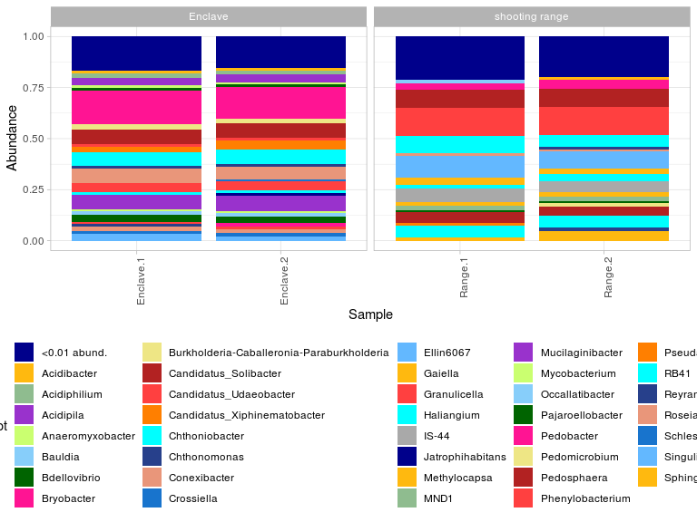
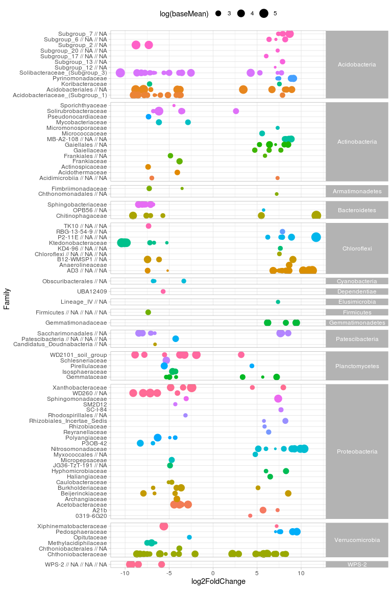

## Intro

This pipline offers first trying to standartise procedure of soil 16s
amplicone sequences Illumina reads processing in ARRIAM. Most operations
performed by several libraries and covered in functions. There we will
talk about most common way of analysis - but for tune or more details
you can edit functions themselves, in [functions.R](/functions.R) or use
a [Template](/Template.Rmd) for your own pipeline.

In this project, followed libraries have been
    used:

  - [dada2](https://benjjneb.github.io/dada2/tutorial.html)
  - [Biostrings](https://bioconductor.org/packages/release/bioc/html/Biostrings.html)
  - [DECIPHER](https://bioconductor.org/packages/release/bioc/html/DECIPHER.html)
  - [phyloseq](https://joey711.github.io/phyloseq/)
  - [ggplot2](https://ggplot2.tidyverse.org/)
  - [ggpubr](https://rpkgs.datanovia.com/ggpubr/)
  - [ape](https://cran.r-project.org/web/packages/ape/index.html)
  - [dplyr](https://dplyr.tidyverse.org/)
  - [DESeq2](http://bioconductor.org/packages/release/bioc/html/DESeq2.html)

-----

## Libraries and functions import

Load requred libraries. Please, install them, if you don\`t have it.
Also, import functions, set your working directory and random seed.

In our test data, we will see at microbiomes of sandy soils. In this
case, we compare sand with frost inclusion on an abandoned shooting
range and self-grown sands (called Anclav).

``` r
library(dada2)
library(Biostrings)
library(DECIPHER)
library(phyloseq)
library(ggplot2)
library(ggpubr)
library(ape)
library(dplyr)
library(DESeq2)

source('functions.R')
set.seed(5678)
setwd('/home/alexey/Analysis/16s-amplicon-processing/')
```

-----

## Dada2 processing of sequences

For processing of data, we need specify a way to raw data, and file with
metadata (information about samples). In our example, raw files are in
`/raw` directory, and metadata in `metadata.csv` file of current work
directory.

Functions in this module are:

#### Read metadata

`read_metadata(filename, sample.names, ...)`

Read metadata file, add future sample names to rownames

  - `filename` - name of metadata file
  - `sample.names` - name of columns with names, which you want to see
    in downstream analysis. Be sure, that they are unique
  - `...` - you can pass any information to `read.csv()` function (for
    example, `sep=("\t")`)
  - return a dataframe, rownames are from `sample.names` column

<!-- end list -->

``` r
mdat <- read_metadata('metadata.csv', "SampleID", sep = '\t')
mdat
```

    ##            SampleID         Source Repeat Num Filename
    ## Range.1     Range.1 shooting range      1   1    Nad-1
    ## Range.2     Range.2 shooting range      2   2    Nad-2
    ## Enclave.1 Enclave.1        Enclave      1   5    Nad-5
    ## Enclave.2 Enclave.2        Enclave      2   6    Nad-6

#### dada2 pipeline

`reads_to_seqtable_by_dada2(raw_files_path, trimLeft, truncLen,
pool=TRUE, cores=TRUE)`

Process reads, plot quality data and show basic log by all steps (also
save it to “processing.log” file)

  - `raw_files_path` - source to raw .fastq.gz files
  - `trimLeft` - if you want to cut primers from ends, use this variable
    as vector - c(len\_forward, len\_reverse)
  - `truncLen` - specify the maximum length of reads, also use this
    variable as vector
  - `pool` - pooling strategy. Options are `TRUE`, `"pseudo"` or
    `FALSE`. See [dada2](https://benjjneb.github.io/dada2/tutorial.html)
    manual.
  - `cores` - number of cores for analysis. Use `TRUE` for all availible
  - return ASV table and their abundance in
samples

<!-- end list -->

``` r
seqtab <- reads_to_seqtable_by_dada2(raw_files_path = 'raw', trimLeft = c(19, 20), truncLen=c(220,180))
```

    ## [1] "Nad-1" "Nad-2" "Nad-5" "Nad-6"

    ## Scale for 'y' is already present. Adding another scale for 'y', which will
    ## replace the existing scale.
    ## Scale for 'y' is already present. Adding another scale for 'y', which will
    ## replace the existing scale.

<!-- -->

    ## 25328412 total bases in 126012 reads from 4 samples will be used for learning the error rates.
    ## 20161920 total bases in 126012 reads from 4 samples will be used for learning the error rates.
    ## 4 samples were pooled: 126012 reads in 63894 unique sequences.
    ## 4 samples were pooled: 126012 reads in 62830 unique sequences.

    ## 18539 paired-reads (in 796 unique pairings) successfully merged out of 23430 (in 3730 pairings) input.

    ## 8104 paired-reads (in 748 unique pairings) successfully merged out of 17786 (in 7083 pairings) input.

    ## 30414 paired-reads (in 902 unique pairings) successfully merged out of 37316 (in 4915 pairings) input.

    ## 30577 paired-reads (in 904 unique pairings) successfully merged out of 37760 (in 5126 pairings) input.

    ## Identified 304 bimeras out of 1342 input sequences.

<!-- -->

    ##       input filtered denoisedF denoisedR merged nonchim
    ## Nad-1 29201    25593     24190     24508  18539   17515
    ## Nad-2 31462    20680     18837     19307   8104    6662
    ## Nad-5 46226    39668     38127     38513  30414   27512
    ## Nad-6 46614    40071     38604     38932  30577   27198

### Rename ASV table

According dada2 pipeline, default names of samples in seqtable are
derived from names of raw files. In most cases, this names are useless,
so there we can rename samples in a flow by specifying a column in
metadata.

`rename_seqtab_by_metadata(seqtab, metadata, old.names)`

rename seqtab to names, specified in `read_metadata` step

  - `seqtab` - ASV table from `reads_to_seqtable_by_dada2` function
  - `metadata` - metadata dataframe from `read_metadata` function
  - `old.names` - specify the column from `metadata` with names of a
    files. This names should be same with rownames of `seqtab`
  - return ASV table with renamed samples

<!-- end list -->

``` r
seqtab2 <- rename_seqtab_by_metadata(seqtab, mdat, "Filename")
```

### Assign taxonomy

`assign_taxonomy(seqtab, set_train_path, train_set_species_path, cores =
TRUE)`

Assign taxonomy by Bayesian naive classifier

  - `seqtab` - ASV table from `reads_to_seqtable_by_dada2` function
  - `set_train_path` - way to trained SILVA database fastas (see more in
    dada2 pipeline
    [here](https://benjjneb.github.io/dada2/tutorial.html))
  - `train_set_species_path` - way to SILVA species fastas (see more in
    dada2 pipeline
    [here](https://benjjneb.github.io/dada2/tutorial.html))
  - `cores` - number of cores for analysis. Use TRUE for all availible
  - return taxonomy
table

<!-- end list -->

``` r
taxa <- assign_taxonomy(seqtab = seqtab2, set_train_path = '/home/alexey/tax_n_refs/silva_nr_v132_train_set.fa.gz', 
                           train_set_species_path = '/home/alexey/tax_n_refs/silva_species_assignment_v132.fa.gz')
```

### Assemble phyloseq object

`assemble_phyloseq(seqtab, metadata, taxonomy, filter.organells = T,
write_fasta = TRUE)`

Assemble phyloseq object from components (except tree)

  - `seqtab` - ASV table from `rename_seqtab_by_metadata` function
  - `metadata` - metadata dataframe from `read_metadata` function
  - `taxonomy` - taxonomy from `assign_taxonomy` function
  - `filter.organells` - filter all entries, attributes as
    “Mitochondria” or “Chloroplast”. Can be `TRUE` or `FALSE`
  - `write_fasta` - allows to write a fasta file of reference sequences
    in “refseqs.fasta”. Can be `TRUE` or `FALSE`
  - return phyloseq
object

<!-- end list -->

``` r
ps <- assemble_phyloseq(seqtab = seqtab2, metadata = mdat, taxonomy = taxa, filter.organells = T, write_fasta = F)
ps
```

    ## phyloseq-class experiment-level object
    ## otu_table()   OTU Table:         [ 921 taxa and 4 samples ]
    ## sample_data() Sample Data:       [ 4 samples by 5 sample variables ]
    ## tax_table()   Taxonomy Table:    [ 921 taxa by 7 taxonomic ranks ]
    ## refseq()      DNAStringSet:      [ 921 reference sequences ]

-----

## Basic stats and save data

Feel free to explore the data and understand, how many taxa we have,
reads per sample number and taxonomical structure. Also to save phyloseq
object to file is always a good idea

``` r
sample_names(ps) # Names of samples
```

    ## [1] "Range.1"   "Range.2"   "Enclave.1" "Enclave.2"

``` r
sample_sums(ps) # Sum of reads per sample
```

    ##   Range.1   Range.2 Enclave.1 Enclave.2 
    ##     16574      5886     18973     18423

``` r
tax_table(ps)[1:5, 1:4] # Taxonomy table
```

    ## Taxonomy Table:     [5 taxa by 4 taxonomic ranks]:
    ##      Kingdom    Phylum           Class                 Order             
    ## ASV4 "Bacteria" "Proteobacteria" "Alphaproteobacteria" "Rhizobiales"     
    ## ASV5 "Bacteria" "Chloroflexi"    "P2-11E"              NA                
    ## ASV6 "Bacteria" "WPS-2"          NA                    NA                
    ## ASV7 "Bacteria" "Acidobacteria"  "Acidobacteriia"      "Solibacterales"  
    ## ASV8 "Bacteria" "Acidobacteria"  "Acidobacteriia"      "Acidobacteriales"

``` r
otu_table(ps)[1:4, 1:5] # ASV table
```

    ## OTU Table:          [5 taxa and 4 samples]
    ##                      taxa are columns
    ##           ASV4 ASV5 ASV6 ASV7 ASV8
    ## Range.1     94  756    1    0    0
    ## Range.2     29  214    0    0    2
    ## Enclave.1  446    0  568  447  217
    ## Enclave.2  412    0  344  388  610

``` r
saveRDS(ps, "ps.RData")
ps <- readRDS("ps.RData")
```

-----

## EDA

This part includes alpha- and beta-diversity, and bargraphs

#### Bargraphs

`bargraphps_object, rank, threshold=0.05)`

Draw a bargraph of relative abundance of different taxa in a dataset.
Also result is a ggplot-object, so, it is possible add to result facet
grid for group from metadata. Although unlimited number of possible
sectors, only 21 unique colors are specified, so, use it on a small
number of categories

  - `ps_object` - phyloseq-object
  - `rank` - taxonomical level for drawing
  - `threshold` - taxa with abundanse less than a threshold will be
    grouped in “less than” category
  - return ggplot graph

<!-- end list -->

``` r
bargraph(ps, 'Phylum', 0.03)
```

<!-- -->

``` r
bargraph(ps, 'Genus', 0.01) + facet_grid(~ Source, scale = 'free_x')
```

<!-- -->

#### Alpha-diversity

`alpha_div_table(ps, metric, group)`

Calculate alpha-diversity indices for samples. Allows to pass columns
from metadata

  - `ps` - phyloseq object
  - `metric` - group of metrics. Correct values are “Observed”, “Chao1”,
    “ACE”, “Shannon”, “Simpson”, “InvSimpson”, “Fisher” or their group
  - `group` - specify a column, or several columns from metadata to add
    to alpha diversity table
  - return dataframe vith alpha-diversity indices

`plot_alpha(ps, metric, group)`

Plot specified alpha metric

  - `ps` - phyloseq object
  - `metric` - metric. Correct value is one from “Observed”, “Chao1”,
    “ACE”, “Shannon”, “Simpson”, “InvSimpson”, “Fisher”
  - `group` - specify a column from metadata to group values
  - return ggplot boxplot with points of exact values

<!-- end list -->

``` r
alpha_div_table(ps, c("Observed", "Simpson", "Shannon"), "Source")
```

    ##                   Source Observed  Shannon   Simpson
    ## Range.1   shooting range      641 5.568590 0.9916790
    ## Range.2   shooting range      562 5.427390 0.9893535
    ## Enclave.1        Enclave      609 5.601094 0.9931880
    ## Enclave.2        Enclave      611 5.540465 0.9924378

``` r
ggarrange(plot_alpha(ps, "Source", "Observed"),
          plot_alpha(ps, "Source", "Simpson"), plot_alpha(ps, "Source", "Shannon"),
          nrow = 1, ncol = 3)
```

<!-- -->

#### Beta-diversity

`beta_plot(ps, method, distance, ...))`

Short functiot to draw beta diversity plot

  - `ps` - phyloseq object
  - `method` - method of ordination. Values are “PCoA”, “NMDS”
  - `...` - allows to pass arguments to `plot_ordination` function. Can
    be used for determination of color and shape
  - return ggplot scatterplot with distances between samples

<!-- end list -->

``` r
beta_plot(ps, 'PCoA', 'bray', color = "Filename", shape = "Source")
```

<!-- -->

-----

## Differential abundance

Here we try to find ASVs, which abundance significantly different in
comparison within two groups. For that, we will use DeSEQ2 package. In
this function, we perform comparison of two groups and return table of
ASVs, significantly different from each other (p-adj \< 0.05) alongside
DeSEQ2 metrics.

`sig_table(ps_object, formula, threshold)`

Construct table of significant ASVs according DeSEQ2, merge it with
abundance table

  - `ps_object` - phyloseq object
  - `formula` - formula ~var\_name for grouping dataset (in our case -
    ~Source)
  - `threshold` - baseMean and log2FoldChange, determined for filtering
    of deseq2 table. Use this variable as vector - c(baseMean,
    log2FoldChange)
  - return dataframe of ASVs, their parameters in DeSEQ2 comparison and
    taxonomy

`draw_sig_table(sig_table, rank)`

Draw a plot by significant table

  - `sig_table` - table of significant ASVs from `sig_table` function
  - `rank` - taxonomical level of
    plot

<!-- end list -->

``` r
table <- sig_table(ps, ~Source, c(10, 2))
```

    ## converting counts to integer mode

    ##   Note: levels of factors in the design contain characters other than
    ##   letters, numbers, '_' and '.'. It is recommended (but not required) to use
    ##   only letters, numbers, and delimiters '_' or '.', as these are safe characters
    ##   for column names in R. [This is a message, not an warning or error]
    ##   Note: levels of factors in the design contain characters other than
    ##   letters, numbers, '_' and '.'. It is recommended (but not required) to use
    ##   only letters, numbers, and delimiters '_' or '.', as these are safe characters
    ##   for column names in R. [This is a message, not an warning or error]

    ## gene-wise dispersion estimates

    ## mean-dispersion relationship

    ##   Note: levels of factors in the design contain characters other than
    ##   letters, numbers, '_' and '.'. It is recommended (but not required) to use
    ##   only letters, numbers, and delimiters '_' or '.', as these are safe characters
    ##   for column names in R. [This is a message, not an warning or error]

    ## final dispersion estimates

    ##   Note: levels of factors in the design contain characters other than
    ##   letters, numbers, '_' and '.'. It is recommended (but not required) to use
    ##   only letters, numbers, and delimiters '_' or '.', as these are safe characters
    ##   for column names in R. [This is a message, not an warning or error]

    ## using pre-existing size factors

    ## estimating dispersions

    ## found already estimated dispersions, replacing these

    ## gene-wise dispersion estimates

    ## mean-dispersion relationship

    ##   Note: levels of factors in the design contain characters other than
    ##   letters, numbers, '_' and '.'. It is recommended (but not required) to use
    ##   only letters, numbers, and delimiters '_' or '.', as these are safe characters
    ##   for column names in R. [This is a message, not an warning or error]

    ## final dispersion estimates

    ##   Note: levels of factors in the design contain characters other than
    ##   letters, numbers, '_' and '.'. It is recommended (but not required) to use
    ##   only letters, numbers, and delimiters '_' or '.', as these are safe characters
    ##   for column names in R. [This is a message, not an warning or error]

    ## fitting model and testing

``` r
head(table)
```

    ##      baseMean log2FoldChange     lfcSE      stat       pvalue         padj
    ## ASV4 206.1649      -2.435617 0.7347598 -3.314848 9.169291e-04 3.186328e-03
    ## ASV5 247.9933      11.698374 1.6439059  7.116207 1.109379e-12 9.252217e-10
    ## ASV6 182.7794      -9.361641 1.4732473 -6.354426 2.092060e-10 2.492540e-08
    ## ASV7 168.9372     -10.541229 1.6493274 -6.391229 1.645574e-10 2.287348e-08
    ## ASV8 173.8732      -7.908777 1.3575020 -5.825978 5.677900e-09 2.630761e-07
    ## ASV9 152.7636     -10.395833 1.6707895 -6.222108 4.905185e-10 4.508327e-08
    ##       Kingdom         Phylum               Class             Order
    ## ASV4 Bacteria Proteobacteria Alphaproteobacteria       Rhizobiales
    ## ASV5 Bacteria    Chloroflexi              P2-11E              <NA>
    ## ASV6 Bacteria          WPS-2                <NA>              <NA>
    ## ASV7 Bacteria  Acidobacteria      Acidobacteriia    Solibacterales
    ## ASV8 Bacteria  Acidobacteria      Acidobacteriia  Acidobacteriales
    ## ASV9 Bacteria    Chloroflexi     Ktedonobacteria Ktedonobacterales
    ##                            Family      Genus Species
    ## ASV4            Xanthobacteraceae       <NA>    <NA>
    ## ASV5                         <NA>       <NA>    <NA>
    ## ASV6                         <NA>       <NA>    <NA>
    ## ASV7 Solibacteraceae_(Subgroup_3) Bryobacter    <NA>
    ## ASV8                         <NA>       <NA>    <NA>
    ## ASV9           Ktedonobacteraceae       <NA>    <NA>

``` r
draw_sig_table(table, 'Family')
```

<!-- -->

`plot_heatmap(ps, group = "SampleID", log.transform = TRUE)`

Plot a heatmap by phyloseq object. Use minimal taxonomic level (Genus),
and group samples by any category from metadata

  - `ps` - phyloseq object
  - `group` - group samples (by mean abundance). Column from the
    metadata
  - `log.transform` - log-transformation of abundance. Can be `TRUE` or
    `FALSE`

DISCLAIMER: This function isn’t perfect. There are lines with zero
abundance in a graph (see below). In future I’m going to improve it :)

``` r
# prune phyloseq according %sig_table% result
sig.ps <- prune_taxa(rownames(table), ps)

plot_heatmap(sig.ps, group = "SampleID", log.transform = TRUE)
```

<!-- -->

-----
