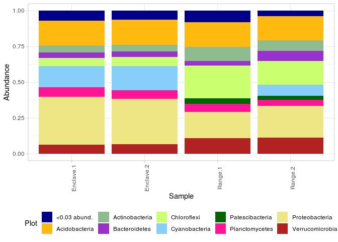
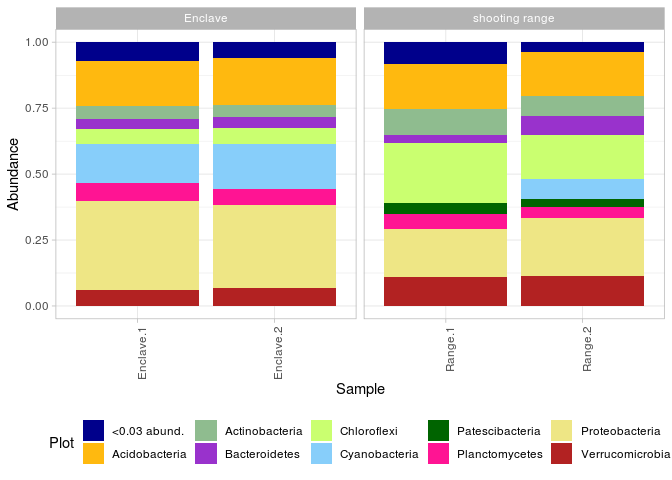
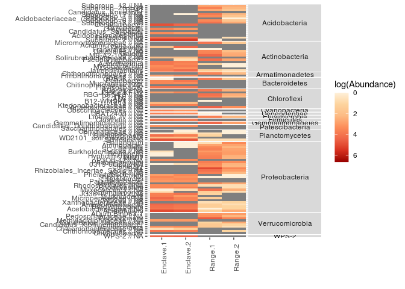
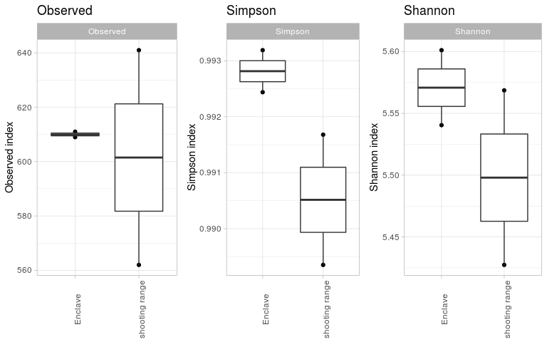
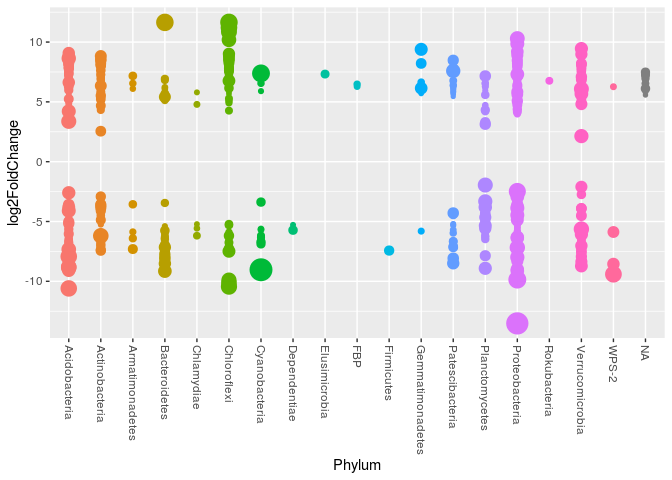

## Intro

This pipline offers first trying to standartise procedure of soil 16s
amplicone sequences Illumina reads processing. Most operations performed
by several libraries and covered in functions. There we will talk about
most common way of analysis - but for tune or more details, please, feel
free to read and rewrite specific function.

In this project, we use followed
    libraries:

  - [dada2](https://benjjneb.github.io/dada2/tutorial.html)
  - [Biostrings](https://bioconductor.org/packages/release/bioc/html/Biostrings.html)
  - [DECIPHER](https://bioconductor.org/packages/release/bioc/html/DECIPHER.html)
  - [phyloseq](https://joey711.github.io/phyloseq/)
  - [ggplot2](https://ggplot2.tidyverse.org/)
  - [ggpubr](https://rpkgs.datanovia.com/ggpubr/)
  - [ape](https://cran.r-project.org/web/packages/ape/index.html)
  - [plyr](https://www.rdocumentation.org/packages/plyr/versions/1.8.6)
  - [dplyr](https://dplyr.tidyverse.org/)
  - [DESeq2](http://bioconductor.org/packages/release/bioc/html/DESeq2.html)

-----

## Libraries and functions import

Load requred libraries. Please, install them, if you don\`t have it.
Also, import functions and set your working directory.

In our test data, we will see at microbiomes of sandy soils. In this
case, we compare sand with frost inclusion on an abandoned shooting
range and self-grown sands (called Anclav).

``` r
library(dada2)
library(Biostrings)
library(DECIPHER)
library(phyloseq)
library(ggplot2)
library(ggpubr)
library(ape)
library(plyr)
library(dplyr)
library(DESeq2)

source('functions.R')

setwd('/home/alexey/Analysis/16s-amplicon-processing/')
```

-----

## Dada2 processing of sequences

For processing of data, we need specify a way to raw data, and file with
metadata (information about samples). In our example, raw files are in
`raw` directory, and metadata in `metadata.csv` file.

Functions in this module are:

`dada2_processing(raw_files_path, cores=TRUE, trimLeft = c(19, 20)`

  - `raw_files_path` - source .fastq.gz files.
  - `cores` - number of cores for analysis. Use TRUE for all availible
  - `trimLeft` - if you want to cut primers from ends, use this variable
    as vector - c(len\_forward, len\_reverse)
  - return table of ASV and their abundance in samples

`rename_by_metadata(seqtab, mdat)`

  - `seqtab` - table of ASV to rename
  - `mdat` - metadata dataframe (use Filename column for basenames of
    raw files)
  - return ASV-table with renamed samples

`dada2_assign_taxonomy(seqtab, set_train_path, train_set_species_path,
cores = TRUE)`

  - `set_train_path` - way to trained SILVA database fastas (see more in
    dada2 pipeline
    [here](https://benjjneb.github.io/dada2/tutorial.html))
  - `train_set_species_path` - way to SILVA species fastas (see more in
    dada2 pipeline
    [here](https://benjjneb.github.io/dada2/tutorial.html))
  - `cores` - number of cores for analysis. Use TRUE for all availible
  - return taxonomy table

<!-- end list -->

``` r
mdat <- read.csv('metadata.csv', sep = '\t')
rownames(mdat) <- mdat$SampleID
mdat
```

    ##            SampleID         Source Repeat Num Filename
    ## Range.1     Range.1 shooting range      1   1    Nad-1
    ## Range.2     Range.2 shooting range      2   2    Nad-2
    ## Enclave.1 Enclave.1        Enclave      1   5    Nad-5
    ## Enclave.2 Enclave.2        Enclave      2   6    Nad-6

``` r
seqtab <- dada2_processing_reads(raw_files_path = 'raw')
```

    ## [1] "Nad-1" "Nad-2" "Nad-5" "Nad-6"
    ## 25328412 total bases in 126012 reads from 4 samples will be used for learning the error rates.
    ## 20161920 total bases in 126012 reads from 4 samples will be used for learning the error rates.

    ## Dereplicating sequence entries in Fastq file: raw/filtered/Nad-1_F_filt.fastq.gz

    ## Encountered 13176 unique sequences from 25593 total sequences read.

    ## Dereplicating sequence entries in Fastq file: raw/filtered/Nad-2_F_filt.fastq.gz

    ## Encountered 17332 unique sequences from 20680 total sequences read.

    ## Dereplicating sequence entries in Fastq file: raw/filtered/Nad-5_F_filt.fastq.gz

    ## Encountered 18418 unique sequences from 39668 total sequences read.

    ## Dereplicating sequence entries in Fastq file: raw/filtered/Nad-6_F_filt.fastq.gz

    ## Encountered 18813 unique sequences from 40071 total sequences read.

    ## Dereplicating sequence entries in Fastq file: raw/filtered/Nad-1_R_filt.fastq.gz

    ## Encountered 12933 unique sequences from 25593 total sequences read.

    ## Dereplicating sequence entries in Fastq file: raw/filtered/Nad-2_R_filt.fastq.gz

    ## Encountered 17105 unique sequences from 20680 total sequences read.

    ## Dereplicating sequence entries in Fastq file: raw/filtered/Nad-5_R_filt.fastq.gz

    ## Encountered 18063 unique sequences from 39668 total sequences read.

    ## Dereplicating sequence entries in Fastq file: raw/filtered/Nad-6_R_filt.fastq.gz

    ## Encountered 18599 unique sequences from 40071 total sequences read.

    ## 4 samples were pooled: 126012 reads in 63894 unique sequences.
    ## 4 samples were pooled: 126012 reads in 62830 unique sequences.

    ## 18539 paired-reads (in 796 unique pairings) successfully merged out of 23430 (in 3730 pairings) input.

    ## 8104 paired-reads (in 748 unique pairings) successfully merged out of 17786 (in 7083 pairings) input.

    ## 30414 paired-reads (in 902 unique pairings) successfully merged out of 37316 (in 4915 pairings) input.

    ## 30577 paired-reads (in 904 unique pairings) successfully merged out of 37760 (in 5126 pairings) input.

    ## Identified 304 bimeras out of 1342 input sequences.

``` r
seqtab <- rename_by_metadata(seqtab, mdat)

taxa <- dada2_assign_taxonomy(seqtab = seqtab, set_train_path = '/home/alexey/tax_n_refs/silva_nr_v132_train_set.fa.gz', 
                           train_set_species_path = '/home/alexey/tax_n_refs/silva_species_assignment_v132.fa.gz')
```

-----

## Create phyloseq object, add tree information to phyloseq object

There we create phyloseq object, which contain all data about our
dataset. Be sure, that names of all components are equal.

``` r
ps <- phyloseq(otu_table(seqtab, taxa_are_rows=FALSE), 
               sample_data(mdat), 
               tax_table(taxa))

ps
```

    ## phyloseq-class experiment-level object
    ## otu_table()   OTU Table:         [ 1038 taxa and 4 samples ]
    ## sample_data() Sample Data:       [ 4 samples by 5 sample variables ]
    ## tax_table()   Taxonomy Table:    [ 1038 taxa by 7 taxonomic ranks ]

Also at this step we export fasta file with sequences for each ASV and
include tree info in a phtloseq object. We do not perform tree
construction in R due to unsufficiently effective alghoritmes, and
recommend you to perform it using Fasttree implementation in QIIME2
package.

`create_ASV_references(ps_object, write = TRUE)`

  - `ps_object` - phyloseq-object
  - `write` - if True, write a `refseqs.fasta` file with reference fasta
    for every ASV
  - return ps\_object with references and ASV\_\_ as name of ASVs

<!-- end list -->

``` r
ps <- create_ASV_references(ps)

tree <- read_tree('tree.nwk')
ps <- merge_phyloseq(ps, phy_tree(tree))

ps
```

    ## phyloseq-class experiment-level object
    ## otu_table()   OTU Table:         [ 1038 taxa and 4 samples ]
    ## sample_data() Sample Data:       [ 4 samples by 5 sample variables ]
    ## tax_table()   Taxonomy Table:    [ 1038 taxa by 7 taxonomic ranks ]
    ## phy_tree()    Phylogenetic Tree: [ 1038 tips and 1034 internal nodes ]
    ## refseq()      DNAStringSet:      [ 1038 reference sequences ]

-----

## Basic stats and save data

Feel free to explore our data and understand, how many taxa we have, or
reads per sample number. Also save phyloseq object to
    file.

``` r
sample_names(ps) # Names of samples
```

    ## [1] "Range.1"   "Range.2"   "Enclave.1" "Enclave.2"

``` r
rank_names(ps) # Taxonomy ranks
```

    ## [1] "Kingdom" "Phylum"  "Class"   "Order"   "Family"  "Genus"   "Species"

``` r
sample_sums(ps) # Sum of reads per sample
```

    ##   Range.1   Range.2 Enclave.1 Enclave.2 
    ##     17515      6662     27512     27198

``` r
tax_table(ps)[1:5, 1:4] # Taxonomy table
```

    ## Taxonomy Table:     [5 taxa by 4 taxonomic ranks]:
    ##        Kingdom    Phylum            Class              Order               
    ## ASV53  "Bacteria" "Verrucomicrobia" "Verrucomicrobiae" "Chthoniobacterales"
    ## ASV218 "Bacteria" "Chloroflexi"     "Anaerolineae"     "RBG-13-54-9"       
    ## ASV86  "Bacteria" "WPS-2"           NA                 NA                  
    ## ASV771 "Bacteria" "Chloroflexi"     "Chloroflexia"     "Elev-1554"         
    ## ASV606 "Bacteria" "Acidobacteria"   "Acidobacteriia"   "Solibacterales"

``` r
otu_table(ps)[1:4, 1:5] # ASV table
```

    ## OTU Table:          [5 taxa and 4 samples]
    ##                      taxa are columns
    ##           ASV53 ASV218 ASV86 ASV771 ASV606
    ## Range.1       0     61     1      0      0
    ## Range.2       0     13     1      0      0
    ## Enclave.1   140      0    74     11      9
    ## Enclave.2    90      0    85      4     14

``` r
saveRDS(ps, "ps.RData")
```

-----

## Normalisation

Normalisation of data is a matter of discussions, but there we have an
opportunity to do it. Now we have relative and simple rarefaction as an
options, but in future we will perform varstab and log-relative
normalization

`normaize_phyloseq(ps_object, method='rarefaction')`

  - `ps_object` - phyloseq-object
  - `method` - method of normalisation. Current options are:
    “rarefaction”, “relative”
  - return phyloseq object with normalized data

<!-- end list -->

``` r
ps.n <- normalize_phyloseq(ps, method='rarefaction')
```

-----

## Bargraphs

This function draw a bargraph of relative abundance of different taxa in
a dataset. Also result is a ggplot-object, so, it is possible add to
result facet grid for group from metadata

`bargraphps_object, rank, threshold=0.05)`

  - `ps_object` - phyloseq-object
  - `rank` - taxonomical level for drawing
  - `threshold` - taxa with abundanse less than a threshold will be
    grouped in “less than” category
  - return ggplot graph

<!-- end list -->

``` r
bargraph(ps, 'Phylum', 0.03)
```

<!-- -->

``` r
bargraph(ps, 'Phylum', 0.03) + facet_grid(~ Source, scale = 'free_x')
```

<!-- -->

## Alpha diversity

This functions calculate alpha-diversity of samples, and draw it on a
plot

`alpha_div(ps, metric, group)`

  - `ps` - phyloseq object
  - `metric` - group of metrics. Correct values are “Observed”, “Chao1”,
    “ACE”, “Shannon”, “Simpson”, “InvSimpson”, “Fisher” or their group
  - `group` - specify a column from metadata to add to alpha diversity
    table
  - return dataframe vith alpha-diversity indices

`plot_alpha(ps, metric, group)`

  - `ps` - phyloseq object
  - `metric` - metric. Correct value is one from “Observed”, “Chao1”,
    “ACE”, “Shannon”, “Simpson”, “InvSimpson”, “Fisher”
  - `group` - specify a column from metadata to group values
  - return ggplot boxplot with points of exact values

<!-- end list -->

``` r
alpha_div(ps.n, c("Observed", "Simpson", "Shannon"), "Source")
```

    ##                   Source Observed  Shannon   Simpson
    ## Range.1   shooting range      576 5.551381 0.9917399
    ## Range.2   shooting range      546 5.361222 0.9875593
    ## Enclave.1        Enclave      551 4.874561 0.9633128
    ## Enclave.2        Enclave      540 4.795866 0.9601160

``` r
ggarrange(plot_alpha(ps.n, "Observed", "Source"),
          plot_alpha(ps.n, "Simpson", "Source"), plot_alpha(ps.n, "Shannon", "Source"),
          nrow = 1, ncol = 3)
```

<!-- -->

-----

## Beta diversity

Short functiot to draw beta diversity plot

`beta_plot(ps, metric, group, method='PCoA')`

  - `ps` - phyloseq object
  - `metric` - metric. Correct value is one from “bray”, “wunifrac”,
    “unifrac”
  - `group` - specify a column from metadata to group by color
  - `method` - method of ordination. Values are “PCoA”, “NMDS”
  - return ggplot scatterplot with distances between samples

<!-- end list -->

``` r
beta_plot <- function(ps, metric, group, method='PCoA'){
  ps.prop <- transform_sample_counts(ps, function(x) x/sum(x))
  ord.nmds.bray <- ordinate(ps.prop, method=method, distance=metric)
  plot_ordination(ps.prop, ord.nmds.bray, color = group, title=metric) +
    geom_point(size=3, alpha=0.7) + labs() +
    theme_light()
}

beta_plot(ps, "bray", "Source")
```

<!-- -->

## Differential abundance

Here we try to find ASVs, which abundance significantly different in
comparison within two groups. For that, we will use DeSEQ2 package. In
this function, we perform comparison of two groups and return table of
ASVs, significantly different from each other (p-adj \< 0.05) alongside
DeSEQ2 metrics.

`sig_table(ps_object, formula)`

  - `ps_object` - phyloseq object
  - `formula` - formula ~var\_name for grouping dataset (in our case -
    ~Source)
  - return dataframe of ASVs, their parameters in DeSEQ2 comparison and
    taxonomy

`draw_sig_table(sig_table, taxa)`

  - `sig_table` - table of significant ASVs (log2FoldChange and baseMean
    columns will be used)
  - `taxa` - taxonomical level of plot

<!-- end list -->

``` r
table <- sig_table(ps, ~Source)
table[1:6,1:9]
```

    ##         baseMean log2FoldChange    lfcSE      stat       pvalue         padj
    ## ASV53  47.030396      -8.722404 1.735541 -5.025754 5.014587e-07 1.023909e-05
    ## ASV218 17.227553       7.832519 1.854443  4.223651 2.403759e-05 1.893193e-04
    ## ASV86  33.711690      -5.877835 1.410739 -4.166493 3.093216e-05 2.282221e-04
    ## ASV606  4.806288      -5.430473 2.262743 -2.399951 1.639725e-02 3.037296e-02
    ## ASV671  4.217089      -5.241059 2.352359 -2.228002 2.588038e-02 4.367696e-02
    ## ASV438  7.297535      -6.035306 2.088734 -2.889456 3.859087e-03 9.359885e-03
    ##         Kingdom          Phylum            Class
    ## ASV53  Bacteria Verrucomicrobia Verrucomicrobiae
    ## ASV218 Bacteria     Chloroflexi     Anaerolineae
    ## ASV86  Bacteria           WPS-2             <NA>
    ## ASV606 Bacteria   Acidobacteria   Acidobacteriia
    ## ASV671 Bacteria Patescibacteria  Saccharimonadia
    ## ASV438 Bacteria   Acidobacteria   Acidobacteriia

``` r
draw_sig_table(table, 'Phylum')
```

<!-- -->

-----

## Networks

This part is under construction. Feel free to see `drafts.R` for any
interesting information
