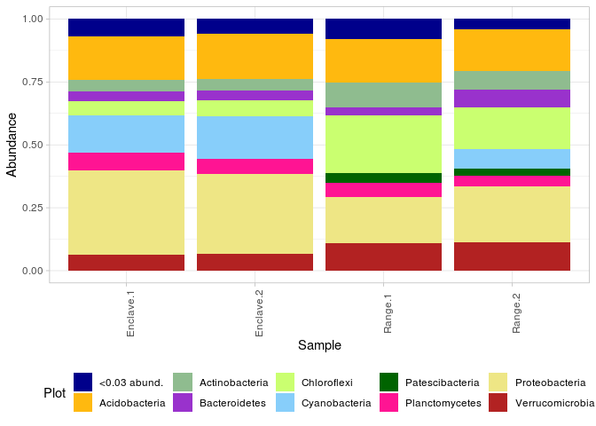
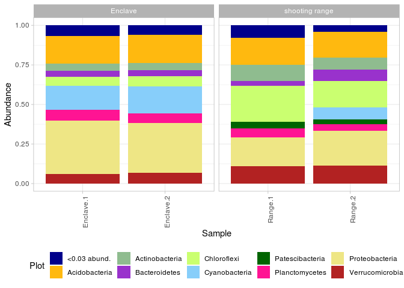
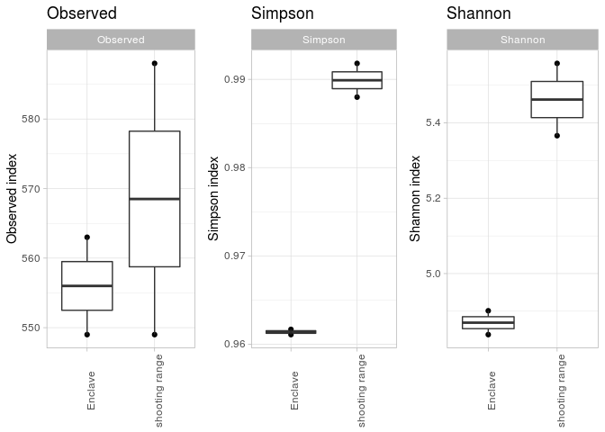
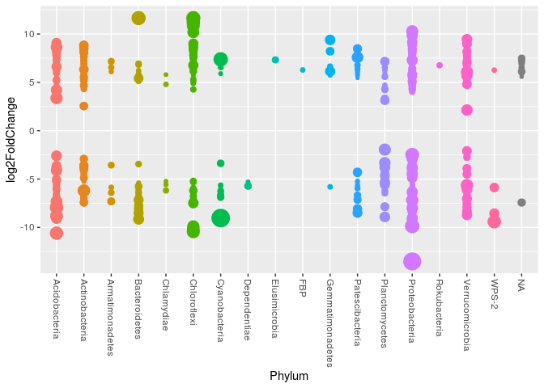

Стандартизованная процедура обработки почвенных ампликонных библиотек
================

## Введение

Данная операционная процедура представляет собой полный цикл обработки
почвенных ампликонных библиотек, включающих обработку сырых прочтений,
их нормализацию, анализ параметров и уровней разнообразия, а также
визуализацию и статистический анализ дифференциальной
представленности и обилия микробных таксонов, маркирующих
определенную стадию почвообразовательного процесса. В качестве
инструмента для анализа кинетики и направления почвенного
экогенеза и сопряженной эволюции микробиома предложена и
стандартизирована процедура определения «корового»
(«консервативного»), и акцессорного,
вариабельного/индикаторного компонента,
характерного для каждой стадии развития/регенерации почвы.
Полученная в результате платформа обеспечивает, таким образом,
стандартизацию рабочего процесса обработки данных по структуре
почвенного метагенома и изучения ведущих факторов и механизмов в
изменении состава микробиома со временем и дифференциацией почвенных
горизонтов, включая процессинг сырых необработанных последовательностей
ДНК и интегральную оценку параметров состава и разнообразия
микробиомов. Большинство операций представляет собой
обращения к сторонним библиотекам и их функциям. В данном
README мы обсудим самый общий вариант анализа почвенного сообщества -
для точной настройки или за подробностями прочтите и/или внесите
исправления в соответствующие функции

В рамках проекта использованы следующие
    библиотеки:

  - [dada2](https://benjjneb.github.io/dada2/tutorial.html)
  - [Biostrings](https://bioconductor.org/packages/release/bioc/html/Biostrings.html)
  - [DECIPHER](https://bioconductor.org/packages/release/bioc/html/DECIPHER.html)
  - [phyloseq](https://joey711.github.io/phyloseq/)
  - [ggplot2](https://ggplot2.tidyverse.org/)
  - [ggpubr](https://rpkgs.datanovia.com/ggpubr/)
  - [ape](https://cran.r-project.org/web/packages/ape/index.html)
  - [plyr](https://www.rdocumentation.org/packages/plyr/versions/1.8.6)
  - [dplyr](https://dplyr.tidyverse.org/)
  - [DESeq2](http://bioconductor.org/packages/release/bioc/html/DESeq2.html)

-----

## Импорт библиотек и функций

Импортируйте нужные библиотеки. При необходимости, установите их. Также
задайте рабочую директорию и экспортируйте функции

В качестве тестового датасета мы будем использовать ампликонные
прочтения песчаных почв. В сравнении будут участвовать песчаные
почвы с морозобойными клиньями (shooting range) и зарастающая песчаная
почва (Anclav)

``` r
library(dada2)
library(Biostrings)
library(DECIPHER)
library(phyloseq)
library(ggplot2)
library(ggpubr)
library(ape)
library(plyr)
library(dplyr)
library(DESeq2)

source('functions.R')

setwd('/home/alexey/Analysis/16s-amplicon-processing/')
```

-----

## Dada2 обработка прочтений

Для работы нужно указать пусть до исходных файлов, а также предоставить
метаданные (информацию об образцах). В нашем примере исходные файлы
находятся в папке `raw`, метаданные в файле `metadata.csv`.

Функции из этого модуля:

`dada2_processing(raw_files_path, cores=TRUE, trimLeft = c(19, 20)`

  - `raw_files_path` - путь к исходным файлам .fastq.gz
  - `cores` - количество ядер для анализа. Используйте TRUE чтобы задать
    все доступные
  - `trimLeft` - если требуется обрезать праймеры, используйте этот
    аргумент в формате c(len\_forward, len\_reverse)
  - возвращает таблицу ASV и их представленности по образцам

`rename_by_metadata(seqtab, mdat)`

  - `seqtab` - таблица ASV
  - `mdat` - датафрейм с метаданными (используйте колонку Filename для
    имен файлов)
  - возвращает ASV-таблицу с переименованными образцами

`dada2_assign_taxonomy(seqtab, set_train_path, train_set_species_path,
cores = TRUE)`

  - `set_train_path` - путь до натренированных fasta-файлов базы
    референсов SILVA (см. детали в пайплайне dada2
    [здесь](https://benjjneb.github.io/dada2/tutorial.html))
  - `train_set_species_path` - путь до натренированных fasta-файлов
    отдельных видов (см. детали в пайплайне dada2
    [здесь](https://benjjneb.github.io/dada2/tutorial.html))
  - `cores` - количество ядер для анализа. Используйте TRUE чтобы задать
    все доступные
  - возвращает таблицу таксономии

<!-- end list -->

``` r
mdat <- read.csv('metadata.csv', sep = '\t')
rownames(mdat) <- mdat$SampleID
mdat
```

    ##            SampleID         Source Repeat Num Filename
    ## Range.1     Range.1 shooting range      1   1    Nad-1
    ## Range.2     Range.2 shooting range      2   2    Nad-2
    ## Enclave.1 Enclave.1        Enclave      1   5    Nad-5
    ## Enclave.2 Enclave.2        Enclave      2   6    Nad-6

``` r
seqtab <- dada2_processing_reads(raw_files_path = 'raw')
```

    ## [1] "Nad-1" "Nad-2" "Nad-5" "Nad-6"
    ## 25328412 total bases in 126012 reads from 4 samples will be used for learning the error rates.
    ## 20161920 total bases in 126012 reads from 4 samples will be used for learning the error rates.

    ## Dereplicating sequence entries in Fastq file: raw/filtered/Nad-1_F_filt.fastq.gz

    ## Encountered 13176 unique sequences from 25593 total sequences read.

    ## Dereplicating sequence entries in Fastq file: raw/filtered/Nad-2_F_filt.fastq.gz

    ## Encountered 17332 unique sequences from 20680 total sequences read.

    ## Dereplicating sequence entries in Fastq file: raw/filtered/Nad-5_F_filt.fastq.gz

    ## Encountered 18418 unique sequences from 39668 total sequences read.

    ## Dereplicating sequence entries in Fastq file: raw/filtered/Nad-6_F_filt.fastq.gz

    ## Encountered 18813 unique sequences from 40071 total sequences read.

    ## Dereplicating sequence entries in Fastq file: raw/filtered/Nad-1_R_filt.fastq.gz

    ## Encountered 12933 unique sequences from 25593 total sequences read.

    ## Dereplicating sequence entries in Fastq file: raw/filtered/Nad-2_R_filt.fastq.gz

    ## Encountered 17105 unique sequences from 20680 total sequences read.

    ## Dereplicating sequence entries in Fastq file: raw/filtered/Nad-5_R_filt.fastq.gz

    ## Encountered 18063 unique sequences from 39668 total sequences read.

    ## Dereplicating sequence entries in Fastq file: raw/filtered/Nad-6_R_filt.fastq.gz

    ## Encountered 18599 unique sequences from 40071 total sequences read.

    ## 4 samples were pooled: 126012 reads in 63894 unique sequences.
    ## 4 samples were pooled: 126012 reads in 62830 unique sequences.

    ## 18539 paired-reads (in 796 unique pairings) successfully merged out of 23430 (in 3730 pairings) input.

    ## 8104 paired-reads (in 748 unique pairings) successfully merged out of 17786 (in 7083 pairings) input.

    ## 30414 paired-reads (in 902 unique pairings) successfully merged out of 37316 (in 4915 pairings) input.

    ## 30577 paired-reads (in 904 unique pairings) successfully merged out of 37760 (in 5126 pairings) input.

    ## Identified 304 bimeras out of 1342 input sequences.

``` r
seqtab <- rename_by_metadata(seqtab, mdat)

taxa <- dada2_assign_taxonomy(seqtab = seqtab, set_train_path = '/home/alexey/tax_n_refs/silva_nr_v132_train_set.fa.gz', 
                           train_set_species_path = '/home/alexey/tax_n_refs/silva_species_assignment_v132.fa.gz')
```

-----

## Создание объекта phyloseq, добавление информации о дереве

На этом шаге нужно создать phyloseq объект, который будет содержать всю
информацию о нашем датасете. Обратите внимание, что все компоненты
должны иметь одинаковые имена

``` r
ps <- phyloseq(otu_table(seqtab, taxa_are_rows=FALSE), 
               sample_data(mdat), 
               tax_table(taxa))

ps
```

    ## phyloseq-class experiment-level object
    ## otu_table()   OTU Table:         [ 1038 taxa and 4 samples ]
    ## sample_data() Sample Data:       [ 4 samples by 5 sample variables ]
    ## tax_table()   Taxonomy Table:    [ 1038 taxa by 7 taxonomic ranks ]

Также на этом этапе мы экспортируем файл fasta с последовательностями
для каждого ASV и включаем информацию о дереве в объект phyloseq. Мы
не выполняем построение дерева в R из-за недостаточно эффективных
алгоритмов и рекомендуем выполнять его с использованием Fasttree в
пакете QIIME2.

`create_ASV_references(ps_object, write = TRUE)`

  - `ps_object` - объект phyloseq
  - `write` - если True, записывает `refseqs.fasta` файл, содержащий
    референсы для каждой ASV
  - возвращает объект phyloseq с отдельно записанными референсами и
    именами ASV вида ASV%%%

<!-- end list -->

``` r
ps <- create_ASV_references(ps)

tree <- read_tree('tree.nwk')
ps <- merge_phyloseq(ps, phy_tree(tree))

ps
```

    ## phyloseq-class experiment-level object
    ## otu_table()   OTU Table:         [ 1038 taxa and 4 samples ]
    ## sample_data() Sample Data:       [ 4 samples by 5 sample variables ]
    ## tax_table()   Taxonomy Table:    [ 1038 taxa by 7 taxonomic ranks ]
    ## phy_tree()    Phylogenetic Tree: [ 1038 tips and 1034 internal nodes ]
    ## refseq()      DNAStringSet:      [ 1038 reference sequences ]

-----

## Базовые статистики и сохранение данных

Осмотрите получившийся объект для получения представления о том, как
много таксонов в датасете, каковы их категории, и каково количество
прочтений в одном образце. Также сохраните phyloseq объект в файл. При
необходимости, его можно загрузить обратно в
    переменную

``` r
sample_names(ps) # Имена образцов
```

    ## [1] "Range.1"   "Range.2"   "Enclave.1" "Enclave.2"

``` r
rank_names(ps) # Таксономические ранги
```

    ## [1] "Kingdom" "Phylum"  "Class"   "Order"   "Family"  "Genus"   "Species"

``` r
sample_sums(ps) # Сумма прочтений по образцам
```

    ##   Range.1   Range.2 Enclave.1 Enclave.2 
    ##     17515      6662     27512     27198

``` r
tax_table(ps)[1:5, 1:4] # Таблица таксономии
```

    ## Taxonomy Table:     [5 taxa by 4 taxonomic ranks]:
    ##        Kingdom    Phylum            Class              Order               
    ## ASV53  "Bacteria" "Verrucomicrobia" "Verrucomicrobiae" "Chthoniobacterales"
    ## ASV218 "Bacteria" "Chloroflexi"     "Anaerolineae"     "RBG-13-54-9"       
    ## ASV86  "Bacteria" "WPS-2"           NA                 NA                  
    ## ASV771 "Bacteria" "Chloroflexi"     "Chloroflexia"     "Elev-1554"         
    ## ASV606 "Bacteria" "Acidobacteria"   "Acidobacteriia"   "Solibacterales"

``` r
otu_table(ps)[1:4, 1:5] # Таблица образцов
```

    ## OTU Table:          [5 taxa and 4 samples]
    ##                      taxa are columns
    ##           ASV53 ASV218 ASV86 ASV771 ASV606
    ## Range.1       0     61     1      0      0
    ## Range.2       0     13     1      0      0
    ## Enclave.1   140      0    74     11      9
    ## Enclave.2    90      0    85      4     14

``` r
saveRDS(ps, "ps.RData")
```

-----

## Нормализация

Нормализация данных - область дискуссий, но в данном случае мы определим
такую возможность. Реализованы варианты относительной численности и
простого разрежения в качестве вариантов, но в будущем планируется
использование varstab и log-relative

`normaize_phyloseq(ps_object, method='rarefaction')`

  - `ps_object` - объект phyloseq
  - `method` - методика нормализации. Варианты: “rarefaction”,
    “relative”
  - возвращает объект phyloseq с нормализованными данными

<!-- end list -->

``` r
ps.n <- normalize_phyloseq(ps, method='rarefaction')
```

-----

## Барграфы

Эта функция задает барграф относительной численности различных таксонов
в наборе данных. Функция возвращает объект ggplot, поэтому при
необходимости можно добавить сетку фасетов для категории
метаданных.

`bargraphps_object, rank, threshold=0.05)`

  - `ps_object` - объект phyloseq
  - `rank` - таксономический уровень для построения
  - `threshold` - таксоны с относительной численностью менее threshold
    будут объединены в категорию “\< abund.”
  - возвращает график ggplot

<!-- end list -->

``` r
bargraph(ps, 'Phylum', 0.03)
```

<!-- -->

``` r
bargraph(ps, 'Phylum', 0.03) + facet_grid(~ Source, scale = 'free_x')
```

<!-- -->

## Альфа разнообразие

Данные функции позволяют рассчитать значения индексов альфа-разнообразия
и создать график

`alpha_div(ps, metric, group)`

  - `ps` - объект phyloseq
  - `metric` - группа метрик. Возможные варианты - “Observed”, “Chao1”,
    “ACE”, “Shannon”, “Simpson”, “InvSimpson”, “Fisher” или их
    сочетания
  - `group` - Дополнительная колонка из метаданных, которая будет
    включена в итоговую таблицу
  - возвращает датафрейм с индексами альфа-разнообразия

`plot_alpha(ps, metric, group)`

  - `ps` - объект phyloseq
  - `metric` - группа метрик. Возможные варианты - один из “Observed”,
    “Chao1”, “ACE”, “Shannon”, “Simpson”, “InvSimpson”, “Fisher”
  - `group` - Дополнительная колонка из метаданных для группировки
    образцов
  - возвращает боксплот ggplot с точками отдельных индексов

<!-- end list -->

``` r
alpha_div(ps.n, c("Observed", "Simpson", "Shannon"), "Source")
```

    ##                   Source Observed  Shannon   Simpson
    ## Range.1   shooting range      588 5.557790 0.9918058
    ## Range.2   shooting range      549 5.365901 0.9879856
    ## Enclave.1        Enclave      563 4.901236 0.9616761
    ## Enclave.2        Enclave      549 4.837941 0.9610834

``` r
ggarrange(plot_alpha(ps.n, "Observed", "Source"),
          plot_alpha(ps.n, "Simpson", "Source"), plot_alpha(ps.n, "Shannon", "Source"),
          nrow = 1, ncol = 3)
```

<!-- -->

-----

## Бета разнообразие

Небольшая функция для отрисовки бета-разнообразия

`beta_plot(ps, metric, group, method='PCoA')`

  - `ps` - объект phyloseq
  - `metric` - метрика. Возможные варианты: “bray”, “wunifrac”,
    “unifrac”
  - `group` - Колонка из метаданных, определяющая окраску точек
  - `method` - метод ординации. Возможные варианты: “PCoA”, “NMDS”
  - возвращает скаттерплот ggplot ординации образцов датасета

<!-- end list -->

``` r
beta_plot <- function(ps, metric, group, method='PCoA'){
  ps.prop <- transform_sample_counts(ps, function(x) x/sum(x))
  ord.nmds.bray <- ordinate(ps.prop, method=method, distance=metric)
  plot_ordination(ps.prop, ord.nmds.bray, color = group, title=metric) +
    geom_point(size=3, alpha=0.7) + labs() +
    theme_light()
}

beta_plot(ps, "bray", "Source")
```

<!-- -->

## Дифференциальная представленность

Здесь мы пытаемся найти ASV, численность которых существенно различается
в сравнении двух категорий. Для этого воспользуемся пакетом DeSEQ2. В
этой функции мы выполняем сравнение двух групп и возвращаем таблицу
ASV, значительно отличающихся друг от друга (p-adj \<0,05) вместе с
метриками DeSEQ2.

`sig_table(ps_object, formula)`

  - `ps_object` - объект phyloseq
  - `formula` - формула ~var\_name для разбиения датасета на 2 группы (в
    нашем случае - ~Source)
  - возвращает датафрейм ASV, а также их параметы при сравнении DeSEQ2 и
    таксономию

`draw_sig_table(sig_table, taxa)`

  - `sig_table` - таблица достоверно меняющихся ASV (используются
    колонки log2FoldChange и baseMean)
  - `taxa` - таксономический уровень для построения

<!-- end list -->

``` r
table <- sig_table(ps, ~Source)
table[1:6,1:9]
```

    ##         baseMean log2FoldChange    lfcSE      stat       pvalue         padj
    ## ASV53  47.030396      -8.722404 1.735541 -5.025754 5.014587e-07 1.023909e-05
    ## ASV218 17.227553       7.832519 1.854443  4.223651 2.403759e-05 1.893193e-04
    ## ASV86  33.711690      -5.877835 1.410739 -4.166493 3.093216e-05 2.282221e-04
    ## ASV606  4.806288      -5.430473 2.262743 -2.399951 1.639725e-02 3.037296e-02
    ## ASV671  4.217089      -5.241059 2.352359 -2.228002 2.588038e-02 4.367696e-02
    ## ASV438  7.297535      -6.035306 2.088734 -2.889456 3.859087e-03 9.359885e-03
    ##         Kingdom          Phylum            Class
    ## ASV53  Bacteria Verrucomicrobia Verrucomicrobiae
    ## ASV218 Bacteria     Chloroflexi     Anaerolineae
    ## ASV86  Bacteria           WPS-2             <NA>
    ## ASV606 Bacteria   Acidobacteria   Acidobacteriia
    ## ASV671 Bacteria Patescibacteria  Saccharimonadia
    ## ASV438 Bacteria   Acidobacteria   Acidobacteriia

``` r
draw_sig_table(table, 'Phylum')
```

<!-- -->

-----

## Сети

Этот раздел в разработке. Вы можете заглянуть в `drafts.R` за любой
интересующей информацией
